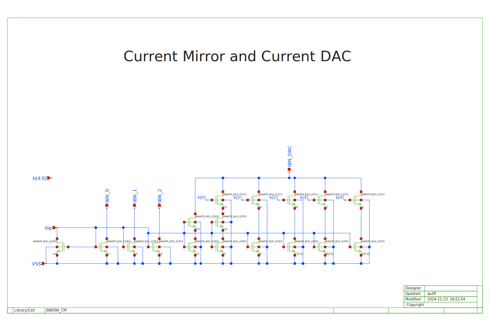

footer: Carsten Wulff 2024
slidenumbers:true
autoscale:true
theme: Plain Jane, 1
text:  Helvetica
header:  Helvetica
date: 2024-12-06

#[fit] Mixed Signal Simulation in ngspice

<!--pan_title: Mixed Signal Simulation in NGSPICE  -->

---

# Digital simulation

- The order of execution of events at the same time-step do not matter

- The system is causal. Changes in the future do not affect signals in the past or the now

---

<!--pan_doc:

There are both commercial an open source tools for digital simulation. If you've never 
used a digital simulator, then I'd recommend you start with iverilog. I've made some examples 
at [dicex](https://github.com/wulffern/dicex/tree/main/project/verilog).

-->

[.column]

**Commercial**

- [Cadence Excelium](https://www.cadence.com/ko_KR/home/tools/system-design-and-verification/simulation-and-testbench-verification/xcelium-simulator.html)
- [Siemens Questa](https://eda.sw.siemens.com/en-US/ic/questa/simulation/advanced-simulator/)
- [Synopsys VCS](https://www.synopsys.com/verification/simulation/vcs.html)

**Open Source**

- [iverilog/vpp](https://github.com/steveicarus/iverilog)
- [Verilator](https://www.veripool.org/verilator/)
- [SystemDotNet](https://sourceforge.net/projects/systemdotnet/)


[.column]

<!--pan_doc:

Below is an example of a counter in  SystemVerilog. The code can be found at [counter_sv](https://github.com/wulffern/dicex/tree/main/sim/verilog/counter_sv).

In the always\_comb section we code what will become the combinatorial logic. 
In the always\_ff section we code what will become our registers. 

-->

```verilog
module dig(
           input wire         clk,
           input wire         reset,
           output logic [4:0] b
           );

   logic                      rst = 0;

   always_ff @(posedge clk) begin
      if(reset)
        rst <= 1;
      else
        rst <= 0;
   end

   always_ff @(posedge clk) begin
      if(rst)
        b <= 0;
      else
        b <= b + 1;
   end // dig

endmodule
```

---

# Transient analog simulation 


[.column]

<!--pan_doc:

Analog simulation is different. There is no quantized time step. How fast "things" 
happen in the circuit is entirely determined by the time constants, change in voltage, 
and change in current in the system. 

It is possible to have a fixed time-step in analog simulation, for example, we say that nothing
is faster than 1 fs, so we pick that as our time step. If we wanted to simulate 
1 s, however, that's at least 1e15 events, and with 1 event per microsecond on a computer it's still a 
simulation time of 31 years. Not a viable solution for all analog circuits. 

Analog circuits are also non-linear, properties of resistors, capacitors, inductors, diodes may 
depend on the voltage or current across, or in, the device. Solving for all the
non-linear differential equations is tricky.

An analog simulation engine must 
-->
parse spice netlist, and setup partial/ordinary differential equations for node matrix

<!--pan_doc: 

The nodal matrix could look like the matrix below, $i$ are the currents, $v$ the voltages, 
and $G$ the conductances between nodes.

-->

$$
\begin{pmatrix}
G_{11} &G_{12}  &\cdots  &G_{1N} \\ 
G_{21} &G_{22}  &\cdots  &G_{2N} \\ 
\vdots &\vdots  &\ddots  & \vdots\\ 
G_{N1} &G_{N2}  &\cdots  &G_{NN} 
\end{pmatrix}
\begin{pmatrix}
v_1\\ 
v_2\\ 
\vdots\\ 
v_N
\end{pmatrix}=
\begin{pmatrix}
i_1\\ 
i_2\\ 
\vdots\\ 
i_N
\end{pmatrix}
$$


[.column]

<!--pan_doc:

The simulator, and devices 
-->
model the non-linear current/voltage behavior between all nodes

<!--pan_doc:

as such, the $G$'s may be non-linear functions, and include the $v$'s and $i$'s.

Transient analysis use 
-->
numerical methods to compute time evolution 

<!--pan_doc:

The time step is adjusted automatically, often by proprietary algorithms, to trade 
accuracy and simulation speed. 

The numerical methods can be forward/backward Euler, or the others listed below.

-->

- [Euler](https://aquaulb.github.io/book_solving_pde_mooc/solving_pde_mooc/notebooks/02_TimeIntegration/02_01_EulerMethod.html)
- [Runge-Kutta](https://aquaulb.github.io/book_solving_pde_mooc/solving_pde_mooc/notebooks/02_TimeIntegration/02_02_RungeKutta.html)
- [Crank-Nicolson](https://en.wikipedia.org/wiki/Crank%E2%80%93Nicolson_method)
- [Gear](https://ieeexplore.ieee.org/document/1083221)


<!--pan_doc:

If you wish to learn more, I would recommend starting with the original paper on analog transient analysis. 

-->

---

[.column]

[SPICE (Simulation Program with Integrated Circuit Emphasis)](https://www2.eecs.berkeley.edu/Pubs/TechRpts/1973/ERL-m-382.pdf)
published in 1973 by Nagel and Pederson

[.column]

<!--pan_doc:

The original paper has spawned a multitude of commercial, free and open source simulators, some are listed below. 

If you have money, then buy Cadence Spectre. If you have no money, then start with ngspice. 

-->


**Commercial**
- [Cadence Spectre](https://www.cadence.com/ko_KR/home/tools/custom-ic-analog-rf-design/circuit-simulation/spectre-simulation-platform.html)
- [Siemens Eldo](https://eda.sw.siemens.com/en-US/ic/eldo/)
- [Synopsys HSPICE](https://www.synopsys.com/implementation-and-signoff/ams-simulation/primesim-hspice.html)


**Free**
- [Aimspice](http://aimspice.com)
- [Analog Devices LTspice](https://www.analog.com/en/design-center/design-tools-and-calculators/ltspice-simulator.html)
- [xyce](https://xyce.sandia.gov)

**Open Source**
- [ngspice](http://ngspice.sourceforge.net)

---


---

# Demo

Tutorial at [http://analogicus.com/jnw\_sv\_sky130a/](http://analogicus.com/jnw_sv_sky130a/)

Repository at [https://github.com/wulffern/jnw\_sv\_sky130a](https://github.com/wulffern/jnw_sv_sky130a)

Assumes knowledge of [Tutorial](https://analogicus.com/aic2025/2025/01/01/Sky130nm-tutorial.html)

---

<!--pan_doc: 

# The circuit

In `design/JNW_SV_SKY130A/JNWSW_CM.sch` you'll find a current mirror, and a
5-bit current DAC. 

What we want from the digital is to control the binary value of the current DAC. 


-->



---

<!--pan_doc: 

# The digital code

The digital code is shown below. The `clk` controls the stepping, while the
`reset` sets the output `b=0`. When `reset` is off, then the `b` increments. 

-->

```verilog
module dig(
           input wire         clk,
           input wire         reset,
           output logic [4:0] b
           );

   logic                      rst = 0;

   always_ff @(posedge clk) begin
      if(reset)
        rst <= 1;
      else
        rst <= 0;
   end

   always_ff @(posedge clk) begin
      if(rst)
        b <= 0;
      else
        b <= b + 1;
   end // dig
endmodule

```
---


# Compile RTL 

<!--pan_doc: 
The first thing we need to do is to translate the verilog into a compiled object
that can be used in ngspice. 


-->


``` bash
cd sim/JNWSW_CM
ngspice vlnggen ../../rtl/dig.v
```

---

# Import object into SPICE file

<!--pan_doc:

I'm lazy. So I don't want to do the same thing multiple times. As such, I've
written a small script to help me instanciate the verilog 

-->

``` bash
perl ../../tech/script/gensvinst ../../rtl/dig.v dig
```

---

[.column]

The script generates an `svninst.spi` file. The first section imports the
digital compiled library 

[.column]

```
adut [clk
+ reset
+ ]
+ [b.4
+ b.3
+ b.2
+ b.1
+ b.0
+ ] null dut
.model dut d_cosim 
+ simulation="../dig.so" delay=10p

```

---

<!--pan_doc: 

Turns out that ngspice needs the digital inputs and outputs to be connected to
something to calculate them (I think), so connect some resistors

-->

[.column]

```
* Inputs
Rsvi0 clk 0 1G
Rsvi1 reset 0 1G

* Outputs
Rsvi2 b.4 0 1G
Rsvi3 b.3 0 1G
Rsvi4 b.2 0 1G
Rsvi5 b.1 0 1G
Rsvi6 b.0 0 1G
```


<!--pan_doc:

For the busses I find it easier to read the value as a real, so translate the
buses from digital `b[4:0]` to a real value `dec_b` 

-->

[.column]

```
E_STATE_b dec_b 0 value={( 0 
+ + 16*v(b.4)/AVDD
+ + 8*v(b.3)/AVDD
+ + 4*v(b.2)/AVDD
+ + 2*v(b.1)/AVDD
+ + 1*v(b.0)/AVDD
+)/1000}
.save v(dec_b)
```

---

# Import in testbench

<!--pan_doc: 

An example testbench can be seen below (`sim/JNWSW_CM/tran.spi`)

-->

```
...

.include ../xdut.spi
.include ../svinst.spi

* Translate names
VB0 b.0 b<0> dc 0
VB1 b.1 b<1> dc 0
VB2 b.2 b<2> dc 0
VB3 b.3 b<3> dc 0
VB4 b.4 b<4> dc 0

...
```

---

# Override default digital output voltage

<!--pan_doc: 

We can override the output dac from digital to analog to ensure that the digital
signals have the right levels 

-->

```

*- Override the default digital output bridge.
pre_set auto_bridge_d_out =
     + ( ".model auto_dac dac_bridge(out_low =te 0.0 out_high = 1.8)"
     +   "auto_bridge%d [ %s ] [ %s ] auto_dac" )

```

---


# Running 

<!--pan_doc: 

You can run the whole thing with 

-->

``` bash
cd sim/JNWSW_CM/
make typical 
```


---

<!--pan_skip: -->

- Compile RTL
- Import object into SPICE file
- Testbench
- Override digital output voltage
- Running
- Waveforms

---


#[fit] Thanks!


