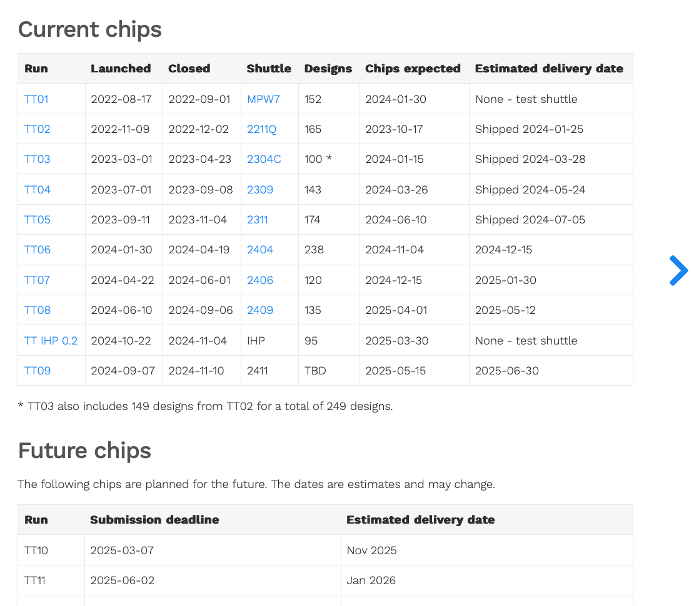

footer: Carsten Wulff 2023
slidenumbers:true
autoscale:true
theme: Plain Jane, 1
text:  Helvetica
header:  Helvetica
date: 2025-01-09
    

<!--pan_title: Lecture 1 -  Introduction -->

<!--pan_skip: -->
## TFE4188 - Advanced Integrated Circuits  

# Lecture 1 - Introduction

---

<!--pan_doc:
<iframe width="560" height="315" src="https://www.youtube.com/embed/rs-5UBA5GRc?si=_FLl66XvLQyCJwo8" title="YouTube video player" frameborder="0" allow="accelerometer; autoplay; clipboard-write; encrypted-media; gyroscope; picture-in-picture; web-share" allowfullscreen></iframe>

-->


#[fit] Who

---

<!--pan_doc: 
My name is 
-->

Carsten Wulff [carstenw@ntnu.no](carstenw@ntnu.no)

<!--pan_doc: and I've worked in the integrated circuit industry for over 20 years. 

I finished my Masters in 2002, and did a Ph.D on analog-to-digital converters finished in 2008. 

Since that time, I've had a three axis in my work/hobby life.

I work at  [Nordic Semiconductor](https://www.nordicsemi.com) where I've been since 2008. The first 7 years I did analog design
  (ADCs, DC/DCs, GPIO). The next 7 years I was the Wireless Group Manager. The Wireless group make most
  of the analog and RF designs for Nordic's short-range products. Now I'm the IC
  Scientist, and focus on technical issues with our integrated circuits that
  occur before we go into volume production. 

I work at [NTNU](https://ntnu.no) where I did a part time postdoc from 2014 - 2017. From 2020 I've been working on and teaching [Advanced Integrated
  Circuits](https://www.ntnu.edu/studies/courses/TFE4188#tab=omEmnet)

I have a hobby trying to figure out how to make a new analog circuit design
  paradigm. The one we have today with
  schematic/simulation/layout/verification/simulation is too slow

-->


---

<!--pan_skip: -->

# Teaching assistant

- Jonathan Sæthre Ege

---

# How I see our roles 

**Professors:** Guide students on what is impossible, possible, and hints on what
might be possible 

**Ph.D students:** Venture into the unknown and make something (more) possible

**Master students:** Learn all that is currently possible

**Bachelor students:** Learn how to make complicated into easy

**Industry:** Take what is possible, and/or complicated, and make it easy


---


<!--pan_skip: -->

#[fit] Why

---

#[fit] I want you to learn the skills necessary to make your own ICs

<!--pan_doc: 

In 2020 the global integrated circuit market was [437.7 billion dollars](https://www.fortunebusinessinsights.com/integrated-circuit-market-106522)! 
The market is expected to grow to 1136 billion in 2028.

Integrated circuits enable pretty much all technologies.

I will be dead in approximately 50 years, and will retire in approximately 20 years. 
Everything I know will be gone (except for the small pieces I've left behind in videos or written word)

Someone must take over, and to do that, they need to know most of what I know, and hopefully a bit more. 

That's were some of you come in. Some of you will find integrated circuits interesting to make, and in addition, you have 
the stamina, patience, and brain necessary to learn some of the hardest topics in the world.

> Making integrated circuits (that work reliably) is not rocket science, it's much harder.

In this course, we'll focus on analog ICs, because the real world is analog, and all ICs must have some 
analog components, otherwise they won't work.

-->

---


[.background-color:#000000]
[.text: #FFFFFF]
# There will always be analog circuits, because the real world is analog

<!--pan_skip: -->

---

<!--pan_skip: -->

### Life of an analog designer: Schematic Design

[.column]


[.column]


---

<!--pan_skip: -->

### Life of an analog designer: Layout Design

[.column]


[.column]


---

| Status | Abstraction | Design | Layout | Why |
|:------:|:------------|:-------|:-------|:----|
| :construction:       | Chip        | SystemVerilog     | digital     | Complex connections, few analog interfaces              |
| :construction:       | Module      | SystemVerilog     | digital     | Large amount of digital signals, few analog signals     |
| :warning:       | Block       | Schematic         | programmatic | Large amount of critical analog interfaces, few digital |
| :white_check_mark:      | Cell         | Netlist/JSON | compiled    | Few analog interfaces, few digital interfaces                                 |
| :white_check_mark:      | Device      | JSON              | compiled    | Polygon pushing                                         |
| :white_check_mark:      | Technology  | JSON/Rules        | compiled    | Custom for each technology                              |


---


[.column]


<sub> [https://circuitcellar.com/insights/tech-the-future/kinget-the-world-is-analog/](https://circuitcellar.com/insights/tech-the-future/kinget-the-world-is-analog/)</sub>

<!--pan_doc:

The steps to make integrated circuits is split in two. We have an analog flow, and a digital flow. 

It's rare to find a single human that do both flows well. Usually people choose, and I think it's based on what they like and their personality.

If you like the world to be ordered, with definite answers, then it's likely that you'll find the digital flow interesting.

If you're comfortable with not knowing, and an insatiable desire to understand how the world *really* works at a fundamental level, then 
it's likely that you'll find analog flow interesting. 


-->

---

<!--pan_skip: -->


---

##[fit] Will you tape-out an IC?

<!--pan_doc:

Something that would make me really happy is if someone is able to tapeout an IC in this course. 

It's now possible without signing an NDA or buying expensive software licenses. 

In 2020 Google and Skywater joined forces to release a 130 nm process design kit to the public. In addition, they 
have fueled a renaissance of open source software tools.

Together with [Efabless](https://https://efabless.com) there are cheap alternatives, like [tinytapeout](https://tinytapeout.com),
which makes it possible for a private citizen to tape-out their own integrated circuit.

-->

---

<!--pan_skip: -->


## [https://tinytapeout.com/runs/](https://tinytapeout.com/runs/)





---

<!--pan_skip: -->

# <https://analogicus.com/aic2025>


---

<!--pan_doc: 

## What the team needs to know to design ICs 

There are a multitude of tools and skills needed to design professional ICs. 
It's not likely that you'll find all the skills in one human, and even if you
could, one human does not have sufficient bandwidth to design ICs with all it's aspects in a 
reasonable timeline 

That is, unless we can find a way to make ICs easier.

The skills needed are

-->

- _Project flow support_: **Confluence**, JIRA, risk management (DFMEA), failure analysis (8D)
- _Language_: **English**, **Writing English (Latex, Word, Email)**
- _Psychology_: Personalities, convincing people, presentations (Powerpoint, Deckset), **stress management (what makes your brain turn off?)**
- _DevOps_: **Linux**, bulid systems (CMake, make, ninja), continuous integration (bamboo, jenkins), **version control (git)**, containers (docker), container orchestration (swarm, kubernetes)
- _Programming_: Python, C, C++, Matlab <sub>Since 1999 I’ve programmed in Python, Go, Visual BASIC, PHP, Ruby, Perl, C#, SKILL, Ocean, Verilog-A, C++, BASH, AWK, VHDL, SPICE, MATLAB, ASP, Java, C, SystemC, Verilog, Assembler, and probably a few I’ve forgotten.</sub>
- _Firmware_: signal processing, algorithms, software architecture, security
- _Infrastructure_: **Power management**, **reset**, **bias**, **clocks**
- _Domains_: CPUs, peripherals, memories, bus systems
- _Sub-systems_: **Radio’s**, **analog-to-digital converters**, **comparators**
- _Blocks_: **Analog Radio**, Digital radio baseband
- _Modules_: Transmitter, **receiver**, de-modulator, timing recovery, state machines
- _Designs_: **Opamps**, **amplifiers**,  **current-mirrors**, adders, random access memory blocks, standard cells
- _Tools_: **schematic**, **layout**, **parasitic extraction**, synthesis, place-and-route, **simulation**,  (System)Verilog, **netlist** 
- _Physics_: transistor, pn junctions, quantum mechanics

---

## Zen of IC design (stolen from Zen of Python)

<!--pan_doc: 

When you learn something new, it's good to listen to someone that has done whatever it is before. 

Here is some guiding principles that you'll likely forget. 

-->

[.column]
- Beautiful is better than ugly.
- Explicit is better than implicit.
- Simple is better than complex.
- Complex is better than complicated.
- Readability counts (especially schematics).
- Special cases aren't special enough to break the rules.
- Although practicality beats purity.

[.column]

- In the face of ambiguity, refuse the temptation to guess.
- There should be one __and preferably only one__ obvious way to do it.
- Now is better than never.
- Although never is often better than *right* now.
- If the implementation is hard to explain, it's a bad idea.
- If the implementation is easy to explain, it may be a good idea.

---
[.background-color: #000000]
[.text: #FFFFFF]

<!--pan_doc: 
## IC design mantra 

To copy an old mantra I have on learning programming 

-->

> Find a problem that you really want to solve, and learn programming to solve it. There is  no point in saying "I want to learn programming", then sit down with a book to read about programming, and expect that you will learn programming that way. It will not happen. The only way to learn programming is to do it, a lot. 
-- Carsten Wulff 

<!--pan_doc:

And run the perl program 

-->


``` perl
s/programming/analog design/ig
```

---

## Analog Design Process

[.column]
- Define the problem, what are you trying to solve?
- Find a circuit that can solve the problem (papers, books)
- Find right transistor sizes. What transistors should be weak inversion, strong
  inversion, or don't care?
- Write a verification plan. Plan to simulate everything that could go wrong.
- Check operating region of transistors (.op)
- Check key parameters (.dc, .ac, .tran)
- Check function. Exercise all inputs. Check all control signals


[.column]

- Check key parameters in all corners. Check mismatch (Monte-Carlo simulation)
- Do layout, and check it's error free. Run design rule checks (DRC). Check layout versus schematic (LVS)
- Extract parasitics from layout. Resistance, capacitance, and inductance if necessary.
- On extracted parasitic netlist, check key parameters in all corners and mismatch (if possible).
- If everything works, then your done.

*On failure, go back as far as necessary*


---


# My Goal

<!--pan_doc: 

Don't expect that I'll magically take information and put it inside your head, and you'll suddenly understand everything about making ICs.

**You are the one that must teach yourself everything.**

I consider my role as a guide, similar to a mountain guide. I can't carry you up the mountain, you need to walk up the mountain
, but I know the safe path to take and increase the likelihood that you'll come back alive. 

I want to:
-->

- Enable you to read the books on integrated circuits
- Enable you to read papers (latest research)
- Correct misunderstandings on the topic 
- Answer any questions you have on the chapters

<!--pan_doc:

I'm not a mind reader, I can't see inside your head. That means, you must ask questions, only by your questions can I start to understand
what pieces of information is missing from your head, or maybe somehow to correct your understanding. 

At the same time, and similar to a mountain guide, you should not assume I'm always right. I'm human, and I will make mistakes. 
And maybe you can correct my understanding of something. All I care about is to *really* understand how the world works, so if you think 
my understanding is wrong, then I'll happily discuss. 

-->

---

<!--pan_skip: -->

[.column]
# Plan

**Lectures:**
Thursday at 10:15 - 12:00

Read the introduction before the lectures at [aic2025](https://analogicus.com/aic2025)

The "lectures" will be Q & A's on the topic. If no questions, then I'll ramble on.

**Project Hours:**
Thursday at 12:15 - 14:00

Groups meet, and work on project. 

---

<!--pan_skip: -->

## 

- [Description](https://www.ntnu.no/studier/emner/TFE4188#tab=omEmnet)

- [Time schedule](https://www.ntnu.no/studier/emner/TFE4188#tab=timeplan)

- [Lecture plan](https://wulffern.github.io/aic2025/plan/)

- [Syllabus](https://wulffern.github.io/aic2025/syllabus/)

- [Youtube Videos](https://www.youtube.com/playlist?list=PLybHXZ9FyEhbm9-A3QR1NRlt6VxeTXYr5)

- [AIC2024](http://analogicus.com/aic2024/)

---

<!--pan_doc:

# Syllabus

The syllabus will be from Analog Integrated Circuit Design (CJM) and Circuits for all seasons. 

These lecture notes are a supplement to the book. I try to give some background, and how to think about electronics. 
It's not my goal to repeat information that you can find in the book.

Buy a hard-copy of the book if you don't have that. Don't expect to understand the book by reading the PDF. 

-->


---

<!--pan_skip: -->

## Exam

- May/June?
- 4 hours
- A - F grade (F = Fail)
- Counts for 55 % of the grade

---

<!--pan_skip: -->

## Compulsary exercises

Follow: [Sky130nm Tutorial](https://analogicus.com/aic2025/2025/01/01/Sky130nm-tutorial.html)

Submit link to your github repository on blackboard

For example, my repository:
[JNW\_EX\_SKY130A](http://analogicus.com/jnw_ex_sky130a/)

**The exercise is designed to teach you everything the skills you need to do the project**

---

<!--pan_skip: -->

# Project

Counts for 45 % of the grade

No exam without project.

Strict deadline 30'th of April. If you hand in 1'th of May at 00:00:01, then you fail the course.

---


# JNW (2025)


**"You can use logic to justify almost anything. That's its power. And its flaw."** - Kathryn Janeway, Star Trek Voyager: Prime Factors


<!--pan_doc: 

The project for 2025 is to 

-->

 
**Design a integrated temperature sensor with digital read-out**

<!--pan_doc: 

An outline of the plan is shown below. 

At the end of the project you will have a function that converts temperature to a digital value.

$$
D = f_0(T)
$$

 I've broken down the challenge into three steps, first convert Temperature into a current

$$
I = f_1(T)
$$

Then convert current into a time 

$$
t = f_2(I)
$$

then time to digital

$$
D = f_3(t) = f_3(f_2(f_1(T))) = f_0(T)
$$

The third milestone is the layout, while the fourth milestone is the report. 

You can find an example of last years designs at [cnr\_gr02\_sky130nm](https://github.com/analogicus/cnr_gr02_sky130nm)

You will be using a repository on github for all your design data. In that repository I've made it possible to run github actions, or github workflows. For each of the milestones there are associated workflows (SIM/DOCS/GDS/DRC/LVS). 

-->


---


<!--pan_doc:

**Milestone 0:** The zero milestone is not really part of the project, but it does introduce you too how you will work with the files in the project. It's important that you do this right away. To complete the milestone, upload a link to blackboard with your github repository for the tutorial [Skywater 130 nm Tutorial](https://analogicus.com/aic2025/2025/01/01/Sky130nm-tutorial.html)
 

**Milestone 1:** The first milestone is to make a circuit that can convert from a temperature, to a current that is proportional to temperature. You will run a simulation on github that demonstrates that the circuit works. That is the SIM workflow.

**Milestone 2:** In the second milestone you will complete the schematic design of the circuit, and possibly also do some SystemVerilog to demonstrate that you get a digital value out that is proportional to temperature. Here, the simulations on github may be too long, so it's sufficient to describe the circuit, and how it works in detail in the documentation. This is the DOC workflow.

**Milestone 3:** The third milestone, making the layout, is optional, however, it will be impossible to get an A without getting some points from the layout milestone. Once the layout is complete, I expect that the design rule checks (DRC), Layout versus Schematic (LVS), and GDS (stream out to a [GDSII](https://en.wikipedia.org/wiki/GDSII) file) is passing on github.

**Milestone 4:** I will force you to work in groups. As such, it may be that some contribute more than others. To ensure that the grading is fair, the report will be indivirual. It's OK to share figures, tables, and so on, but the PDF shall be written by you and you alone.

-->

---

## Grading

| Milestone | What does it mean                                               | Condition for more than 0 points | Possible Points |
|-----------|-----------------------------------------------------------------|----------------------------------|-----------------|
| M1 I=f(T) | Circuit that can convert a temperature into a current           | SIM passing                      | 10              |
| M2 D=f(T) | Circuit that can convert from temperature into  a digital value | DOC passing                      | 20              |
| M3 Layout | Layout of your circuit                                          | DRC/LVS/GDS passing              | 20              |
| M4 Report | Individual report                                               | Uploaded to blackboard           | 48              |
| Cooleness  | Extra points that I may choose to award                         |                                  | 10              |
| Total     |                                                                 |                                  | 108             |


<!--pan_doc:

## Group dynamics

How you work together is important. No-one can do everything by them self. I know from experience it can be 
magical when bright brains come together. The collective brain can be smarter, better, faster, than anyone 
in the group. 

That's why I think it's important not to just work in groups, but also focus on how we work in groups.

A group shall be maximum 4 members. There must be at least 3 that don't know each-other that well. 

The group will meet once per week in the exercise hours.

### Check-in

All group session must start with a Check-in (10 minutes)

Some example questions could be 

- Share one thing that is going on in your life (personal or professional.)
- What is one thing that you are grateful for right now?
- What is something funny that happened?

Some examples answers could be:
- My dog died yesterday, so I'm not feeling great today.
- I woke up early, had an omelet, and went running, so I feel motivated and fantastic.
- I feel *blaaah* today, motivation is lacking. 
- I went running yesterday and did not discover before I got home that I'd forgotten to put my pants on, even though it was
  -10 C.

The point of this exercise is to get to know each other a bit, and attempt to create psychological safety in the group.

-->

---

#[fit] Software

<!--pan_doc:

We'll use professional 
-->
Open source software (xschem, ngspice, sky130B PDK, Magic VLSI, netgen)

<!--pan_doc:

I've made a rather detailed (at least I think so myself) tutorial on how to make a current mirror with the open source tools.
I strongly recommend you start with that first. 
-->

 [Skywater 130 nm Tutorial](https://analogicus.com/aic2025/2025/01/01/Sky130nm-tutorial.html)
 
 
<!--pan_doc:
 
 I've also made some more complex examples, that can be found at the link below. There are digital logic cells, standard transistors, and few other blocks. 
 
-->
 
 [aicex](https://wulffern.github.io/aicex)

---

<!--pan_skip: -->

# Lower your expectations on EDA software

Expect that you will spend at least $$2\pi$$ times more time than planned *(mostly due to software issues)* 

---

<!--pan_skip: -->

#[fit] Questions 

---

<!--pan_skip: -->

# Do
- google
- ask a someone in your class
- use the "øvingstime and labratorieøvelse" to talk to teaching assistants and hopefully me. 
- come to the office (B311) on Thursday's

---

<!--pan_skip: -->

#[fit] Thanks!


