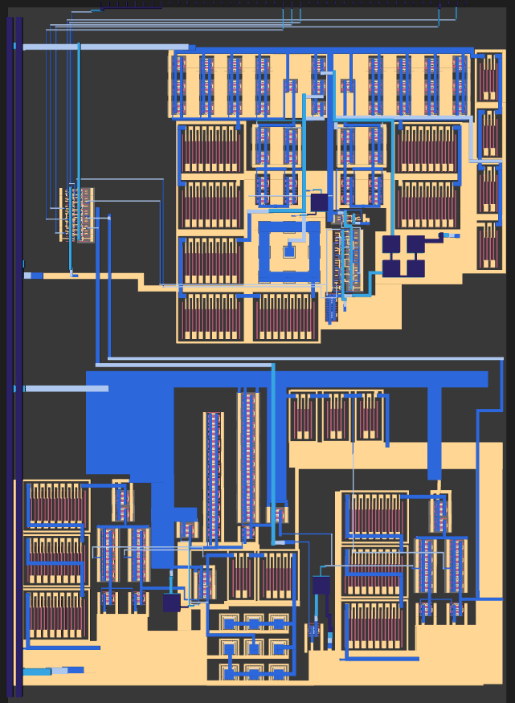
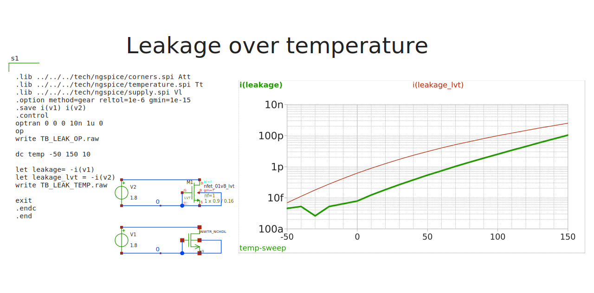

footer: Carsten Wulff 2026
slidenumbers:true
autoscale:true
theme: Plain Jane, 1
text:  Helvetica
header:  Helvetica
date: 2026-01-09

<!--pan_skip: --> 

#[fit] The Project

---

> _AIC is likely one of the most rewarding courses I’ve attended at NTNU. It gave me a lot of valuable knowledge on different types of circuits, IC design workflows and open source EDA tools that I greatly appreciate. It is also one of the most challenging courses, due to the amount of effort and time I had to spend in order to figure things out._ - Tord, AIC2025

---
<!--pan_ski: -->

The goal is for  you to experience a full mixed signal integrated circuit design, with the option of tapeout!

In 2025, two groups reached a tapeout of their design <http://analogicus.com/jnw-tt-2025/> on the <https://tinytapeout.com/chips/ttsky25a/> Tiny Tapeout shuttle.

<!--pan_doc: 
Below is the layout of group 6 <https://analogicus.github.io/jnw_gr06_sky130a/> and group 7 <https://analogicus.github.io/jnw_gr07_sky130a/>
-->
    

<!--pan_doc: 
Figure 1: Layout of group 6 and group 7 temperature sensors from AIC2025
-->

--- 

<!--pan_title: The Project -->

<!--pan_doc: 

The project will walk you through the full analog/digital design process. From specification all the way to a finished layout, and a potential tapeout. 

The project is not easy, it's rather hard. You'll experience frustration, desperation, epic wins, epic losses, stress, collaboration,
and you will figure out whether you love analog design, or digital design or neither. 

I promise that the design project closely matches how we would develop a circuit in industry. 

I ask a lot of you on the project, as such, it accounts for 45 % of the grade, and is maybe the thing that you'll learn the most from. 

In this document I'll go through the problem (what we're trying to solve), and the milestones that we'll use along the way. 

-->

#[fit] The problem 

---

### Complex System-on-chip have complex regulator systems 

<!--pan_doc:  

See the example in Figure 2 from Nordic Semiconductor's nRF54L15 product specification. 

VDD is the supply from the battery (1.7 V - 3.6 V). While the DECD, DECA and DECRF are the low voltage supplies for the digital, analog and radio. 

The VREGMAIN has both a DC/DC, and a LDO. We'll learn about those in the course. For now it's sufficient to know that the DC/DC converts 
power drawn on the low supply (DECA,DECD,DECRF) to power drawn from the high supply (VDD), while the LDO has the samme current on low supply as the high supply, but the voltage is different. 

You will learn in the course that the typical systems inside VREGMAIN are complicated, and sometimes complex, analog circuits. 

From the datasheet you'll see that the lowest power state is about 700 nA, while the highest power state is about 10 mA. The high power state is 14 thousand times higher than the low power state!

-->

<!--pan_doc: 
Figure 2: Power system of nRF54L15 
-->

---

### Leakage current varies orders of magnitude over temperature

<!--pan_doc: 

The sub-threshold leakage current in a MOSFET is

-->

  

$$I_{leak} = I_0 e^{-V_{th}/n V_T} \left(1 - e^{-V_{ds}/V_T}\right)$$

<!--pan_doc:

The change in leakage as a function of temperature is rather complicated. The $V_T = \frac{k T}{q}$ factor is easy,
but both $I_0$ and $V_{th}$ have a complicated relation to temperature. 

In Figure 3 you can see the leakage simulation (from <http://analogicus.com/lelo_aic_sky130a/>)

-->

---

 

<!--pan_doc: 
Figure 3: Leakage simulation 
-->

---

<!--pan_doc: 

Based on the previous curves we could run a thought experiment. 

-->

- Assume 1 pA at 25 C, and 1 nA at 125 C, per logic cell 

- Assume 100 million logic cells

- Leakage at 25 C => 100 uA

- Leakage at 125 C => 100 mA !!!

---

### We would like to know the temperature on die

- Assume we use 1 % of the load current for the regulator 

- At 25 C => 1 uA 

- At 125 C => 1 mA 

Insanely difficult to design a regulator that is efficient across the full range. 

It would be good if we could know temperature. 

---

### There are proposed solutions 

In [@tang20] they used a leakage based digital ring oscillator.  

# The Project: Design a temperature sensor 

| Parameter       | Value | Unit | Description                                                    |
|-----------------|-------|------|----------------------------------------------------------------|
| Area            | <10   | km^2 |                                                                |
| Conversion time | < 30  | us   | Should finish in one 32768 Hz clock period                     |
| Sample rate     | 100   | ms   |                                                                |
| Leakage current | < 1   | nA   |                                                                |
| Active current  | < 100 | uA   |                                                                |
| Average current | < 50  | nA   | Active current x conversion time/sample rate + leakage current |
| Accuracy        | +-5   | C    | One temperature (25C) calibration                              |
| Accuracy        | +-1   | C    | Two temperature (25C, 85C) calibration                         |

---

## Milestone 0: The tutorial 

<!--pan_doc: 

The goal of milestone 0 is to force you to install the tools, and get 

-->

Follow: [Sky130nm Tutorial](https://analogicus.com/aic2025/2025/01/01/Sky130nm-tutorial.html)

Submit link to your github repository on blackboard

For example, my repository:
[LELO\_EX\_SKY130A](http://analogicus.com/lelo_ex_sky130a/)

**The exercise will  teach you the skills you need to do the project**

---

## Milestone 1: 

## Milestone 2:

## Milestone 3:

## Milestone 4:

## Milestone 5:

