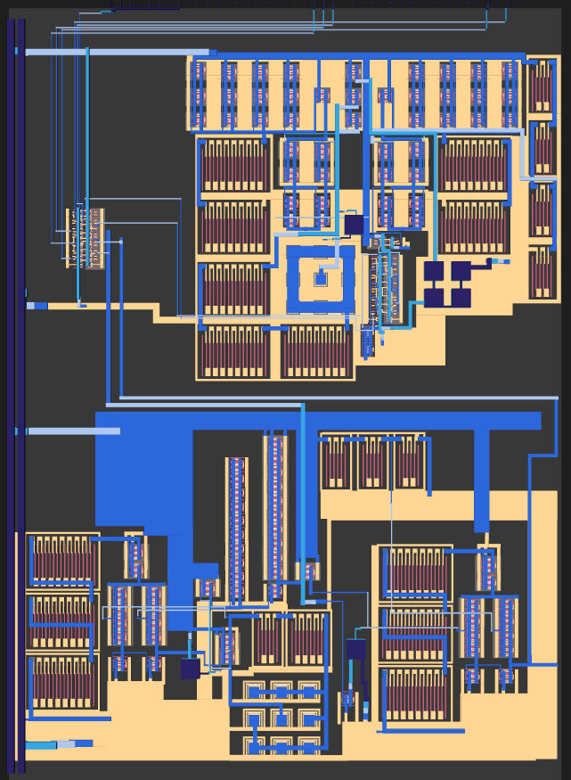
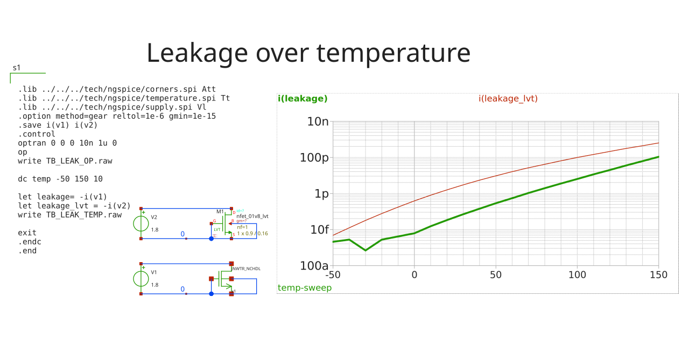

footer: Carsten Wulff 2026
slidenumbers:true
autoscale:true
theme: Plain Jane, 1
text:  Helvetica
header:  Helvetica
date: 2026-01-09

<!--pan_skip: --> 

#[fit] The Project

---

<!--pan_doc:
> AIC is likely one of the most rewarding courses I’ve attended at NTNU. It gave me a lot of valuable knowledge on different types of circuits, IC design workflows and open source EDA tools that I greatly appreciate. It is also one of the most challenging courses, due to the amount of effort and time I had to spend in order to figure things out. - Tord, AIC2025

-->

> A fantastic project/course that just might turn your world upside down, push you to re-evaluate your life choices, and stare briefly into the existential void… all while being deeply enjoyable and engaging! - Domen, AIC2025 

---
<!--pan_ski: -->

The goal of the project is for you to experience a full mixed signal integrated circuit design, with the option of tapeout!

In 2025, two groups reached a tapeout of their design <http://analogicus.com/jnw-tt-2025/> on the <https://tinytapeout.com/chips/ttsky25a/> Tiny Tapeout shuttle.

<!--pan_doc: 
Below is the layout of group 6 <https://analogicus.github.io/jnw_gr06_sky130a/> and group 7 <https://analogicus.github.io/jnw_gr07_sky130a/>
-->
    

<!--pan_doc: 
Figure 1: Layout of group 6 and group 7 temperature sensors from AIC2025
-->

--- 

<!--pan_title: The Project -->

<!--pan_doc: 

The project will walk you through the full analog/digital design process. From specification all the way to a finished layout, and a potential tapeout. 

The project is not easy, it's rather hard. You'll experience frustration, despair, epic wins, epic losses, stress, collaboration,
and you will figure out whether you love analog design, or digital design or neither. 

I promise that the design project closely matches how we would develop a circuit in industry. 

I ask a lot of you on the project, as such, it accounts for 45 % of the grade, and is maybe the thing that you'll learn the most from. 

In this document I'll go through the problem (what we're trying to solve), and the milestones that we'll use along the way. 

-->

<!--pan_skip: -->

#[fit] The challenge
#[fit] Design a temperature sensor

---

<!--pan_doc: 

# The challenge

The assignment is to  Design a temperature sensor

But why? I'll try to explain.

-->

## System-on-chip have complex regulator systems 

<!--pan_doc:  

See the example in Figure 2 from Nordic Semiconductor's nRF54L15 product specification. 

VDD is the supply from the battery (1.7 V - 3.6 V). While the DECD, DECA and DECRF are the low voltage supplies for the digital, analog and radio. 

The VREGMAIN has both a DC/DC, and a LDO. We'll learn about those in the course. For now it's sufficient to know that the DC/DC converts 
power drawn on the low supply (DECA, DECD, DECRF) to power drawn from the high supply (VDD), while the LDO has the same current on low supply as the high supply, but the voltage is different. 

You will learn in the course that the typical systems inside VREGMAIN are complicated, and sometimes complex, analog circuits. 

From the data-sheet you'll see that the lowest power state is about 700 nA, while the highest power state is about 10 mA. The high power state is 14 thousand times higher than the low power state!

-->

<!--pan_doc: 
Figure 2: Power system of nRF54L15 

Those numbers are the total current consumption. That includes switching currents from digital,
analog bias currents, and leakage currents. In modern technologies, because of the low threshold voltage, the leakage currents can be a large part of the total current budget.

-->

---

## Leakage current varies orders of magnitude over temperature

<!--pan_doc: 

The sub-threshold leakage current in a MOSFET is

-->

  

$$I_{leak} = I_0 e^{-V_{th}/n V_T} \left(1 - e^{-V_{ds}/V_T}\right)$$

<!--pan_doc:

The change in leakage as a function of temperature is rather complicated. The $V_T = \frac{k T}{q}$ factor is easy,
but both $I_0$ and $V_{th}$ have a complicated relation to temperature. 

In Figure 3 you can see the leakage simulation (from <http://analogicus.com/lelo_aic_sky130a/>)

-->

---

 

<!--pan_doc: 
Figure 3: Leakage simulation 
-->

---

<!--pan_doc: 

Based on the previous curves we could run a thought experiment. 

-->

- Assume 1 pA at 25 C, and 1 nA at 125 C, per logic cell 

- Assume 100 million logic cells

- Leakage at 25 C => 100 uA

- Leakage at 125 C => 100 mA !!!

---

## Why we would like to know the temperature on die

<!--pan_doc: 

Expanding on the thought experiment. 

-->

- Assume we use 1 % of the load current for the regulator 

- At 25 C => 1 uA for LDO

- At 125 C => 1 mA for LDO

It's insanely difficult to design a regulator that is efficient across the full range of leakage currents at any temperature. 

It would be good if we could know temperature. 

---

## How to measure temperature?

<!--pan_doc:
There are a multitude of ways to make a temperature sensor. In [@tang20] they used a leakage based digital ring oscillator, in [@jeong2014] they used a two-transistor MOSFET sensing element, in [@pertijs2005] they had a more complicated sigma-delta ADC sensing bipolar transistors. 

The design of a temperature sensor is more difficult than you think. As such, I would suggest that you don't go too crazy in your choice of sensor. So far, none has gotten close to the finish line with a sigma-delta ADC based sensor. 

In the previous years of Advanced Integrated Circuits most groups have chosen an architecture similar to [@park2022] Fig. 2. I would recommend you do the same, and that's what I'll target in the milestones. 

The principle of the temperature sensor is: 1) Create a current that is proportional to temperature (Lecture 3), 2) Convert current to frequency with a relaxation oscillator (Lecture 9). 3) Check the frequency to read the temperature.

In Figure 4 below you can see an illustration of the temperature sensor. 

A bandgap circuit is used to make a current that is proportional to absolute
temperature ($I_{PTAT}$) and a voltage that is complementary to absolute
temperature ($V_{CTAT}$). A relaxation oscillator converts the current and
voltage into a frequency ($f_{OSC}$). A digital finite-state-machine and a
counter converts the frequency to a digital value that is proportional to
temperature. 

I've made an example temperature sensor at [lelo\_temp\_sky130a](https://analogicus.com/lelo_temp_sky130a/). Feel free to steal ideas, and circuits, from that design.
-->

<!--pan_doc: 
Figure 4: Leakage simulation 
-->

---

# The Project

<!--pan_doc: 

I'm going to lead you through the design of a, to you, complicated mixed signal
circuit design. You will despair, you will not understand, but you will learn. 

In order to make the problem possible to learn, we're going to focus on one
milestone at a time. I hope that will enable you to not drown before we get
started. 

An illustration of the milestones can be seen in Figure 5. 

The first milestone is the design of the bandgap circuit, a pure analog design. The second milestone is the design of the relaxation oscillator. The third milestone is how you measure the frequency of the oscillator, and is usually done in SystemVerilog. 

The fourth milestone is optional, but you can't get an A in the course if you don't have some points from the layout and parasitic simulation milestone. 

The fifth milestone is an individual report. I will force you to work in groups. As such, it may be that some contribute more than others. To ensure that the grading is fair, the report will be individual. It's OK to share figures, tables, and so on, but the PDF shall be written by you and you alone.

The sixth and last milestone is the tapeout on <tinytapeout.com>. It's optional, and not everyone will get to that stage.

-->

--- 

 

<!--pan_doc: 
Figure 5: Project overview 
-->
---

<!--pan_doc: 

## Specification 

The temperature sensor shall be design to fit with the specification below. 

-->

| Parameter        | Value | Unit | Description                                                    |
|------------------|-------|------|----------------------------------------------------------------|
| Area             | < 10  | km^2 |                                                                |
| Conversion time  | < 30  | us   | Analog should only be active for one 32768 Hz period           |
| Sample rate      | 100   | ms   |                                                                |
| Leakage current  | < 1   | nA   |                                                                |
| Active current   | < 100 | uA   |                                                                |
| Average current  | < 50  | nA   | Active current x conversion time/sample rate + leakage current |
| Accuracy 0 - 70C | +-10  | C    | One temperature (25C) calibration                              |
| Accuracy 0 - 70C | +-5   | C    | Two temperature (25C, 85C) calibration                         |

---

## Grade

<!--pan_doc: 

Milestones are important, and Milestone 0 - 5 will count towards your final grade!

That means, you have to start working right away. 

The points have been designed such that it's impossible to get an A without
getting some points on the layout

-->

| Week | Deadline   | Milestone | Task                                                                       | Condition for more than 0 points                                       | Possible Points |
|:-----|------------|:----------|:---------------------------------------------------------------------------|:-----------------------------------------------------------------------|:----------------|
| 4    | 2026-01-23 | M0        | Complete tutorial                                                          | Link on blackboard                                                     | 5               |
| 7    | 2026-02-13 | M1        | Design a circuit that can convert a temperature into a current and voltage | Description of the circuit on github docs                              | 5               |
| 10   | 2026-03-06 | M2        | Design a circuit that can convert a temperature into a frequency           | Description of the circuit on github docs. Demonstrate that it works   | 10              |
| 13   | 2026-03-27 | M3        | A verilog testbench that can convert a frequency into a digital value      | Description of the testbench on github docs. Demonstrate that it works | 10              |
| 16   | 2026-04-17 | M4        | Layout of your circuit                                                     | DRC/LVS/GDS passing on github                                          | 20              |
| 18   | 2026-05-01 | M5        | Individual report                                                          | Uploaded to Inspera                                                    | 48              |
| ?    |            | M6        | Tapeout                                                                    | None                                                                   | 0               |
|      |            | Coolness  | Extra points that I may choose to award                                    |                                                                        | 10              |
|      |            | Total     |                                                                            |                                                                        | 108             |

---

## Milestone 0: The tutorial 

__Goal__: force you to install the tools, and get you started. 

Follow [Sky130nm Tutorial](https://analogicus.com/aic2026/sky130nm_tutorial)

__Delivery__: Submit link to your github repository on blackboard

For example, my repository: [LELO\_EX\_SKY130A](http://analogicus.com/lelo_ex_sky130a/)

**The exercise will teach you the skills you need to do the project**

---

## Milestone 1: The bandgap

__Goal__: Create a circuit that can transform a
temperature on the integrated circuit to a current proportional to temperature (PTAT), and a voltage
complementary to temperature (CTAT). 

<!--pan_doc: 

For this purpose it's common to use "Bandgap" circuits. We'll learn about them
in the course, but if you don't want to wait then  you should read
<https://analogicus.com/aic2026/references_and_bias>
and ask me questions in reference and bias lecture.

In the git repository for your group you'll create schematics for the bandgap
circuits, and you'll make test-benches to check that the bandgap circuit works.

If you don't know what you should simulate and verify, it's good to have a chat to chat.
See <https://chatgpt.com/share/69481b11-8830-8007-9986-c9e41d735cfc>. 

Or check my test-benches at <https://github.com/wulffern/lelo_temp_sky130a/tree/main/sim/LELOTEMP_BIAS_IBP>

-->

__Delivery__: Link to your github repository with a description of
how the bandgap works.

---

## Milestone 2: The oscillator

__Goal__: Use the PTAT current, and the CTAT voltage an
create a oscillator. 

<!--pan_doc: 

One way is to charge a capacitor with the current, and have a comparator trigger
when the voltage on the capacitor reaches a voltage (CTAT voltage for example). 
When the comparator triggers, then we can reset the capacitor.

This is similar
to what group 7 did last year (one of the groups got all the way to tapeout).
One difference, though, is that group 7 used VDD/2 as the reference. I would
recommend you use the CTAT voltage from the bandgap instead. That way, the
oscillation frequency is independent (to first order) from the VDD.

-->

__Delivery__ Link to your github repository with description on
how your oscillator works. There should be proof on how it works.

---

## Milestone 3: The measurement

__Goal__: Measure the frequency of the oscillator. 

<!--pan_doc: 
In the system we can assume we have an accurate 32768 Hz clock source. One way
to find the frequency is to run the oscillator for a fixed number of clock
cycles on the 32768 Hz clock, and have a counter that can count the output
pulses. 

Assume we counted 128 clock cycles over 2 clock periods of the 32768 Hz clock.
That would mean the frequency of the oscillator was approximately 2.09 MHz. Once
we have the frequency we can calculate the temperature. 

I would recommend that you write in verilog the system to start the oscillator,
count for a number of 32768 Hz clock cycles, and transform the frequency into a
temperature. 

-->

__Delivery__: Link to your github repository where you describe
how you measure the frequency of the oscillator.

---

## Milestone 4 (Optional): The physical design

__Goal__: Do the physical layout of your oscillator, and
prove that it still works with the layout parasitics. 

<!--pan_doc:

If you do the layout, then your design must fit within a digital 1x1 tinytapeout
block. I've made a template at
<https://github.com/wulffern/lelo_temp_sky130a/blob/main/design/LELO_TEMP_SKY130A/tt_block_1x1_pg.mag>
that you can use. If the design does not fit within that space, then you won't
be able to tapeout.

When your design is complete, then the DRC, LVS, GDS actions should be passing
on github. 

-->

__Delivery__: Link to your github repository with passing GDS,
DRC, LVS actions. 

---

## Milestone 5: The Report

__Goal__: Write a report 

__Delivery__: A PDF copy of the report in Inspera. You'll all write an individual report. The report shall be in the IEEE template. 

See further details in <https://analogicus.com/aic2026/how_to_write_a_project_report>

--- 

## Milestone 6 (Optional): The Tapeout

Target TTSKY26b tapeout (June 2026) on <https://tinytapeout.com/chips/>

Those students that follow the course at NTNU will be able to tapeout if the design is complete. I've gotten [Nordic Semiconductor](https://nordicsemi.com) to sponsor the tapeout for 2026.

---

#[fit] Thanks!

