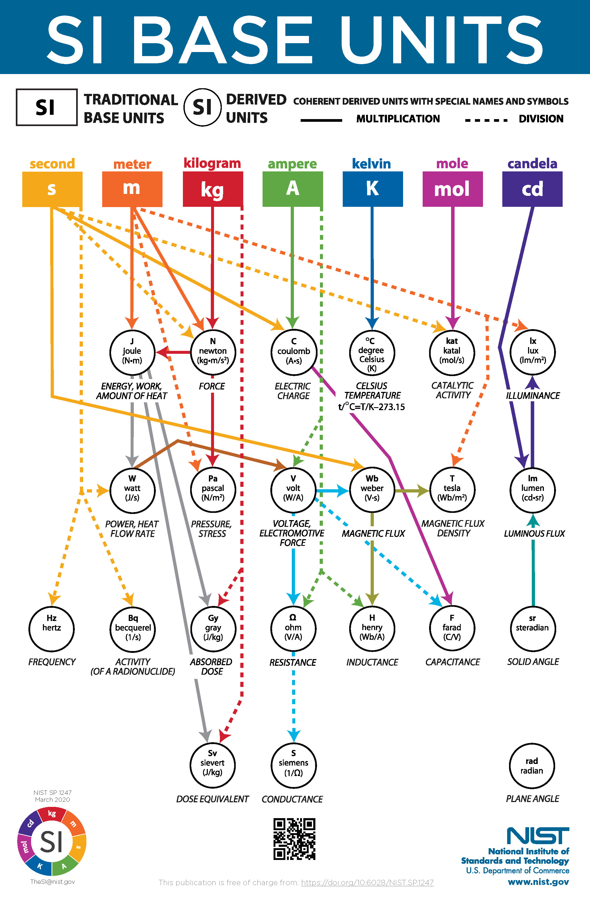
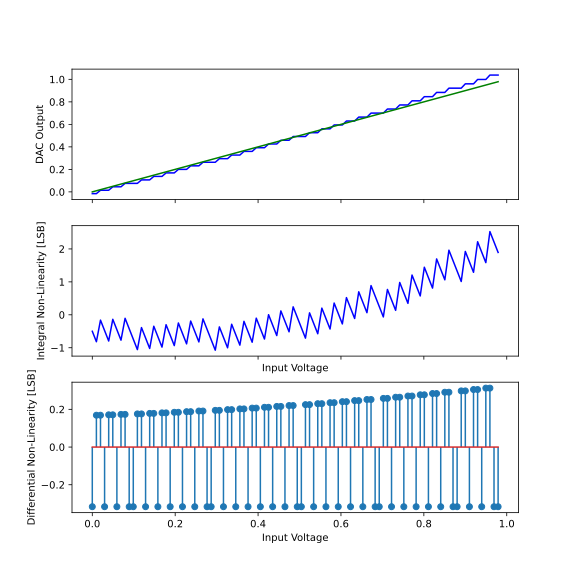
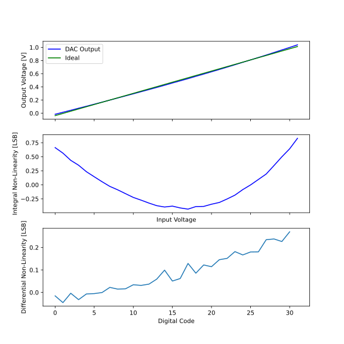

footer: Carsten Wulff 2026
slidenumbers:true
autoscale:true
theme: Plain Jane, 1
text:  Helvetica
header:  Helvetica
date: 2026-02-06

<!--pan_title: Digital to analog conversion-->

<!--pan_doc 

**Keywords:**

**Status:**

-->

<!--pan_skip: -->

#[fit] Digital to Analog Conversion

---

<!--pan_doc: 

Processing of signals has shifted into the digital domain. But the real world is
analog. In order to interact with the analog we need to convert the digital
signals (discrete-value, discrete-time) back to analog signals (continuous
value, continuous time).

The SI base units define the fundamental analog quantities as second, meter, kilogram,
ampere, kelvin, mole and candela (</aic2026/a_refresher>). Assume that
electronic circuits interact with the real world in terms of second and ampere.

Related to Ampere we have the derived units of charge (Ampere Seconds), Volt
(W/A), Ohm (V/A), or indeed Simens (1/$\Omega$). 

-->

<!---->

<!--pan_doc:

As such, to create a digital to analog converter, we somehow have to create a
circuit that has a function of 

-->

 $$ I_{out} = D_{in} \times I_{ref}\text{ [I]} $$
 
 $$ t_{out} = D_{in} \times t_{ref}\text{ [s]} $$

 $$ Q_{out} = D_{in} \times Q_{ref}\text{ [C]} $$

 $$ V_{out} = D_{in} \times V_{ref}\text{ [V]} $$
 
 $$ R_{out} = D_{in} \times R_{ref}\text{ [}\Omega\text{]} $$
 
The digital value is dimensionless, as such, there must be a reference value

---

Digital to analog conversion can be indirect through the relations between voltage, resistance, current, time, inductance and capacitance. 

$$ V = R I $$

$$ Q = C V $$ 

$$ dt = \frac{C dV}{I} $$

$$ dt = \frac{L dI}{V} $$

--- 

#[fit] Resistor based DACs

---

$$ I_{ref} = \frac{V_{ref}}{3 R}$$

$$ V_{out} = D_{in} R I_{ref} = \frac{D_{in} R V_{ref}}{3 R} \text{ [V]} $$

$$ V_{out} = \frac{b_0 2 R V_{ref}}{3 R}  + \frac{\overline{b_0} R V_{ref}}{3 R} $$

$$  V_{out} = \begin{cases} 
\frac{2}{3} V_{ref}, & b_0 = 1 \\
\frac{1}{3} V_{ref}, & b_0 = 0 
\end{cases}
$$

--- 

$$ I_{ref} = \frac{V_{ref}}{2 R}$$

$$ V_{out} = \frac{b_0 2 R V_{ref}}{2 R}  + \frac{\overline{b_0} R V_{ref}}{2 R} $$

$$  V_{out} = \begin{cases} 
 V_{ref}, & b_0 = 1 \\
\frac{1}{2} V_{ref}, & b_0 = 0 
\end{cases}
$$

---

<!--pan_skip: -->

| b  | Vo/Vr | Vo/Vr |
|:---|:------|-------|
| 00 | 1/4   | 0/4   |
| 01 | 2/4   | 1/4   |
| 10 | 3/4   | 2/4   |
| 11 | 4/4   | 3/4   |

What is correct?

---

#[fit] DAC errors

---

Digital to analog converters do not add quantization error. The quantization error is already in the digital word.

$$ V_{out} = a_1^1 D_{in}^1 + B + \left( a_n^n D_{in}^n + ... a_2^2 D_{in}^2\right) $$

DAC output will contain gain errors, offset errors, and non-linear components

---

$$ DNL[k] = \frac{V[k+1] - V[k]}{V_{LSB}} - 1 $$

$$ INL[k] = \frac{V[k] - V_{ideal}[k]}{V_{LSB}} $$

--- 

#[fit] DAC complexity

---

As number of resistors grow, the switches grow as 

$$ \sum_{n=1}^{N} 2^n = 2^{N+1} - 2 $$

--- 

Use a matrix with R rows and C columns. Need R + C switches, or

$$ 2^{N} + 2^{N/2} $$

---

Switches in a 10-bit digital to analog converter.

$$
\begin{array}{ll}
\text{Tree: } &2^{N+1}-2 = 2046 \\
\text{Matrix : } &2^{N}  + 2^{N/2}  = 1056 \\ 
\text{6b Matrix + 4b Tree: } & 2^{M+1} - 2 + 2^{N} + 2^{N/2} = 80 
\end{array}
$$

Large number of bits, will be large number of resistors and switches. 

---

#[fit] Binary scaled DACs

---

$$ R_{in} = 2R || 2R = R $$

---

$$ R_{in} = R + R = 2R $$

$$ I_{0} = \frac{V_0}{2R} = \frac{V_1}{4R} $$

---

$$ R_{in} = 2R || 2R = R $$

$$ I_{0} = \frac{V_0}{2R} = \frac{V_1}{4R} $$

$$ I_{1} = \frac{V_1}{2R}$$

---

$$ I_{RF} = I_1b_1 + I_0b_0 = \frac{V_{REF}}{2R}b_1 + \frac{V_{REF}}{4R}b_0 $$

$$ V_{O} = \left(\frac{V_{REF}}{2R}b_1 + \frac{V_{REF}}{4R}b_0\right)R_{F0}$$

---

## Binary coding 

For 4 states (2-bit) there are 12 possible transitions

---

Assume MSB first (left) 

$$ 1 \rightarrow 3 \rightarrow 2 $$

Assume LSB first (right) 

$$ 1 \rightarrow 0 \rightarrow 2 $$

Both cause a non-monotonic glitch during transition. 

--- 

## Thermometer encoding 

--- 

The sequence of MSB to LSB does not matter. 

$$ 0 \rightarrow 1 \rightarrow 2  \rightarrow 3$$

--- 

<!--pan_skip: -->

--- 

#[fit] Current mode DACs

---

--- 

---

<!--pan_skip: -->

[.column]

$$ I_{out} = D_{in} \times I_{ref}\text{ [I]} $$

$$ V_{out} = D_{in} \times V_{ref}\text{ [V]} $$
 
$$ R_{out} = D_{in} \times R_{ref}\text{ [}\Omega\text{]} $$

 

$$ t_{out} = D_{in} \times t_{ref}\text{ [s]} $$

$$ Q_{out} = D_{in} \times Q_{ref}\text{ [C]} $$

[.column]

$$ V = R I $$

$$ Q = C V $$ 

$$ dt = \frac{C dV}{I} $$

$$ dt = \frac{L dI}{V} $$

<!--pan_doc: 

[@cjm11]
-->

---

# References

A 28-nm 75-fsrms Analog Fractional-N Sampling PLL With a Highly Linear DTC Incorporating Background DTC Gain Calibration and Reference Clock Duty Cycle Correction [@wu19]

A 10-bit Charge-Redistribution ADC Consuming 1.9 uW at 1 MS/s [@elzakker10]

A 6.3 uW 20 bit Incremental Zoom-ADC with 6 ppm INL and 1 uV Offset [@chae13]

A 12-Bit 1.25-GS/s DAC in 90 nm CMOS With >70 dB SFDR up to 500 MHz [@tseng11]
