footer: Carsten Wulff 2026
slidenumbers:true
autoscale:true
theme: Plain Jane, 1
text:  Helvetica
header:  Helvetica
date: 2026-01-15

<!--pan_title: Circuits -->

# Circuits

<!--pan_doc: 

<iframe width="560" height="315" src="https://www.youtube.com/embed/VKkOr--6FV4?si=MZI-iDjn-2VJynFR" title="YouTube video player" frameborder="0" allow="accelerometer; autoplay; clipboard-write; encrypted-media; gyroscope; picture-in-picture; web-share" referrerpolicy="strict-origin-when-cross-origin" allowfullscreen></iframe>

Most of the circuit design on integrated circuits uses MOSFET transistors. This document provides a short 
refresh of the most common circuits and their properties. 

But first, how should transistors be used, and sized. 
-->

---

# Transistor size and bias point

---

<!--pan_doc:

In Figure 1 and Figure 2 we can see two transistors. One with short gate length (approximately 1F2 = 1.2 x minimum gate length) and 
one with longer gate length (approxmiately 5F0 = 5.0 x minimum gate length). The width of both transistors is sufficient to have 2 contacts on the drain/source (2C). 

These transistors come from a standard transistor library I've made, and that can be found at [JNW_ATR_SKY130A](https://analogicus.github.io/jnw_atr_sky130A/).

-->

<!--pan_doc: 
Figure 1: JNWATR_PCH_2C1F2 transistor  
-->

<!--pan_doc: 
Figure 2: JNWATR_PCH_2C5F0 transistor  
-->

<!--pan_doc:

In all our circuits we will need to pick the right size, but how should we do it?

By now you should know that MOSFETs have different regions of operation. Related to the $V_{GS}$ we talk about 
weak inversion, moderate inversion and strong inversion. These names correspond directly to the density of 
charge carriers in the thin inversion layer underneath the oxide in the channel. See [MOSFETs](https://analogicus.com/aic2026/mosfets) 
lecture for details. 

In Figure 3 we can see how the log of the current changes behavior at low $V_{GS}$ versus at large $V_{GS}$. 
As such, when we pick the transistor size we should be consioucs of which region we operate the transistor in. The 
regions (weak, moderate, strong) have behavior differences. 

-->

---

<!--pan_doc: 
Figure 3: Log of drain current versus gate/source voltage  
-->

<!--pan_doc: 

One of the behavior differences is the "bang-for-the-buck". For a circuit we may target a specific number for the
transconductance ($g_m$). In Figure 4 we can see how the $g_m/I_D$ changes as we sweep the $V_{GS}$

In weak inversion, we have a large bang for the buck 

$$ g_m/I_D \approx 1/n/V_T \approx 1/1.5/26\text{ mV} \approx 25$$

While in strong inversion 

$$ \frac{g_m}{I_D} = 2 \frac{1}{V_{eff}}$$

where the effective overdrive is 

$$V_{eff} = V_{GS} - V_{TH}$$

In moderate inversion, the $g_m/I_D$ is somewhere between the two. 

Assume we need a transconductance of 1 mS. If we have a $g_m/I_D = 10$, then we'd need at least 100 $\mu$A in the 
transistor. If we had a $g_m/I_D = 15$, then we'd only need 66 $\mu$A in the transistor. 

-->

---

<!--pan_doc: 
Figure 4: gm/Id (Y-axis) versus Gate voltage (X-axis)  
-->

---

<!--pan_doc: 

When the $g_m/I_D$ choice is made, then there are some things that have already been determined. One is the 
necessary drain/source voltage for the transistor to operation in "saturation" or "linear" region. 

For most circuits we want the transistor to operate in "saturation" region, as such, we must provide a certain 
drain source voltage. 

In Figure 5 you can see how the $V_{dsat}$ of the transistor changes as the $g_m/I_D$ changes. 

Notice that the two transistor have different $V_{dsat}$. The shorter transistor needs less voltage across drain/source
to operate in saturation. 

-->

<!--pan_doc: 
Figure 5: Vdsat versus gm/Id  
-->

---

<!--pan_doc: 

The choice of $g_m/I_D$ also determine how much the gate source voltage will be. It's actually rare we control 
the gate voltage directly to set the bias point of the transistor. It's more common to bias transistors with 
a current, and let the $V_{GS}$ be whatever the $V_{GS}$ needs to be. 

In Figure 6 we can see that at $g_m/I_D$ of 15 we have a lower $V_{GS}$ than $g_m/I_D$ of 10. 

-->

<!--pan_doc: 
Figure 6: Vg versus gm/Id  
-->

---

<!--pan_doc: 

The choice between the two transistors come down to "What intrinsic gain do I need in my transistor?". 

For current mirrors we really don't want the output current to change with $V_{DS}$ 
so we want a small conductance ($g_{ds}$), or a large intrinsic gain ($g_m/g_{ds}$).

In Figure 7 we can see how the intrinsic gain of the two transistors is different. For the 1F2 we can also see
there is some funky behavior above gm/id of 20, I don't know why, but I suspect something funky in the model (non-physical)

-->

<!--pan_doc: 
Figure 7: gm/gds versus gm/Id  
-->

---

# Transistor sizing strategy 

## Option 1: Full freedom 

<!--pan_doc: 

If you really want to dig deep, and get your transistor size exactly correct, then
method that makes most sense to me, is to use the inversion-coefficient method, described in 

--> 

- [Nanoscale MOSFET Modeling: Part 1](https://ieeexplore.ieee.org/document/8016485) 
- [Nanoscale MOSFET Modeling: Part 2](https://ieeexplore.ieee.org/document/8110872).

<!--pan_doc: 

This is similar to a gm/Id strategy, but we're rather looking directly at the inversion level 

The inversion coefficient tells us how strongly inverted the MOSFET channel (inversion layer) is. 
A number below 0.1 is weak inversion, between 0.1 and 10 is moderate inversion. 
A number above 10 is strong inversion.

There are also some blog posts worth looking at [Inversion Coefficient Based Circuit Design](https://kevinfronczak.com/blog/inversion-coefficient-based-circuit-design) and  [My Circuit Design Methodology](https://kevinfronczak.com/blog/my-circuit-design-methodology).

--> 

## Option 2: Constrained 

<!--pan_doc:

"Full transistor size freedom" "is similar to giving a loaded gun to a kid and say "don't shoot yourself". 
It's a bad idea!

If you're inexperienced with transistor sizing I would highly recommend to pick a few transistors, and compute 
the parameters ($V_{GS}$, $V_{dsat}, ...) for the transistor, and then use a limited set. 

That's exactly what I've done in 
-->

[JNW\_ATR\_SKY130A](https://analogicus.github.io/jnw_atr_sky130A/)

---

# My circuit does not work, why????????????????

---

<!--pan_doc: _

The reason is usually that the transistors are not operating in the right region. So either the $V_{GS}$ is causing problems
or the $V_{VDS}$ is not high enough. 

-->

<!--pan_doc: 
Figure 8: Gate-source voltage as a function of corner  
-->

---

<!--pan_doc: 
Figure 9: Drain Saturation Voltage as a function of corner  
-->

---

<!--pan_doc: 

As such, for any transistor design, it's necessary to see exactly what voltages and currents
flow in your transistors. 

Most tools can show the operating point in the schematic, which makes it easier to figure out what the 
voltages and currents are. In Figure 10 we can see an example from [TB\_JNW\_TEMP\_OP](https://github.com/wulffern/jnw_temp_sky130a/blob/main/design/JNW_TEMP_SKY130A/TB_JNW_TEMP_OP.sch)

-->

<!--pan_doc: 
Figure 10: Example of operating point annotation 
-->

---

#[fit] Current Mirrors

---

<!--pan_doc: 

MOSFETs need a current for the transistor to be biased in the correct operating region. The current must come from somewhere, we'll look at bias generators later. Usually there is a central bias circuit that provides a single, good, reference current.

On an IC, however, there will be many circuits, and they all need a bias current (usually). As such, we need a circuit to copy a current. 

In the figure below you can see a selection of current mirrors. They all do the same thing. Try to ensure that $i_i$ and $i_o$ are the same current. 

Which one we choose is usually determined by what we mean by $i_i = i_o$. Do we mean "within $\pm$ 10 %", or "within $\pm$ 2 %". 

-->

<!--pan_doc: 
Figure 11: Example of current mirrors 
-->

---

## Normal current mirror

<!--pan_doc: 

The normal current mirror consists of a diode connected transistor ($M_1$) and a common source transistor $M_2$. 

If we assume infinite output resistance of the MOSFETs, then the drain voltage does not affect the current. 

If the two transistors are the same size, threshold voltage, mobility, etc, and they have the same gate-source voltage, then the current in them must be the same. 

A current pushed into $M_1$ will cause the $V_{GS1}$ to rise, and at some point, find a stable point where the current pushed in is equal to the current in $M_1$

$M_2$ will see the same $V_{GS1} = V_{GS2}$ so the current will be the same, provided the voltage at $i_o$ is sufficient to pinch-off the channel of $M_2$, or 
the $V_{DS2} \approx 3 kT/q$ if the transitor is in weak-inversion.

The output resistance of a normal current mirror is simply the $r_{ds}$ of the output transistor. 

-->

<!--pan_doc: 
Figure 11: Normal current mirror
-->

---

## Source degenerated current mirror

<!--pan_doc: 

In most modern technologies, and if we care about the output current accuracy, then a normal current mirror 
cannot give us a sufficient independence of the drain/source voltage. 

For more advanced current mirrors, it's almost always to increase the output resistance, and make it more like a 
current source. 

In Figure 12 we can see a current mirror with resistors on source. 

-->

<!--pan_doc: 
Figure 12: Source degenerated current mirror 
-->

---

<!--pan_doc:

Observe the small signal model in Figure 13. If we now apply a test current $i_x$ we can compute 
what the output resistance is ($r_{out} = v_{x}/i_x$) 

-->

<!--pan_doc: 
Figure 13: Source degenerated current mirror small signal model 
-->

$$v_{gs} = -v_{s}$$, $$v_{s} = i_x R_s$$, $$r_{out} = \frac{v_x}{i_x}$$

$$i_x = g_{m2} v_{gs} + \frac{v_x - v_s}{r_{ds2}}$$

$$i_x = -i_x g_{m2} R_s + \frac{v_x - i_x R_s}{r_{ds2}}$$

$$v_x = i_x\left[ r_{ds2} + R_s(g_{m2} r_{ds2} + 1)\right]$$ 

Rearranging

$$ r_{out} =  r_{ds2}[1 + R_s(g_{m1} + g_{ds2})] \approx r_{ds2} [1 + g_{m1}R_s]$$ 

---

## Cascoded current mirror 

<!--pan_doc:

To further increase the output resistance, we can move to a cascoded current mirror as shown in Figure 15.

Now we need a separate voltage to bias the cascode to ensure that the source node of $M_3$ keeps the 
drain node of $M_1$ above $V_{DSAT}$. 

If we bias the cascode correctly, then even if the voltage at $i_o$ changes, then the source of $M_4$ does 
not really change, and the current in $M_2$ stays the same. 

-->

<!--pan_doc: 
Figure 14: Cascoded current mirror
-->

From source degeneration (ignoring bulk effect)

$$r_{out} =  r_{ds4}[1 + R_s(g_{m4} + g_{ds4})] $$

$$ R_S = r_{ds2} $$

$$
r_{out} =  r_{ds4}[1 + r_{ds2}(g_{m4} + g_{ds4})] 
$$

$$
r_{out} \approx  r_{ds2}(r_{ds4}g_{m4})
$$

---

## Active cascodes

<!--pan_doc:

If we need even higher output resistance, then we can add a operational transconductance 
amplifier (OTA) to the gate of the cascode to further increase the $g_m$ of the cascode. 

In OTAs it's common to increase the open loop gain by increasing the output resistance. The 
output stage of an OTA is usually current mirrors, as a result, one can end up with active cascodes in the OTA
that is used in the active cascode of the current mirror. All horribly complicated, but sometimes necessary. 

-->

$$
r_{out} \approx  r_{ds2}(A r_{ds4} g_{m4})
$$

<!--pan_doc: 
Figure 15: Active cascode current mirror 
-->

---

#[fit] Amplifiers

<!--pan_doc: 

There are usually three amplifiers that we consider when we talk about single transistors. Common Source, Common Gate and Source Follower. 

For two transistors there are a few more possiblities. I'd highly recommend [Fifty Nifty Variations of Two-Transistor Circuits: A tribute to the versatility of MOSFETs](https://ieeexplore.ieee.org/document/9523464)

<iframe width="560" height="315" src="https://www.youtube.com/embed/jL7MVr5wY5w?si=kMQN5iOJYzmTbg3e" title="YouTube video player" frameborder="0" allow="accelerometer; autoplay; clipboard-write; encrypted-media; gyroscope; picture-in-picture; web-share" referrerpolicy="strict-origin-when-cross-origin" allowfullscreen></iframe>

-->

<!--pan_skip: -->

- Single transistor: Common Source, Common Gate and Source Follower.
- Two transistors: [Fifty Nifty Variations of Two-Transistor Circuits: A tribute to the versatility of MOSFETs](https://ieeexplore.ieee.org/document/9523464)

---

##[fit] Source follower

<!--pan_doc: 

The source follower can be seen in Figure 16. The input signal is at the gate, and the output at the source.  The properties of the source follower are 

-->

Input resistance $$\approx \infty$$

Gain $$ A = \frac{v_o}{v_i}$$

Output resistance $$r_{out}$$

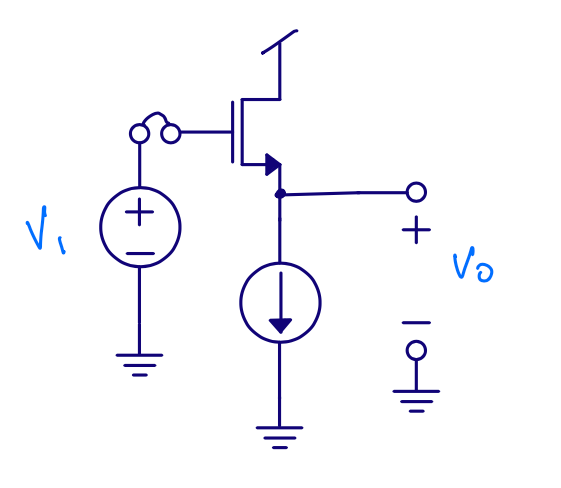

<!--pan_doc: 
Figure 16: Source follower 
-->

---

### Small signal gain 

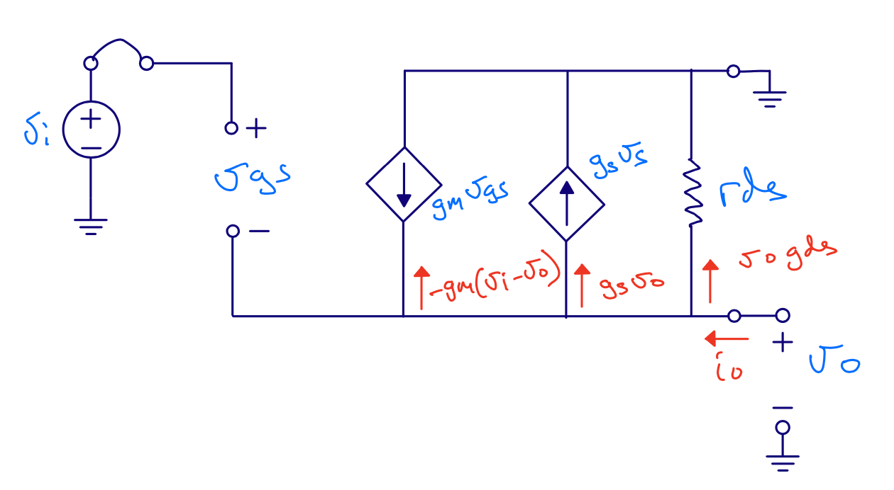

<!--pan_doc: 
Figure 17: Source follower small signal model
-->

$$ i_o = v_o (g_{ds} + g_{s}) - g_{m} v_i + v_o g_m $$

$$ i_o = 0 $$

$$ g_m v_i = v_o ( g_m + g_s + g_{ds} ) $$

$$ A = \frac{v_o}{v_i} = \frac{g_m}{g_m + g_{ds} + g_s} $$

**Gain is less than 1**

---

## Output resistance 

$$ i_o = v_o (g_{ds} + g_{s}) - g_{m} v_i + v_o g_m $$

$$v_i = 0$$

$$ i_o = v_o (g_{ds} + g_{s} + g_m) $$

$$ r_{out} = \frac{v_o}{i_o} = \frac{1}{g_m + g_{ds} + g_{s}} $$

$$ r_{out} \approx \frac{1}{g_m}$$

---

## Why use a source follower?

Assume 100 electrons

[.column]

$$ \Delta V  = Q/C  = -1.6 \times 10^{-19} \times 100 / (1\times 10^{-15}) = - 16\text{ mV} $$ 

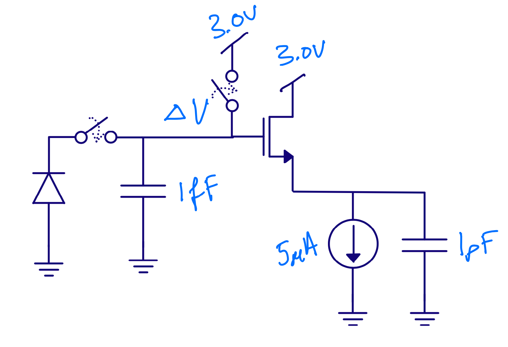

[.column]

$$ \Delta V  = Q/C  = -1.6 \times 10^{-19} \times 100 / (1\times 10^{-12}) = - 16\text{ uV} $$ 

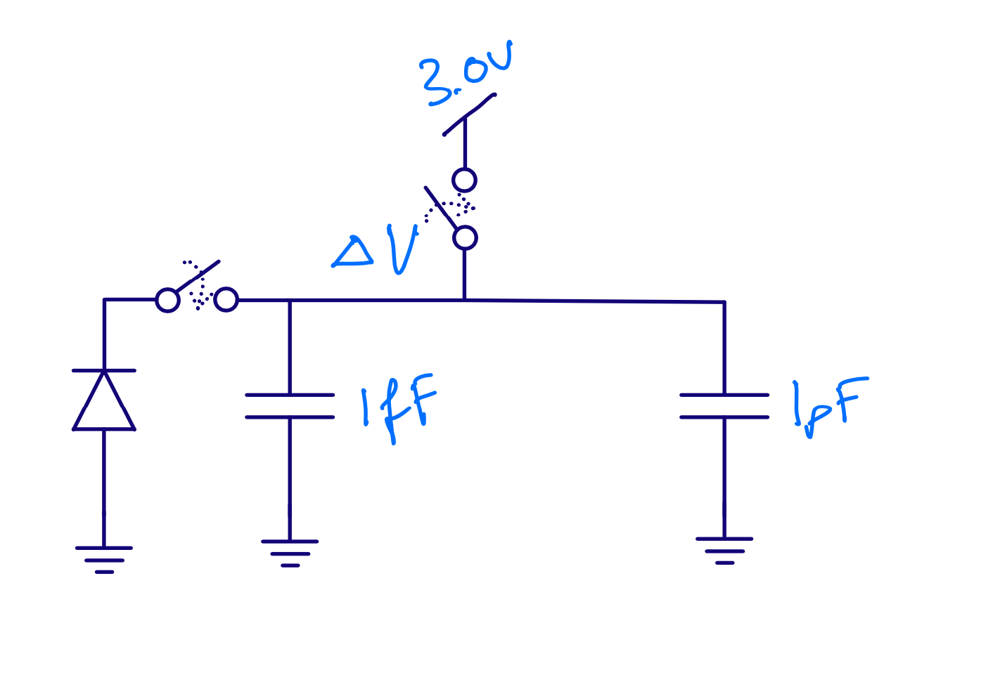

<!--pan_doc: 

Another example of a source follower can be found in [A 92.5mW 205MS/s 10b Pipeline IF ADC Implemented in 1.2V/3.3V 0.13μm CMOS](https://ieeexplore.ieee.org/document/4242465)

-->

---

#[fit] Common gate

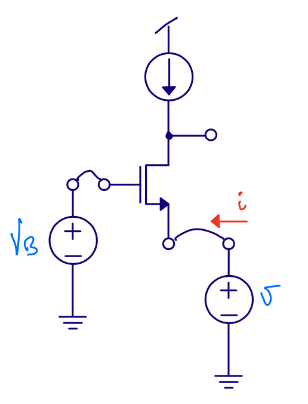

---

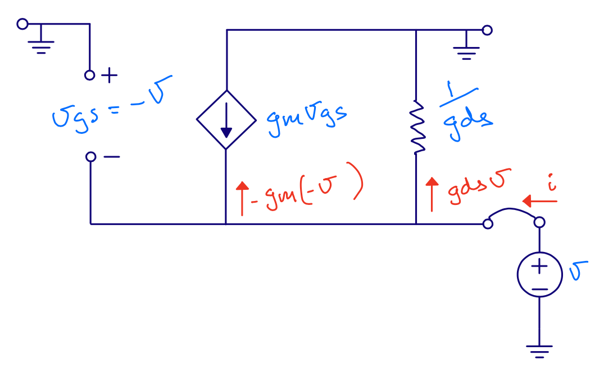

### Input resistance

$$ i = g_m v + g_{ds} v $$

$$ r_{in} = \frac{1}{g_m + g_{ds}} \approx \frac{1}{g_m}$$

However, we've ignored load resistance. 

$$ r_{in}  \approx \frac{1}{g_m}\left(1 + \frac{R_L}{r_{ds}}\right) $$

<!--pan_skip: -->

---

### Output resistance

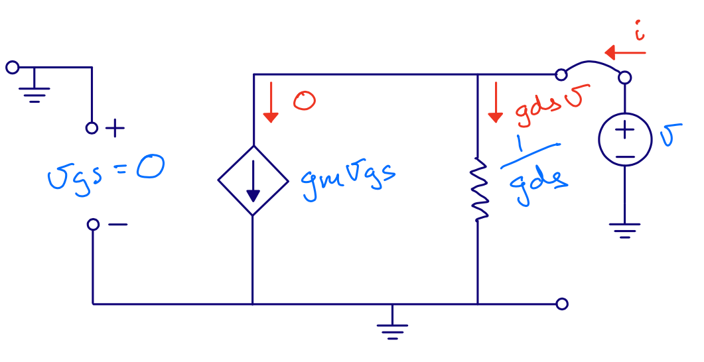

---

### Small signal gain

$$ i_{o} = - g_m v_{i} + \frac{v_{o} - v_{i}}{r_{ds}} $$

$$ i_{o}  = 0 $$

$$ 0 = - g_m v_{i} r_{ds}  + v_{o} - v_{i}$$

$$ v_{i} (1 + g_m r_{ds}) = v_{o} $$

$$ \frac{v_o}{v_i} = 1 + g_m r_{ds} $$

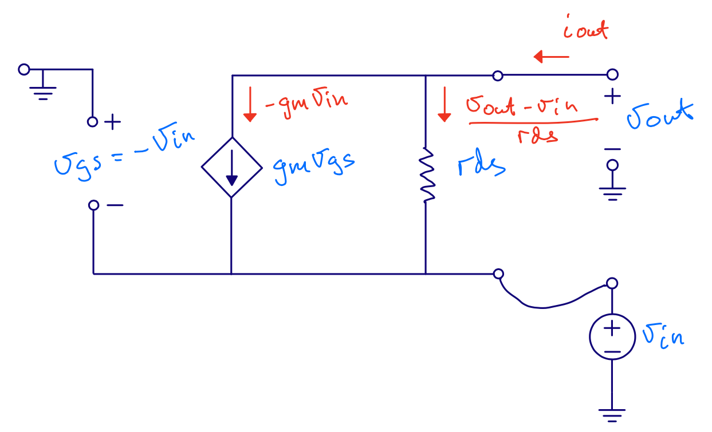

---

We've ignored bulk effect ($$g_s$$), source resistance ($$R_S$$) and load resistance ($$R_L$$)

$$ A = \frac{(g_{m} + g_s + g_{ds})(R_L||r_{ds})}{1 + R_S\left(\frac{g_m + g_s +
g_{ds}}{1 + R_L/r_{ds}}\right)}$$

If $$R_L >> r_{ds} $$, $$R_S  = 0$$ and $$g_s = 0$$

$$ A = \frac{(g_{m} + g_{ds})r_{ds}}{1} = 1+ g_m r_{ds} $$ 

<!--pan_skip: -->

---

#[fit] Common source

$$r_{in} \approx \infty$$

$$r_{out}  = r_{ds}$$, it's same circuit as the output of a current mirror

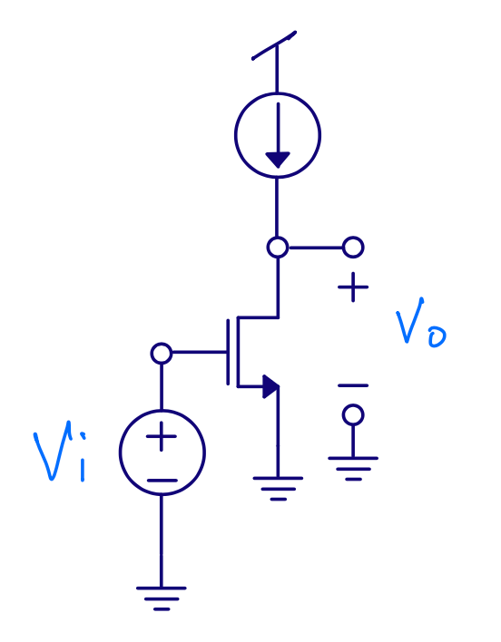

---

### Small signal gain

$$ i_{o} = g_m v_i + \frac{v_o}{r_{ds}} $$

$$ i_o = 0 $$

$$ -g_m v_i = \frac{v_o}{r_{ds}} $$

$$ \frac{v_o}{v_i} = - g_m r_{ds}$$

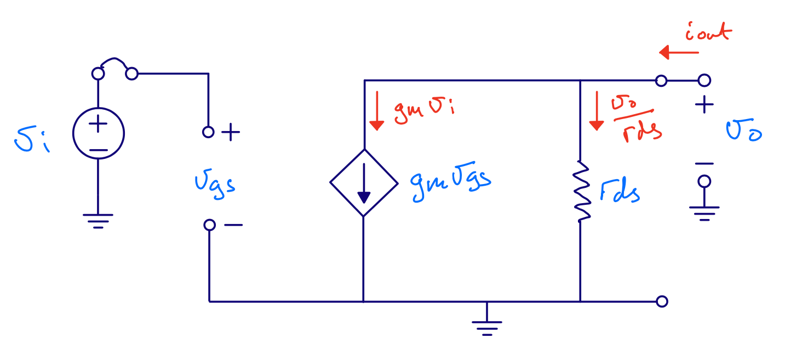

---

<!--pan_doc: 

## Why common source?

-->

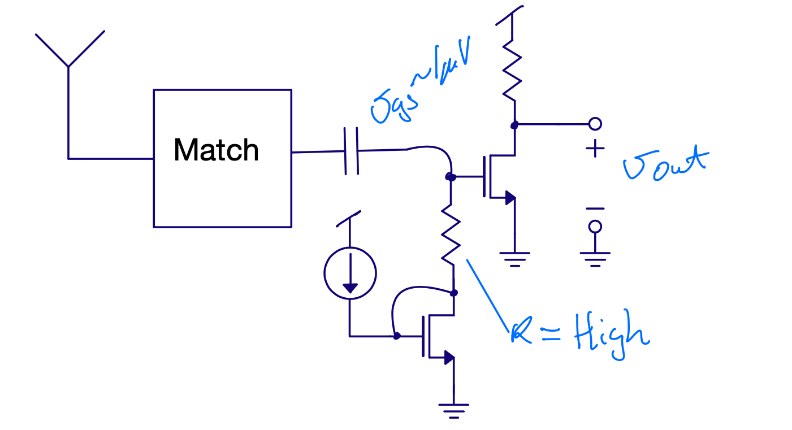

---

# Differential pair

Input resistance $$r_{in} \approx \infty$$

Gain  $$ A  = g_m r_{ds} $$

Output resistance $$ r_{out} = r_{ds}$$

Best analyzed with T model of transistor (see CJM page 31)

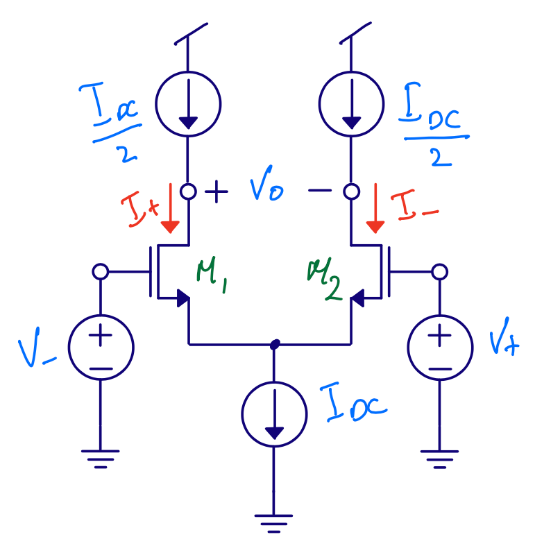

---

## Diff pairs are cool

 Can choose between 

 $$ v_o = g_m r_{ds} v_i$$

 and 

 $$ v_o = -g_m r_{ds} v_i$$
 
 by flipping input (or output) connections

---

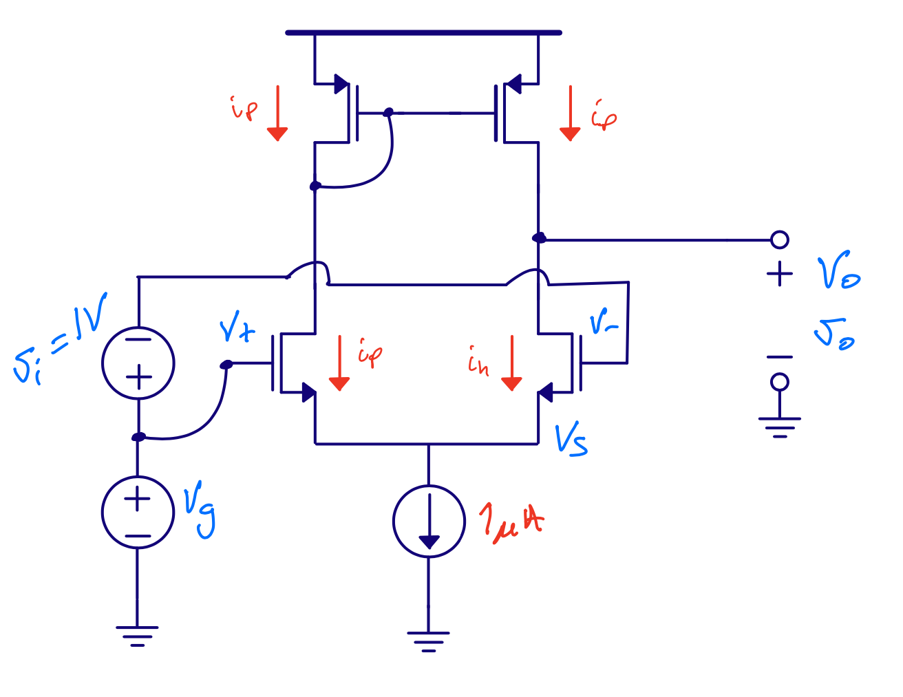

---

#[fit] Thanks!

---

