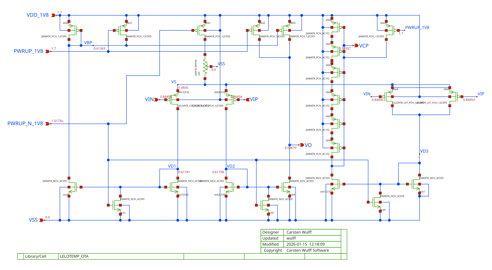

footer: Carsten Wulff 2026
slidenumbers:true
autoscale:true
theme: Plain Jane, 1
text:  Helvetica
header:  Helvetica
date: 2026-01-15

<!--pan_title: Circuits -->

<!--pan_doc:

**Keywords:** Sizing, Bias Point, gm/ID, Current Mirrors, Cascode, CS, CD, CG, Differential Pair, OTA

-->

# Circuits

<!--pan_doc: 

<iframe width="560" height="315" src="https://www.youtube.com/embed/VKkOr--6FV4?si=MZI-iDjn-2VJynFR" title="YouTube video player" frameborder="0" allow="accelerometer; autoplay; clipboard-write; encrypted-media; gyroscope; picture-in-picture; web-share" referrerpolicy="strict-origin-when-cross-origin" allowfullscreen></iframe>

Most of the circuit design on integrated circuits uses MOSFET transistors. This document provides a short 
refresh of the most common circuits and their properties. 

But first, how should transistors be used, and sized. 
-->

---

# Transistor size and bias point

---

<!--pan_doc:

In Figure 1 and Figure 2 we can see two transistors. One with short gate length (approximately 1F2 = 1.2 x minimum gate length) and 
one with longer gate length (approximately 5F0 = 5.0 x minimum gate length). The width of both transistors is sufficient to have 2 contacts on the drain/source (2C). 

These transistors come from a standard transistor library I've made, and that can be found at [JNW\_ATR\_SKY130A](https://analogicus.github.io/jnw_atr_sky130A/).

-->

<!--pan_doc: 
Figure 1: JNWATR_PCH_2C1F2 transistor  
-->

<!--pan_doc: 
Figure 2: JNWATR_PCH_2C5F0 transistor  
-->

<!--pan_doc:

In all our circuits we will need to pick the right size, but how should we do it?

By now you should know that MOSFETs have different regions of operation. Related to the $V_{GS}$ we talk about 
weak inversion, moderate inversion and strong inversion. These names correspond directly to the density of 
charge carriers in the thin inversion layer underneath the oxide in the channel. See [MOSFETs](https://analogicus.com/aic2026/mosfets) 
lecture for details. 

In Figure 3 we can see how the log of the current changes behavior at low $V_{GS}$ versus at high $V_{GS}$. 
As such, when we pick the transistor size we should be conscious of which region we operate the transistor in. The 
regions (weak, moderate, strong) have different behaviours. 

-->

---

<!--pan_doc: 
Figure 3: Log of drain current versus gate/source voltage  
-->

<!--pan_doc: 

One of the behavior differences is the "bang-for-the-buck". For a circuit we may target a specific number for the
transconductance ($g_m$). In Figure 4 we can see how the $g_m/I_D$ changes as we sweep the $V_{GS}$

In weak inversion, we have a large bang for the buck 

$$ g_m/I_D \approx 1/n/V_T \approx 1/1.5/26\text{ mV} \approx 25$$

While in strong inversion 

$$ \frac{g_m}{I_D} = \frac{2}{V_{eff}}$$

where the effective overdrive is 

$$V_{eff} = V_{GS} - V_{TH}$$

In moderate inversion, the $g_m/I_D$ is somewhere between the two. 

Assume we need a transconductance of 1 mS. If we have a $g_m/I_D = 10$, then we'd need at least 100 $\mu$A in the 
transistor. If we had a $g_m/I_D = 15$, then we'd only need 66 $\mu$A in the transistor. 

-->

---

<!--pan_doc: 
Figure 4: gm/Id (Y-axis) versus Gate voltage (X-axis)  
-->

---

<!--pan_doc: 

When the $g_m/I_D$ choice is made, then there are some things that have already been determined. One is the 
necessary drain/source voltage for the transistor to operation in "saturation" or "linear" region. 

For most circuits we want the transistor to operate in "saturation" region, as such, we must provide a certain 
drain source voltage. 

In Figure 5 you can see how the $V_{dsat}$ of the transistor changes as the $g_m/I_D$ changes. 

Notice that the two transistor have different $V_{dsat}$. The shorter transistor needs less voltage across drain/source
to operate in saturation. 

-->

<!--pan_doc: 
Figure 5: Vdsat versus gm/Id  
-->

---

<!--pan_doc: 

The choice of $g_m/I_D$ also determine what the gate source voltage is. It's actually rare we control 
the gate voltage directly to set the bias point of the transistor. It's more common to bias transistors with 
a current, and let the $V_{GS}$ be whatever the $V_{GS}$ needs to be. 

In Figure 6 we can see that at $g_m/I_D$ of 15 we have a lower $V_{GS}$ than $g_m/I_D$ of 10. 

-->

<!--pan_doc: 
Figure 6: Vg versus gm/Id  
-->

---

<!--pan_doc: 

The choice between the two transistors come down to "What intrinsic gain do I need in my transistor?". 

For current mirrors we really don't want the output current to change with $V_{DS}$ 
so we want a small conductance ($g_{ds}$), or a large intrinsic gain ($g_m/g_{ds}$).

In Figure 7 we can see how the intrinsic gain of the two transistors is different. For the 1F2 we can also see
there is some funky behavior above gm/id of 20, I don't know why, but I suspect something funky in the model (non-physical). 

For a larger intrinsic gain we should pick a longer transistor.

-->

<!--pan_doc: 
Figure 7: gm/gds versus gm/Id  
-->

---

# Transistor sizing strategy 

## Option 1: Full freedom 

<!--pan_doc: 

If you really want to dig deep, and get your transistor size exactly correct, then
method that makes most sense to me, is to use the inversion-coefficient method, described in 

--> 

- Nanoscale MOSFET Modeling: Part 1 [@enz17] 
- Nanoscale MOSFET Modeling: Part 2 [@enz17a].

<!--pan_doc: 

This is similar to a gm/Id strategy, but we're rather looking directly at the inversion level 

The inversion coefficient tells us how strongly inverted the MOSFET channel (inversion layer) is. 
A number below 0.1 is weak inversion, between 0.1 and 10 is moderate inversion. 
A number above 10 is strong inversion.

There are also some blog posts worth looking at [Inversion Coefficient Based Circuit Design](https://kevinfronczak.com/blog/inversion-coefficient-based-circuit-design) and  [My Circuit Design Methodology](https://kevinfronczak.com/blog/my-circuit-design-methodology).

--> 

## Option 2: Constrained 

<!--pan_doc:

"Full transistor size freedom" "is similar to giving a loaded gun to a kid and say "don't shoot yourself". 
It's a bad idea!

If you're inexperienced with transistor sizing I would highly recommend to pick a few transistors, and compute 
the parameters ($V_{GS}$, $V_{dsat}$, ...) for the transistor, and then use a limited set. 

That's exactly what I've done i
-->

[JNW\_ATR\_SKY130A](https://analogicus.github.io/jnw_atr_sky130A/)

<!--pan_doc: 

I would encourage you to only use transistors from that library in your design. I always do that when I do design, in any technology. 

-->

---

# My circuit does not work, why????????????????

---

<!--pan_doc: _

The reason is usually that the transistors are not operating in the correct region. So either the $V_{GS}$ is causing problems
or the $V_{DS}$ is not high enough. 

In Figure 8 we can see how the $V_{GS}$ of transistors change with corner. It's usually highest for slow-slow and low temperature, and the lowest for 
fast-fast and high temperature. But event that statement is obviously not always correct. For a gm/Id of 6 we can see that it's the low temperature that has the lowest $V_{GS}$.

If we observe the equation for the current in strong inversion 

$$ I_D = \frac{1}{2} \mu_n C_{ox} \frac{W}{L}\left( V_{GS} - V_{TH}\right)^2$$

we can see that the current decreses if the $V_{TH}$ increases, and we can see that current increases if the mobility ($\mu_n$) increases. The threshold voltage increases
at low temperature. The mobility increases at low temperature. At a gm/Id of a bit more than 8 we can see that from Figure 8 the two effects cancel each other. While for lower gm/Id 
the mobility becomes dominant, and lowers the $V_{GS}$.

-->

<!--pan_doc: 
Figure 8: Gate-source voltage as a function of corner  
-->

---

<!--pan_doc: 

The drain-source voltage does not change that much with corner, but it does change. The deeper into strong inversion we go, the larger the change. 

-->

<!--pan_doc: 
Figure 9: Drain Saturation Voltage as a function of corner  
-->

---

<!--pan_doc: 

As such, for any transistor design, it's necessary to see exactly what voltages and currents
flow in your transistors. 

Most tools can show the operating point in the schematic, which makes it easier to figure out what the 
voltages and currents are. In Figure 10 we can see an example from [TB\_JNW\_TEMP\_OP](https://github.com/wulffern/jnw_temp_sky130a/blob/main/design/JNW_TEMP_SKY130A/TB_JNW_TEMP_OP.sch)

-->

<!--pan_doc: 
Figure 10: Example of operating point annotation 
-->

---

#[fit] Current Mirrors

---

<!--pan_doc: 

MOSFETs need a current for the transistor to be biased in the correct operating region. The current must come from somewhere, we'll look at bias generators later. Usually there is a central bias circuit that provides a single, good, reference current.

On an IC, however, there will be many circuits, and they all need a bias current (usually). As such, we need a circuit to copy a current. 

In the figure below you can see a selection of current mirrors. They all do the same thing. Try to ensure that $i_i$ and $i_o$ are the same current. 

Which one we choose is usually determined by what we mean by $i_i = i_o$. Do we mean "within $\pm$ 10 %", or "within $\pm$ 2 %". 

-->

<!--pan_doc: 
Figure 11: Example of current mirrors 
-->

---

## Normal current mirror

<!--pan_doc: 

The normal current mirror consists of a diode connected transistor ($M_1$) and a common source transistor $M_2$. 

If we assume infinite output resistance of the MOSFETs, then the drain voltage does not affect the current. 

If the two transistors are the same size, threshold voltage, mobility, etc, and they have the same gate-source voltage, then the current in them must be the same. 

A current pushed into $M_1$ will cause the $V_{GS1}$ to rise, and at some point, find a stable point where the current pushed in is equal to the current in $M_1$

$M_2$ will see the same $V_{GS1} = V_{GS2}$ so the current will be the same, provided the voltage at $i_o$ is sufficient to pinch-off the channel of $M_2$, or 
the $V_{DS2} \approx 3 kT/q$ if the transistor is in weak-inversion.

The output resistance of a normal current mirror is simply the $r_{ds}$ of the output transistor. 

-->

<!--pan_doc: 
Figure 12: Normal current mirror 
-->

---

## Source degenerated current mirror

<!--pan_doc: 

In most modern technologies, and if we care about the output current accuracy, then a normal current mirror 
cannot give us a sufficient independence of the drain/source voltage. 

When we use more advanced current mirrors, it's almost always to increase the output resistance, and make the current mirror more like a 
current source. 

In Figure 13 we can see a current mirror with resistors on source. 

-->

<!--pan_doc: 
Figure 13: Source degenerated current mirror 
-->

---

<!--pan_doc:

Observe the small signal model in Figure 14. If we now apply a test current $i_x$ we can compute 
what the output resistance is ($r_{out} = v_{x}/i_x$) 

-->

<!--pan_doc: 
Figure 14: Source degenerated current mirror small signal model 
-->

$$v_{gs} = -v_{s}$$, $$v_{s} = i_x R_s$$, $$r_{out} = \frac{v_x}{i_x}$$

$$i_x = g_{m2} v_{gs} + \frac{v_x - v_s}{r_{ds2}}$$

$$i_x = -i_x g_{m2} R_s + \frac{v_x - i_x R_s}{r_{ds2}}$$

$$v_x = i_x\left[ r_{ds2} + R_s(g_{m2} r_{ds2} + 1)\right]$$ 

Rearranging

$$ r_{out} =  r_{ds2}[1 + R_s(g_{m1} + g_{ds2})] \approx r_{ds2} [1 + g_{m1}R_s]$$ 

---

## Cascoded current mirror 

<!--pan_doc:

To further increase the output resistance, we can move to a cascoded current mirror as shown in Figure 15.

Now we need a separate voltage to bias the cascode to ensure that the source node of $M_3$ keeps the 
drain node of $M_1$ above $V_{DSAT}$. 

If we bias the cascode correctly, then even if the voltage at $i_o$ changes, then the source of $M_4$ does 
not really change, and the current in $M_2$ stays the same. 

-->

<!--pan_doc: 
Figure 15: Cascoded current mirror 
-->

From source degeneration (ignoring bulk effect)

$$r_{out} =  r_{ds4}[1 + R_s(g_{m4} + g_{ds4})] $$

$$ R_S = r_{ds2} $$

$$
r_{out} =  r_{ds4}[1 + r_{ds2}(g_{m4} + g_{ds4})] 
$$

$$
r_{out} \approx  r_{ds2}(r_{ds4}g_{m4})
$$

---

## Active cascodes

<!--pan_doc:

If we need even higher output resistance, then we can add a operational transconductance 
amplifier (OTA) to the gate of the cascode to further increase the $g_m$ of the cascode. 

In OTAs it's common to increase the open loop gain by increasing the output resistance. The 
output stage of an OTA is usually current mirrors, as a result, one can end up with active cascodes in the OTA
that is used in the active cascode of the current mirror. All horribly complicated, but sometimes necessary. 

-->

$$
r_{out} \approx  r_{ds2}(A r_{ds4} g_{m4})
$$

<!--pan_doc: 
Figure 16: Active cascode current mirror 
-->

---

#[fit] Amplifiers

<!--pan_doc: 

There are usually three amplifiers that we consider when we talk about single transistors. Common Source, Common Gate and Source Follower. 

For two transistors there are a few more possibilities. I'd highly recommend Fifty Nifty Variations of Two-Transistor Circuits: A tribute to the versatility of MOSFETs [@pretl21]

<iframe width="560" height="315" src="https://www.youtube.com/embed/jL7MVr5wY5w?si=kMQN5iOJYzmTbg3e" title="YouTube video player" frameborder="0" allow="accelerometer; autoplay; clipboard-write; encrypted-media; gyroscope; picture-in-picture; web-share" referrerpolicy="strict-origin-when-cross-origin" allowfullscreen></iframe>

-->

<!--pan_skip: -->

- Single transistor: Common Source, Common Gate and Source Follower.
- Two transistors: Fifty Nifty Variations of Two-Transistor Circuits: A tribute to the versatility of MOSFETs [@pretl21]

---

##[fit] Source follower

<!--pan_doc: 

The source follower can be seen in Figure 17. The input signal is at the gate, and the output at the source. The transistor and its bias current source form a level shifter: the output follows the input, one $V_{GS}$ lower. The properties we care about are

-->

Input resistance $$\approx \infty$$

Gain $$ A = \frac{v_o}{v_i}$$

Output resistance $$r_{out}$$

<!--pan_doc: 
Figure 17: Source follower 
-->

---

### Small signal gain 

<!--pan_doc: 

To find the gain, replace the transistor with its small signal model, as
shown in Figure 18. The drain is at the supply, and the supply does not
move for small signals, so the drain rail is at AC ground. The source rail
is the output. Between the two hang the transconductance, the bulk
transconductance, and $r_{ds}$.

Sum the currents into the output node, and set the output current to zero
- nothing is loading us:

-->

<!--pan_doc: 
Figure 18: Source follower small signal model
-->

$$ i_o = v_o (g_{ds} + g_{s}) - g_{m} v_i + v_o g_m $$

$$ i_o = 0 $$

$$ g_m v_i = v_o ( g_m + g_s + g_{ds} ) $$

$$ A = \frac{v_o}{v_i} = \frac{g_m}{g_m + g_{ds} + g_s} $$

**Gain is less than 1**

<!--pan_doc:

The transconductance appears both on top and in the bottom of the
fraction, so the gain approaches, but never reaches, one. The bulk
transconductance $g_s$ is the main thief: with bulk tied to ground the
gain of an NMOS follower is typically 0.8 to 0.9.

-->

---

## Output resistance 

<!--pan_doc:

The same equation gives the output resistance. Zero the input, push a
current into the output, and see what voltage builds up:

-->

$$ i_o = v_o (g_{ds} + g_{s}) - g_{m} v_i + v_o g_m $$

$$v_i = 0$$

$$ i_o = v_o (g_{ds} + g_{s} + g_m) $$

$$ r_{out} = \frac{v_o}{i_o} = \frac{1}{g_m + g_{ds} + g_{s}} $$

$$ r_{out} \approx \frac{1}{g_m}$$

<!--pan_doc:

A $1/g_m$ output resistance is the point of the whole circuit: it is the
cheapest low impedance money can buy in CMOS. Whatever fragile,
high impedance node you have, a follower turns it into a node that can
drive real capacitance.

-->

---

## Why use a source follower?

<!--pan_doc:

A concrete example makes the point. In an image sensor pixel a photodiode
collects charge on a tiny sense node - say 1 fF. Assume the light gives us
100 electrons.

In Figure 19 the sense node drives the gate of a source follower. The gate
draws no charge, so all 100 electrons stay on the 1 fF, and the signal is
a healthy 16 mV, which the follower copies onto the 1 pF bus below.

-->

Assume 100 electrons

[.column]

$$ \Delta V  = Q/C  = -1.6 \times 10^{-19} \times 100 / (1\times 10^{-15}) = - 16\text{ mV} $$ 

<!--pan_doc: 
Figure 19: Sense node buffered by a source follower
-->

[.column]

$$ \Delta V  = Q/C  = -1.6 \times 10^{-19} \times 100 / (1\times 10^{-12}) = - 16\text{ uV} $$ 

<!--pan_doc: 
Figure 20: The same sense node connected straight to the bus

In Figure 20 the follower is gone and the sense node must charge the 1 pF
bus directly. The same 100 electrons now land on a thousand times the
capacitance, and the signal shrinks to 16 uV - buried in the noise. The
follower does not amplify anything, and still it makes the difference
between a signal and no signal.

Another example of a source follower can be found in A 92.5mW 205MS/s 10b Pipeline IF ADC Implemented in 1.2V/3.3V 0.13um CMOS [@hernes07a]

-->

---

#[fit] Common gate

<!--pan_doc:

In the common gate stage, Figure 21, the roles rotate: the gate is held at
a bias voltage, the signal goes in at the source, and the output is taken
at the drain. Nothing amplifies the voltage between input and gate except
the transistor's own $V_{GS}$ - the input current simply reappears at the
drain. That makes the common gate a current buffer: a low resistance
input, a high resistance output, and a current gain of one.

-->

<!--pan_doc: 
Figure 21: Common gate stage
-->

---

<!--pan_doc:

Start with the input resistance, using the small signal model in Figure
22. The gate is grounded, so wiggling the source by $v_x$ makes
$v_{gs} = -v_x$: the transconductance pulls current out of the test
source, and the input looks like a resistance of roughly $1/g_m$.

-->

<!--pan_doc: 
Figure 22: Common gate input resistance
-->

### Input resistance

$$ i = g_m v + g_{ds} v $$

$$ r_{in} = \frac{1}{g_m + g_{ds}} \approx \frac{1}{g_m}$$

However, we've ignored load resistance. 

$$ r_{in}  \approx \frac{1}{g_m}\left(1 + \frac{R_L}{r_{ds}}\right) $$

<!--pan_doc:

The last line is worth a pause: the friendly $1/g_m$ input resistance
only holds if the drain sees a low load resistance. Load the drain with a
current source, and the input resistance grows by the ratio $R_L/r_{ds}$
- the cascode chapter of every textbook in one line.

-->

<!--pan_skip: -->

---

### Output resistance

<!--pan_doc:

For the output resistance, ground the source: then $v_{gs} = 0$, the
transconductance is dead, and the test source at the drain sees only
$r_{ds}$, as drawn in Figure 23.

-->

<!--pan_doc: 
Figure 23: Common gate output resistance

$$ r_{out} = r_{ds} $$
-->

---

### Small signal gain

<!--pan_doc:

For the voltage gain, drive the source and leave the drain open, Figure
24. The same $g_m$ that made the input resistance low now pushes its
current into $r_{ds}$:

-->

$$ i_{o} = - g_m v_{i} + \frac{v_{o} - v_{i}}{r_{ds}} $$

$$ i_{o}  = 0 $$

$$ 0 = - g_m v_{i} r_{ds}  + v_{o} - v_{i}$$

$$ v_{i} (1 + g_m r_{ds}) = v_{o} $$

$$ \frac{v_o}{v_i} = 1 + g_m r_{ds} $$

<!--pan_doc: 
Figure 24: Common gate small signal gain

The gain is the intrinsic gain plus one, and it is not inverting: the
common gate has the same gain magnitude as the common source, it just
refuses to flip the sign.
-->

---

<!--pan_doc:

The full expression, with nothing ignored, is uglier:

-->

We've ignored bulk effect ($$g_s$$), source resistance ($$R_S$$) and load resistance ($$R_L$$)

$$ A = \frac{(g_{m} + g_s + g_{ds})(R_L||r_{ds})}{1 + R_S\left(\frac{g_m + g_s +
g_{ds}}{1 + R_L/r_{ds}}\right)}$$

If $$R_L >> r_{ds} $$, $$R_S  = 0$$ and $$g_s = 0$$

$$ A = \frac{(g_{m} + g_{ds})r_{ds}}{1} = 1+ g_m r_{ds} $$ 

<!--pan_doc:

Check the simplification against the special case above, and note what
the full expression adds: the source resistance $R_S$ divides the gain
down, and the bulk transconductance helps for once - in a common gate the
bulk effect adds to $g_m$ instead of stealing from it.

-->

<!--pan_skip: -->

---

#[fit] Common source

<!--pan_doc:

The common source stage, Figure 25, is the amplifier: input at the gate,
source grounded, output at the drain. It is also a circuit we have already
met - the output half of every current mirror is a common source
transistor - so the input and output resistances come for free:

-->

$$r_{in} \approx \infty$$

$$r_{out}  = r_{ds}$$, it's same circuit as the output of a current mirror

<!--pan_doc: 
Figure 25: Common source stage
-->

---

### Small signal gain

<!--pan_doc:

The small signal model, Figure 26, has only two elements, and the sum of
their currents at the output node gives the gain in three lines:

-->

$$ i_{o} = g_m v_i + \frac{v_o}{r_{ds}} $$

$$ i_o = 0 $$

$$ -g_m v_i = \frac{v_o}{r_{ds}} $$

$$ \frac{v_o}{v_i} = - g_m r_{ds}$$

<!--pan_doc: 
Figure 26: Common source small signal model

The gain is minus the intrinsic gain of the transistor - the most gain a
single device can give, which is why the common source is the default
gain stage in every amplifier.
-->

---

<!--pan_doc: 

## Why common source?

The signal from an antenna is microvolts, Figure 27. Before anything can
demodulate, filter or digitize it, it must be made bigger - and the only
thing that makes voltages bigger is gain. The matching network hands the
microvolt signal through an AC coupling capacitor to the gate, a high
value resistor from a current mirror sets the bias point without loading
the signal, and the common source transistor multiplies the voltage by
$-g_m R$. First gain, then everything else.

-->

<!--pan_doc: 
Figure 27: A low noise amplifier is a common source stage
-->

---

# Differential pair

<!--pan_doc:

Single-ended amplifiers share a weakness: they cannot tell the signal
from the ground bounce. The differential pair, Figure 28, fixes that by
amplifying only the *difference* between two inputs. Two matched
transistors share one tail current: with equal inputs the current splits
evenly and nothing happens at the outputs. Apply a difference, and
current steers from one branch to the other - the tail current is a
see-saw, and the differential input tilts it.

Per side, the numbers are the common source numbers:

-->

Input resistance $$r_{in} \approx \infty$$

Gain  $$ A  = g_m r_{ds} $$

Output resistance $$ r_{out} = r_{ds}$$

Best analyzed with T model of transistor (see CJM page 31)

<!--pan_doc: 
Figure 28: Differential pair
-->

---

## Diff pairs are cool

<!--pan_doc:

Two properties make the pair the default input of every OTA. First,
whatever is common to both inputs - supply bounce, substrate noise, bias
drift - is rejected, because it does not tilt the see-saw. Second, sign
is free:

-->

 Can choose between 

 $$ v_o = g_m r_{ds} v_i$$

 and 

 $$ v_o = -g_m r_{ds} v_i$$
 
 by flipping input (or output) connections

---

## Summary

<!--pan_doc:

The single transistor gives us three views of the same device:

-->

| Stage | $$r_{in}$$ | $$r_{out}$$ | Gain |
| :--: | :--: | :--: | :--: |
| Common source | $$\infty$$ | $$r_{ds}$$ | $$-g_m r_{ds}$$ |
| Common gate | $$1/g_m$$ | $$r_{ds}$$ | $$1 + g_m r_{ds}$$ |
| Source follower | $$\infty$$ | $$1/g_m$$ | $$\approx 1$$ |

<!--pan_doc:

Common source when you need gain, common gate when you need to move a
current without disturbing it, source follower when you need to drive
something. Current mirrors bias them all, and the differential pair wraps
two common source stages around one tail current so only the difference
matters.

Put a differential pair on top of a current mirror and you have built the
five transistor OTA - which is where the [OTA chapter](https://analogicus.com/aic2026/otas)
picks up.

-->

---

