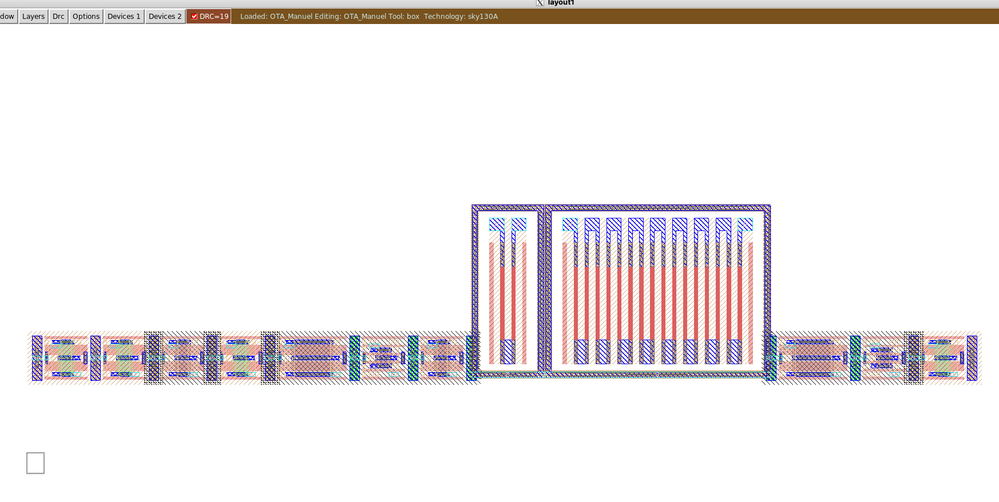
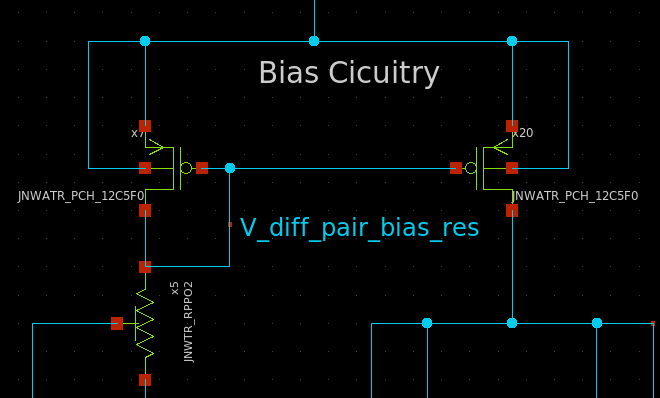
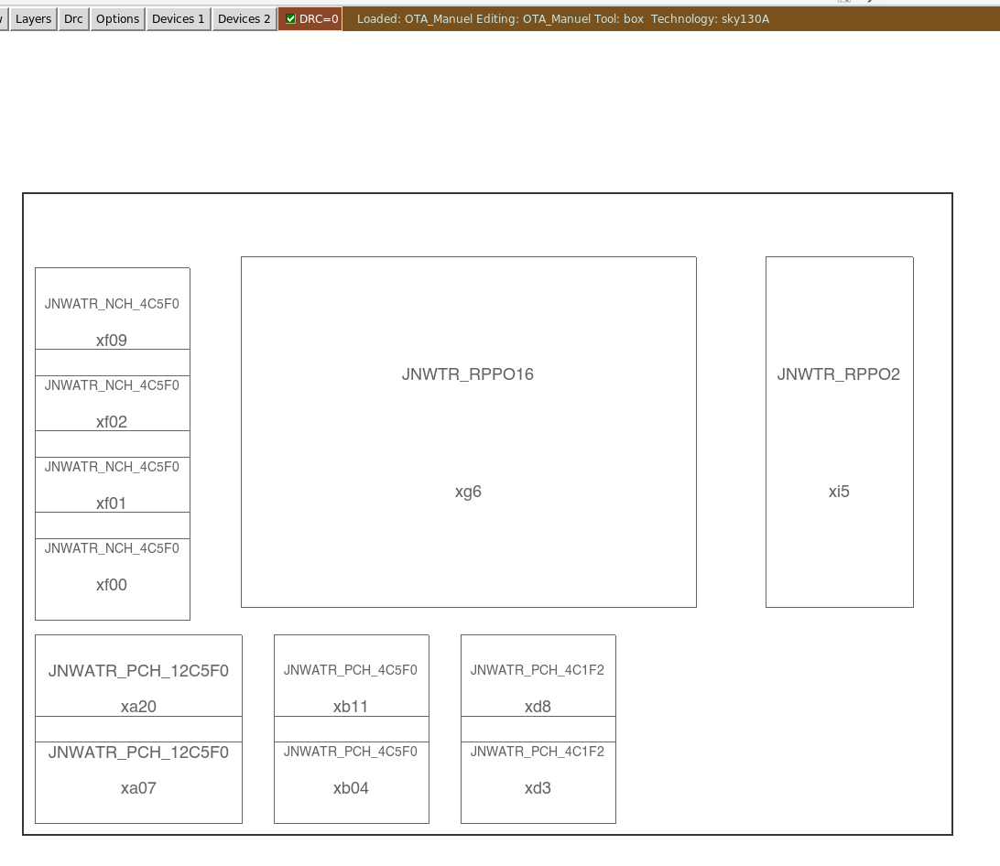
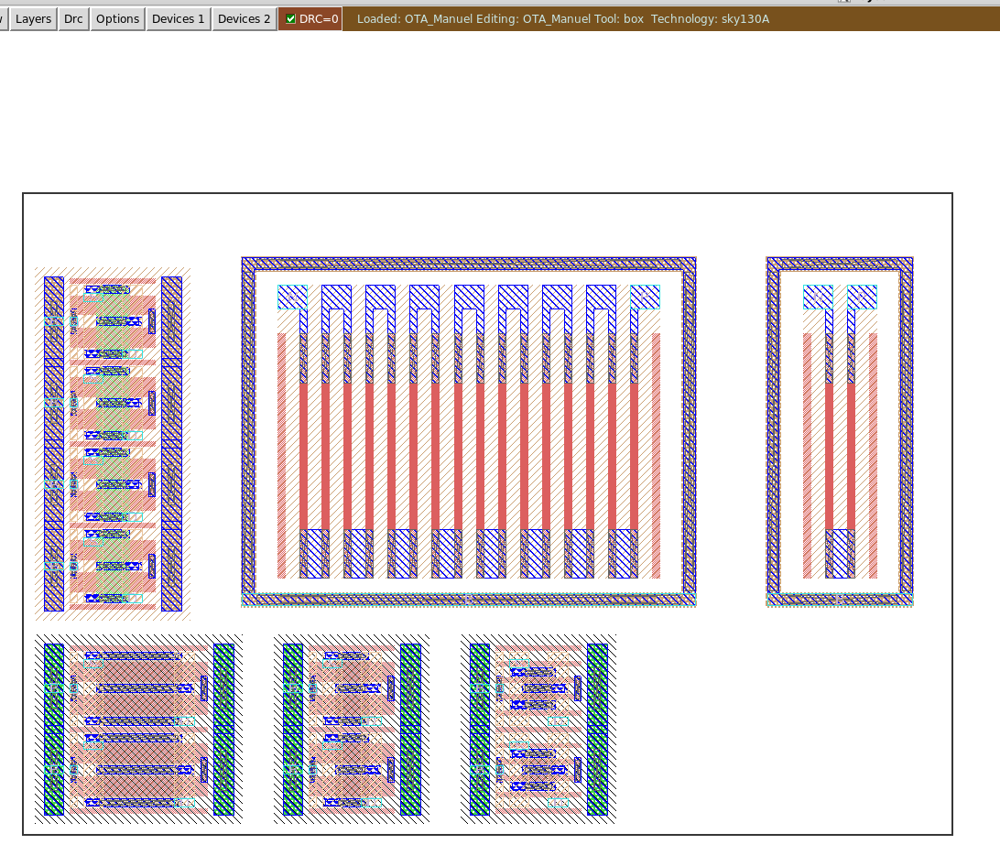

footer: Carsten Wulff 2025
slidenumbers:true
autoscale:true
theme: Plain Jane, 1
text:  Helvetica
header:  Helvetica
date: 2025-03-20

<!--pan_title: Layout Generation-->


# Layout

The open source tools don't have any automatic analog layout. To my knowledge,
there is no general purpose analog automagic layout anywhere in the world. It's an unsovled problem.
Many have tried (including myself), but none have succeeded with a generic
analog layout engine.

There are a few things, though, that could help you on the way.

# Setup

I assume that you have the latest and greatest `aicex\ip` setup. 

See [SKY130NM
Tutorial](https://analogicus.com/aic2025/2025/01/01/Sky130nm-tutorial.html) if
aicex is unfamiliar.


Let's assume we use `jnw_gr05_sky130a` to test out our layout 

```bash
cd aicex/ip/
cd jnw_gr05_sky130a
git checkout a1e3dfc324194729e042f5e653777b052759863b
cd work
```

# CICPY

The first thing we need to do is to place all transistors. I do have a script to
help. Install cicpy. 

```bash 
cd aicex/ip/cicpy
git checkout master
git pull 
python3 -m pip install -e .
cd ..
cd cicspi 
git checkout main 
git pull
python3 -m pip install -e .
```

# Placement 

To generate an initial placement we can do the command below. If a layout exists
it will be overriden

```bash 
cd jnw_gr05_sky130a/work 
cicpy sch2mag JNW_GR05_SKY130A OTA_Manuel
```



The layout engine has no idea what components belong together, for example, the
current mirror below should have been place together 



We can instruct the layout engine by adding a "group" name to the instance name.
The instance name always starts with `x<something><number>` where the something
can be nothing, or a group name (a,b, not a number).

The rules for placement are:

1. Sort all instances by groups 
1. Sort all groups by instance name 
1. Place the first instance. 
1. For all instances: If the next instance has the same group, then add on top.
Otherwise increment the x location.

As such, if I rename my instances, as shown below, 


Then the layout becomes a bit better 

```bash 
cicpy sch2mag JNW_GR05_SKY130A OTA_Manuel --gbreak 3 --xspace 34000 --yspace 30000
```

The gbreak command inserts a "group break" after the fourth group, such that a
new Y coordinate is selected.

The X and Y space is for the distance between groups. The unit is "Ångstrøm", so
1 um is 10 000 Å. 






