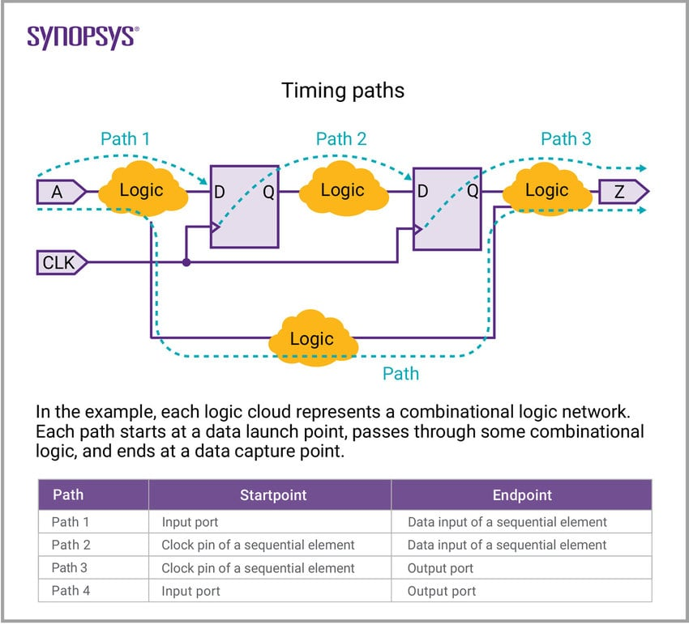
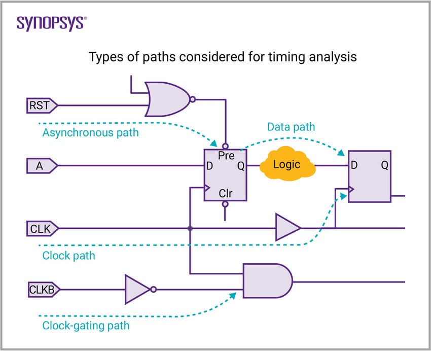
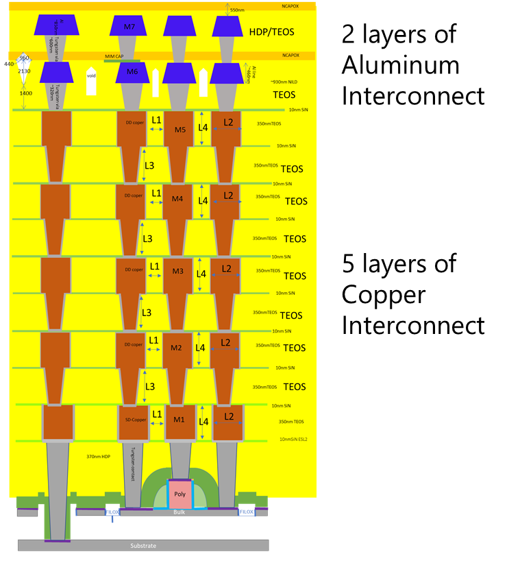

footer: Carsten Wulff 2021
slidenumbers:true
autoscale:true
theme: Plain Jane, 1
text:  Helvetica
header:  Helvetica
date: 2025-01-08

# CMOS Logic 

<!--pan_title: CMOS Logic -->

**Status:** 0.3


#[fit] Analog transistor to digital transistor
---

 NMOS current (W = 0.4u L=0.15u) as a function of $$V_{GS}$$ and $$V_{DS}$$

<sub><sub>[dicex/lectures/l13/mos.py]()


---


---


---

| Gate | NMOS | PMOS |
|:---: | :---: | :---:|
| VDD | ON | OFF|
| VDD -> VSS | X | X |
| VSS -> VDD | X | X |
| VSS | OFF | ON |

---

| Gate | NMOS | PMOS |
|:---: | :---: | :---:|
| 1 | ON | OFF|
| 1 -> 0 | X | X |
| 0 -> 1 | X | X |
| 0 | OFF | ON |

---

# CMOS static logic assumptions

NMOS source is connected to low potential

$$ V_{GS} > V_{TH}$$ when $$V_G = V_{DD}$$


PMOS source is connected to high potential

$$ V_{GS} < V_{TH}$$ when $$V_G = 0$$


---


---
[.background-color: #000000]
[.text: #FFFFFF]

# Don't break rules unless you know exactly why it will be OK

---
#[fit] Logic cells
--- 


---

## CMOS static logic is inverting


| A | Y |
|:---: | :---: | 
| 1 | 0 | 
| 0 | 1 | 


---


<sub>PD = Pull-down PU = Pull-up</sub>

```verilog
logic => [0,1,Z,X];
```


---
[.table-separator: #000000, stroke-width(1)] 
[.table: margin(8)]


*Pull-up series*

| A | B | Y |
|:---|:---|:---|
| 0 | 0 | 1 |
| 0 | 1 | Z |
| 1 | 0 | Z |
| 1 | 1 | Z |

*Pull-up paralell*

| A | B | Y |
|:---|:---|:---|
| 0 | 0 | 1 |
| 0 | 1 | 1 |
| 1 | 0 | 1 |
| 1 | 1 | Z |


---
[.table-separator: #000000, stroke-width(1)] 
[.table: margin(8)]

*Pull-down series*

| A | B | Y |
|:---|:---|:---|
| 0 | 0 | Z |
| 0 | 1 | Z |
| 1 | 0 | Z |
| 1 | 1 | 0 |

*Pull-down paralell*

| A | B | Y |
|:---|:---|:---|
| 0 | 0 | Z |
| 0 | 1 | 0 |
| 1 | 0 | 0 |
| 1 | 1 | 0 |


---

## Rules for inverting logic

**Pull-up**
OR $$\Rightarrow$$ PMOS in series $$\Rightarrow$$ POS 
AND $$\Rightarrow$$ PMOS in paralell $$\Rightarrow$$ PAP

**Pull-down**
OR $$\Rightarrow$$ NMOS in paralell $$\Rightarrow$$ NOP 
AND $$\Rightarrow$$ NMOS in series $$\Rightarrow$$ NAS 


---


[.table-separator: #000000, stroke-width(1)] 
[.table: margin(8)]

$$ \text{Y} = \overline{\text{AB}} = \text{NOT ( A AND B)}$$

 **AND**
 PU $$\Rightarrow$$ PMOS in paralell
 PD  $$\Rightarrow$$ NMOS in series


| A | B | <sub>NOT(A AND B)</sub> |
|:---|:---|:---|
| 0 | 0 | 1 |
| 0 | 1 | 1 |
| 1 | 0 | 1 |
| 1 | 1 | 0 |

---


<!--pan_skip: -->


---
[.table-separator: #000000, stroke-width(1)] 
[.table: margin(8)]


$$ \text{Y} = \overline{\text{A + B}} = \text{NOT ( A OR B)}$$  

**OR**
PU $$\Rightarrow$$ PMOS in series
PD  $$\Rightarrow$$ NMOS in paralell


| A | B | <sub>NOT(A OR B)</sub> |
|:---|:---|:---|
| 0 | 0 | 1 |
| 0 | 1 | 0 |
| 1 | 0 | 0 |
| 1 | 1 | 0 |


---


<!--pan_skip: -->


---

<!--pan_skip: -->

   

---

# SR-Latch

Use boolean expressions to figure out how gates work. 

Remember De-Morgan 

$$\overline{AB}  = \overline{A}+ \overline{B}$$
$$\overline{A+B}  = \overline{A} \cdot \overline{B}$$


 $$Q = \overline{R \overline{Q}} = \overline{R} +
\overline{\overline{Q}} = \overline{R} + Q $$

 $$\overline{Q} = \overline{S Q} = \overline{S} +
\overline{Q} = \overline{S} + \overline{Q} $$


---


$$Q = \overline{R} + Q$$ , 

$$\overline{Q} =\overline{S} + \overline{Q}$$

| S | R | Q | ~Q |
|:---|:---|:---| :---|
| 0 | 0 | X | X |
| 0 | 1 | 0 | 1 |
| 1 | 0 | 1 | 0 |
| 1 | 1 | Q | ~Q |

<!--pan_skip: -->


---

# D-Latch (16 transistors)

| C | D | Q | ~Q |
|:---|:---|:---| :---|
| 0 | X | Q | ~Q |
| 1 | 0 | 0 | 1 |
| 1 | 1 | 1 | 0 |


---

#[fit] Other logic cells

---

What about $$\text{Y} = \text{AB}$$ and $$\text{Y} = \text{A} + \text{B}$$?


[.column]

 $$\text{Y} = \text{AB} = \overline{\overline{\text{AB}}}$$

**Y** = **A** AND **B** = NOT( NOT( **A** AND **B** ) )


[.column]

$$\text{Y} = \text{A+B} = \overline{\overline{\text{A+B}}}$$

**Y** = **A** OR **B** = NOT( NOT( **A** OR **B** ) )


---

# AOI22: and or invert

 **Y** = NOT( **A** AND **B** OR **C** AND **D**) 

 $$\text{Y} =  \overline{\text{AB} + \text{CD}}$$
 


---


---
[.table-separator: #000000, stroke-width(1)] 
[.table: margin(8)]

# Tristate inverter

| E | A | Y |
|:---|:---|:---|
| 0 | 0 | Z |
| 0 | 1 | Z |
| 1 | 0 | 1 |
| 1 | 1 | 0 |


---

[.table-separator: #000000, stroke-width(1)] 
[.table: margin(8)]

# Mux

| S |  Y |
|:---|:---|
| 0 | NOT(P1) |
| 0 | NOT(P1) |
| 1 | NOT(P0) |
| 1 | NOT(P0) |


---
D-Latch (12 transistors)


---
D-Flip Flop (< 26 transistors)


---


---


# There are other types of logic

[.column]
- True single phase clock (TSPC) logic
- Pass transistor logic
- Transmission gate logic
- Differential logic
- Dynamic logic

[.column]
Consider other types of logic "rule breaking", so you should know why you need it.

---


<sub><sub>Dynamic logic => [A Compiled 9-bit 20-MS/s 3.5-fJ/conv.step SAR ADC in 28-nm FDSOI for Bluetooth Low Energy Receivers](https://ieeexplore.ieee.org/document/7906479)</sub></sub>

---


#[fit] Speed


---


---


---

# Flip-flops and speed

[.column]


[.column]


```ruby
dicex/lib/SUN_TR_GF130N.spi:

.SUBCKT DFRNQNX1_CV D CK RN Q QN AVDD AVSS
XA0 AVDD AVSS TAPCELLB_CV
XA1 CK RN CKN AVDD AVSS NDX1_CV
XA2 CKN CKB AVDD AVSS IVX1_CV
XA3 D CKN CKB A0 AVDD AVSS IVTRIX1_CV
XA4 A1 CKB CKN A0 AVDD AVSS IVTRIX1_CV
XA5 A0 A1 AVDD AVSS IVX1_CV
XA6 A1 CKB CKN QN AVDD AVSS IVTRIX1_CV
XA7 Q CKN CKB RN QN AVDD AVSS NDTRIX1_CV
XA8 QN Q AVDD AVSS IVX1_CV
.ENDS
```

---
Setup time: How long before clk does the data need to change


---
Hold time: How long after clk can the data change


---

<!--pan_skip: -->

[.background-color: #000000]
[.text: #FFFFFF]
#[fit] Digital timing challenge: Estimate and analyze all delays over PVT

---


#[fit] Timing analysis

---

Analyze arrival times of all nodes in a combinatorial circuit

 $$ arrival_j = max_{j \in fanin(i)}{arrival_j} + t_{pd_i} \Rightarrow  a_j = max_{j \in fanin(i)}{a_j} + t_{pd_i}$$

 $$ slack_i = required_i - arrival_j$$

Positive slack (over PVT[^1]) $$\Rightarrow$$ Timing is OK
Negative slack (over PVT[^1]) $$\Rightarrow$$ Timing is not OK

[^1]: PVT $$\Rightarrow$$ Process, Voltage, Temperature

---


---

# Timing analysis tools 

[.column]
**Commercial**
[Cadence Tempus](https://www.cadence.com/en_US/home/tools/digital-design-and-signoff/silicon-signoff/tempus-timing-signoff-solution.html)

[Synopsys PrimeTime](https://www.synopsys.com/implementation-and-signoff/signoff/primetime.html)


[.column]
**Free**
[OpenTimer](https://github.com/OpenTimer/OpenTimer)

---
### [What is timing analysis](https://www.synopsys.com/glossary/what-is-static-timing-analysis.html)

<!---->

---

<!---->

---


[.column]
### [What do the tools need?](https://www.csee.umbc.edu/courses/graduate/CMPE641/Fall08/cpatel2/slides/lect05_LIB.pdf)

Input and output delay paths as a function of input transition time and capacitive load, setup and hold time.

[osu018\_stdcells.lib](https://github.com/OpenTimer/OpenTimer/blob/master/example/simple/osu018_stdcells.lib)

```json

cell (INVX1) {
  cell_footprint : inv;
area : 16;
  cell_leakage_power : 0.0221741;
  pin(A)  {
    direction : input;
    capacitance : 0.00932456;
    rise_capacitance : 0.00932196;
    fall_capacitance : 0.00932456;
  }
  pin(Y)  {
    direction : output;
    capacitance : 0;
    rise_capacitance : 0;
    fall_capacitance : 0;
    max_capacitance : 0.503808;
    function : "(!A)";
    timing() {
      related_pin : "A";
      timing_sense : negative_unate;
      cell_fall(delay_template_5x5) {
        index_1 ("0.005, 0.0125, 0.025, 0.075, 0.15");
        index_2 ("0.06, 0.18, 0.42, 0.6, 1.2");
        values ( \
          "0.030906, 0.037434, 0.038584, 0.039088, 0.030318", \
          "0.04464, 0.057551, 0.073142, 0.077841, 0.081003", \
          "0.064368, 0.091076, 0.11557, 0.126352, 0.144944", \
          "0.139135, 0.174422, 0.232659, 0.261317, 0.321043", \
          "0.249412, 0.28434, 0.357694, 0.406534, 0.51187");
      }
      
```
[.column]
```json
      fall_transition(delay_template_5x5) {
        index_1 ("0.005, 0.0125, 0.025, 0.075, 0.15");
        index_2 ("0.06, 0.18, 0.42, 0.6, 1.2");
        values ( \
          "0.032269, 0.0648, 0.087, 0.1032, 0.1476", \
          "0.036025, 0.0726, 0.1044, 0.1236, 0.183", \
          "0.06, 0.0882, 0.1314, 0.1554, 0.2286", \
          "0.1494, 0.1578, 0.2124, 0.2508, 0.3528", \
          "0.288, 0.2892, 0.3192, 0.3576, 0.492");
      }
      cell_rise(delay_template_5x5) {
        index_1 ("0.005, 0.0125, 0.025, 0.075, 0.15");
        index_2 ("0.06, 0.18, 0.42, 0.6, 1.2");
        values ( \
          "0.037639, 0.056898, 0.083401, 0.104927, 0.156652", \
          "0.05258, 0.083003, 0.119028, 0.141927, 0.207952", \
          "0.07402, 0.112622, 0.162437, 0.191122, 0.271755", \
          "0.15767, 0.201007, 0.284096, 0.331746, 0.452958", \
          "0.285016, 0.326868, 0.415086, 0.481337, 0.653064");
      }
      rise_transition(delay_template_5x5) {
        index_1 ("0.005, 0.0125, 0.025, 0.075, 0.15");
        index_2 ("0.06, 0.18, 0.42, 0.6, 1.2");
        values ( \
          "0.031447, 0.059488, 0.0846, 0.0918, 0.138", \
          "0.047167, 0.0786, 0.1044, 0.1224, 0.1734", \
          "0.072, 0.096, 0.1398, 0.1578, 0.222", \
          "0.1866, 0.1914, 0.2358, 0.2748, 0.3696", \
          "0.3648, 0.3648, 0.384, 0.4146, 0.5388");
      }
    }
    internal_power() {
      related_pin : "A";
      fall_power(energy_template_5x5) {
        index_1 ("0.005, 0.0125, 0.025, 0.075, 0.15");
        index_2 ("0.06, 0.18, 0.42, 0.6, 1.2");
        values ( \
          "0.009213, 0.004772, 0.00823, 0.018532, 0.054083", \
          "0.009047, 0.005677, 0.005713, 0.015244, 0.049453", \
          "0.008669, 0.006332, 0.002998, 0.01159, 0.04368", \
          "0.007879, 0.007243, 0.001451, 0.004701, 0.030385", \
          "0.007605, 0.007297, 0.003652, 0.000737, 0.020842");
      }
      rise_power(energy_template_5x5) {
        index_1 ("0.005, 0.0125, 0.025, 0.075, 0.15");
        index_2 ("0.06, 0.18, 0.42, 0.6, 1.2");
        values ( \
          "0.023555, 0.029044, 0.041387, 0.051684, 0.087278", \
          "0.023165, 0.028621, 0.039211, 0.048916, 0.083039", \
          "0.023574, 0.02752, 0.036904, 0.045723, 0.077971", \
          "0.024479, 0.025247, 0.032268, 0.039242, 0.066587", \
          "0.024942, 0.025187, 0.029612, 0.034835, 0.057524");
      }
    }
  }
}
```

---


# Every gate must be simulated to provide behavior over input transition and load capacitance

---

# All analog blocks must have associated liberty file to describe behavior and timing paths <sub>If you integrate analog into digital top flow</sub>

---

#[fit] Gate Delay

---

### Delay definitions

| Parameter | Name| Description|
| :-- | :--| :--|
| t\_pdr | max rising propagation delay | input to rising output cross 50 %|
| t\_pdf | max falling propagation delay | input to falling output cross 50 %|
| t\_pd | propagation delay | t\_pdf = (t\_pdr + t\_pdf)/2|
| t\_r | rise time | 20 % to 80 %|


---


| Parameter | Name| Description|
| :-- | :--| :--|
| t\_f | fall time | 80 % to 20 %|
| t\_cdr | min rising contamination delay | input to rising output cross 50 %|
| t\_cdf | min falling contamination delay | input to falling output cross 50 %|
| t\_cd | contamination delay | t\_cd = (t\_cdr + t\_cdf)/2|


---

[.column]

# Delay estimation

How can we get a resonably accurate hand calculation model of delay?

$$ C \approx 1 \text{ fF}/\mu\text{m}$$

$$ R \approx 1 \text{ k}\Omega\mu\text{m}$$

---

### Inverter with inverter load


 $$ C \approx 1 \text{ fF}/\mu\text{m}$$, $$ R \approx 1 \text{ k}\Omega\mu\text{m}$$

 $$ t_{pd} = R \times 6C  = 6RC $$

 $$ t_{pd} = 6 \times 1 \times 10^{3} \times 1 \times 10^{-15} \text{ s}$$ 
 
 $$ t_{pd} = 6 \times 10^{-12}  = 6 \text{ ps}$$


---


# Elmore Delay

$$ t_{pd} \approx \sum_{\text{nodes}}{R_{\text{nodes}-to-source} C_i} $$

$$ = R_1C_1 + (R_1 + R_2)C_2 + ... + (R_1 + R_2 + ... + R_N) C_N$$

Good enough for hand calculation


---
# Delay components

[.column]
**Parasitic delay (p)** 

p = 9 or 12 RC

Independent of load capacitance

[.column]
**Effort delay (f)**

f = 5h RC

Proportional to load capacitance

---

Let's use process independent unit $$d = \frac{d_{real}}{\tau}$$, $$ \tau = 3 RC$$

Parasitic delay $$\Rightarrow p = 12 RC / 3 RC = 4$$

Effort delay $$\Rightarrow f = 5h RC / 3RC = \frac{5}{3} h $$

Delay $$\Rightarrow d = f + p = \frac{5}{3}h + 4$$

---

Logical effort (g) is the ratio of the input capacitance of a gate to the input capacitance of an inverter delivering the same output current

---

Parasitic delay $$\Rightarrow p = 4$$

Logic effort $$\Rightarrow g = \frac{5}{3} $$

Electrical effort $$\Rightarrow h = 1$$

Effort $$\Rightarrow f = gh $$

Delay $$\Rightarrow d = f + p = gh + p = 5\frac{2}{3}$$

Real delay $$\Rightarrow d = 5\frac{2}{3} \times 3 \text{ ps} = 17 \text{ ps}$$

---


---
[.background-color: #000000]
[.text: #FFFFFF]

#[fit] Modern IC timing analysis requires computers with advanced programs[^2] 

[^2]: Opportunity for good programmers

---

#[fit] Best number of stages

---

#[fit] Which has shortest delay?


---

[.column]


[.column]

 $$H = C_{cout}/C_{in} = 64 $$

 $$G = \prod{g_i} = \prod{1} = 1$$

 $$B = 1$$

 $$F = GBH = 64$$

*One stage*
$$f = 64 \Rightarrow D = 64 + 1 = 65$$

*Three stage with $$f=4$$*
$$D_F = 12, p = 3 \Rightarrow D = 12 + 3 = 15$$

----
[.background-color: #000000]
[.text: #FFFFFF]

<!--pan_skip: -->

#[fit] For close to optimal delay, use $$f = 4$$ <sub><sub>(Used to be $$f=e$$)</sub></sub>

---

<!--pan_doc: 

For close to optimal delay, use $$f = 4$$ <sub><sub>(Used to be $$f=e$$)</sub></sub>

-->


#[fit] Trends

---


---


---

#[fit] Attack vector

---

```verilog
module counter(
               output logic [WIDTH-1:0] out,
               input logic              clk,
               input logic              reset
               );

   parameter WIDTH = 8;

   logic [WIDTH-1:0]                    count;
   always_comb begin
      count = out + 1;
   end

   always_ff @(posedge clk or posedge reset) begin
      if (reset)
        out <= 0;
      else
        out <= count;
   end

endmodule // counter

```


---


---

```
.SUBCKT counter out_7 out_6 out_5 out_4 out_3 out_2 out_1 out_0 clk reset AVDD AVSS
* SPICE netlist generated by Yosys 0_9 (git sha1 1979e0b1, gcc 10_3_0-1ubuntu1~20_10 -fPIC -Os)
X0 out_2 1 AVDD AVSS IVX1_CV
X1 out_3 2 AVDD AVSS IVX1_CV
X2 out_4 3 AVDD AVSS IVX1_CV
X3 out_5 4 AVDD AVSS IVX1_CV
X4 out_6 5 AVDD AVSS IVX1_CV
X5 out_0 6 AVDD AVSS IVX1_CV
X6 out_1 7 AVDD AVSS IVX1_CV
X7 6 7 8 AVDD AVSS NRX1_CV
X8 out_0 out_1 9 AVDD AVSS NDX1_CV
X9 1 9 10 AVDD AVSS NRX1_CV
X10 10 11 AVDD AVSS IVX1_CV
X11 2 11 12 AVDD AVSS NRX1_CV
X12 out_3 10 13 AVDD AVSS NDX1_CV
X13 out_3 10 14 AVDD AVSS NRX1_CV
X14 12 14 15 AVDD AVSS NRX1_CV
X15 3 13 16 AVDD AVSS NRX1_CV
X16 16 17 AVDD AVSS IVX1_CV
X17 out_4 12 18 AVDD AVSS NRX1_CV
X18 16 18 19 AVDD AVSS NRX1_CV
X19 4 17 20 AVDD AVSS NRX1_CV
X20 out_5 16 21 AVDD AVSS NDX1_CV
X21 out_5 16 22 AVDD AVSS NRX1_CV
X22 20 22 23 AVDD AVSS NRX1_CV
X23 5 21 24 AVDD AVSS NRX1_CV
X24 out_6 20 25 AVDD AVSS NRX1_CV
X25 24 25 26 AVDD AVSS NRX1_CV
X26 out_7 24 27 AVDD AVSS NRX1_CV
X27 out_7 24 28 AVDD AVSS NDX1_CV
X28 28 29 AVDD AVSS IVX1_CV
X29 27 29 30 AVDD AVSS NRX1_CV
X30 out_0 out_1 31 AVDD AVSS NRX1_CV
X31 8 31 32 AVDD AVSS NRX1_CV
X32 out_2 8 33 AVDD AVSS NRX1_CV
X33 10 33 34 AVDD AVSS NRX1_CV
X34 35 clk AVSS reset out_0 35 AVDD AVSS DFSRQNX1_CV
X35 32 clk AVSS reset out_1 36 AVDD AVSS DFSRQNX1_CV
X36 34 clk AVSS reset out_2 37 AVDD AVSS DFSRQNX1_CV
X37 15 clk AVSS reset out_3 38 AVDD AVSS DFSRQNX1_CV
X38 19 clk AVSS reset out_4 39 AVDD AVSS DFSRQNX1_CV
X39 23 clk AVSS reset out_5 40 AVDD AVSS DFSRQNX1_CV
X40 26 clk AVSS reset out_6 41 AVDD AVSS DFSRQNX1_CV
X41 30 clk AVSS reset out_7 42 AVDD AVSS DFSRQNX1_CV
V0 count_0 35 DC 0
V1 43 out_2 DC 0
V2 44 out_3 DC 0
V3 count_3 15 DC 0
V4 45 out_4 DC 0
V5 count_4 19 DC 0
V6 46 out_5 DC 0
V7 count_5 23 DC 0
V8 47 out_6 DC 0
V9 count_6 26 DC 0
V10 48 out_7 DC 0
V11 count_7 30 DC 0
V12 49 out_0 DC 0
V13 50 out_1 DC 0
V14 count_1 32 DC 0
V15 count_2 34 DC 0
.ENDS

```


---

dicex/sim/verilog/counter\_sv/counter\_attack\_tb.cir

```ruby
VDDA AVDD_ATTACK 0 dc 0.5 pulse(1.5 0.6 tcd trf trf tapw taper)
```


---


---

#[fit] Pick two


---

#[fit] Power

---

# What is power?

Instantanious power: $$ P(t) = I(t)V(t)$$

Energy : $$ \int_0^T{P(t)dt} $$  [J]

Average power: $$\frac{1}{T} \int_0^T{P(t)dt} $$ [W or J/s]


---
# Power dissipated in a resistor

 Ohm's Law $$V_R = I_R R$$

 $$P_R = V_R I_R =  I_R^2 R  = \frac{V_R^2}{R} $$

---
# Charging a capacitor to VDD

 Capacitor differential equation $$ I_C = C\frac{dV}{dt}$$

 $$E_{C}  = \int_0^\infty{I_C V_C dt} = \int_0^\infty{ C \frac{dV}{dt} V_C dt} = \int_0^{V_C}{C V dV} = C\left[\frac{V^2}{2}\right]_0^{V_{DD}} $$

 $$E_{C} = \frac{1}{2} C V_{DD}^2$$

---
# Energy to charge a capacitor to a voltage VDD

 $$E_{C} = \frac{1}{2} C V_{DD}^2$$
 
 $$I_{VDD} = I_C = C \frac{dV}{dt}$$

 $$E_{VDD} = \int_0^\infty{I_{VDD} V_{DD} dt} = \int_0^\infty{C \frac{dV}{dt} V_{DD} dt} = C V_{DD}\int_0^{V_{DD}}{dV} = C V_{DD}^2$$

 Only half the energy is stored on the capacitor, the rest is dissipated in the PMOS 

---
# Discharging a capacitor to 0

$$E_{C} = \frac{1}{2} C V_{DD}^2$$

Voltage is pulled to ground, and the power is dissipated in the NMOS

---
# Power consumption of digital circuits

$$E_{VDD} = C V_{DD}^2$$

In a clock distribution network (chain of inverters), every output is charged once per clock cycle

$$P_{VDD} = C V_{DD}^2 f$$

---
# Sources of power dissipation in CMOS logic

$$P_{total} = P_{dynamic} + P_{static}$$ 

[.column]
**Dynamic power dissipation**

Charging and discharging load capacitances

*short-circut* current, when PMOS and NMOS conduct at the same time

$$P_{dynamic} = P_{switching} + P_{short circuit}$$

[.column]
**Static power dissipation**

Subthreshold leakage in OFF transistors

Gate leakage (tunneling current) through gate dielectric

Source/drain reverse bias PN junction leakage

$$P_{static} = \left( I_{sub} + I_{gate} + I_{pn} \right) V_{DD}$$

---
# Switching Power in logic gates

Only output node transitions from low to high consume power from $$V_{DD}$$

Define $$P_i$$ to be the probability that a node is 1

Define $$\overline{P_i} = 1 - P_i$$ to be the probability that a node is 0

Define **activity factor ($$\alpha_i$$)** as the **probability of switching a node from 0 to 1**

If the probabilty is uncorrelated from cycle to cycle

$$\alpha_i = \overline{P_i}P_i$$

---
# Switching probability

Random data $$P = 0.5$$, $$\alpha = 0.25$$

Clocks $$\alpha = 1$$


---

[.column]


[.column]

 Assume $$P = P_A = P_B = P_C = P_D = \frac{1}{2}$$

 $$P_X = P_Z =  1 - P P = 1 - \frac{1}{4} = \frac{3}{4}$$

 $$\overline{P_X} = \overline{P_Y} = \frac{1}{4}$$ 

 $$P_Y = \frac{1}{4} \times \frac{1}{4} = \frac{1}{16}$$

 
 $$\alpha = \frac{1}{16}\left(1 - \frac{1}{16}\right) = \frac{15}{16}\frac{1}{16} = \frac{15}{256}$$

---

[.column]


[.column]


$$ \overline{\overline{\text{AB}} + \overline{\text{CD}}} $$ 

Use *De Morgan* first  $$\overline{A+B}  = \overline{A} \cdot \overline{B}$$


 $$\overline{\overline{\text{AB}} + \overline{\text{CD}}} = \overline{\overline{\text{AB}}} \overline{\overline{\text{CD}}} = ABCD$$

 $$\Rightarrow P_Y = P_A P_B P_C P_D = \left(\frac{1}{2}\right)^4 = \frac{1}{16} $$

---

<!--pan_skip: -->

#[fit] $$P_{tot} = \alpha C V_{DD}^2 f$$

---

<!--pan_doc:

$$P_{tot} = \alpha C V_{DD}^2 f$$

-->

# Strategies to reduce dynamic power

1. Stop clock
1. Stop activity
1. Reduce clock frequency
1. Turn off VDD
1. Reduce VDD


---

## Stop clock [^1]

 


[^1]: Often called *clock gating*

---

## Stop activity

   

---
## Reduce frequency
 

---
## Turn off power supply [^2]

 

[^2]: Often called power gating

---

### Reduce power supply 

 

---
### Energy-Delay Product

$$ EDP = k\frac{C^2 V_{DD}^3}{(V_{DD}- V_t)^{\text{1 to 2}}}$$

Differentiating with respect to $$V_{DD}$$ and setting the result to $$0$$ it's possible to work out that

$$ V_{DD-opt} = \frac{3}{3-\text{1 to 2}}V_t  \in[1.5,3]V_{t}$$

---

#[fit] Wires

---

# Wire geometry

Pitch = w + s

Aspect ratio (AR) = t/w

These days $$AR \approx 2$$


---
# Metal stack

Often 5 - 10 layers of metal

|Metal |Material | Thickness |Purpose |
| :--: | :--:|:--:| :--: |
|Metal 1 | Copper| Thin | in gate routing|
|Metal 3 - 5 | Copper| Thicker| Between gates routing|
|RDL | Aluminium | Ultra tick | Can tolerate high forces during wire bonding.|

<!---->


<!-- Figure from lect14-wires Integrated Circuit Design slide set -->

---
[.background-color: #000000]
[.text: #FFFFFF]

#[fit] Metal routing rules on IC

Odd numbers metals $$\Rightarrow$$ Horizontal routing (as far as possible)

Even numbers metals $$\Rightarrow$$ Vertical routing (as far as possible)

---
# Modeling Interconnect

**Resistance** 
narrow size impedes flow

**Capacitance** 
through under the leaky pipes

**Inductance** 
paddle wheel intertia opposes changes in flow rate


---

# Lumped model

Use 1-segment $$\pi$$-model for Elmore delay

```bash 
C/2   R   C/2
---/\/\/\---
 |        |
---      ---
---      --- 
 |        |
---      --- 
 -        -
```

---
# Wire resistance

 $$ \text{resistivity} \Rightarrow \rho \text{ [} \Omega\text{m]} $$

 $$ R = \frac{\rho}{t}\frac{l}{w} = R_\square \frac{l}{w} $$

 $$ R_\square  = \text{sheet resistance [} \Omega/\square \text{]} $$

 To find resistance, count the number of squares

 $$ R = R_\square \times \text{\# of squares} $$


---
# Most wires: Copper

$$R_{sheet-m1} \approx \frac{1.7 \mu\Omega cm}{200 nm} \approx 0.1 \Omega/\square$$  
$$R_{sheet-m9} \approx \frac{1.7 \mu\Omega cm}{3 \mu m} \approx 0.006 \Omega/\square$$  

**Pitfalls**

Cu atoms diffuse into silicon and can cause damage

Must be surrounded by a diffusion barrier

Difficult high current densities (mA/$$\mu$$m)
and high temperature (125 C)


<!-- Figure from lect14-wires Integrated Circuit Design slide set -->

---
# Contacts

Contacts and vias can have 2-20 $$\Omega$$ 

Must use many contacts/vias for high current wires


---

# Wire Capacitance

Dense wires has about $$0.2 \text{ fF/}\mu\text{m}$$

---

#[fit] FSM

---

# Mealy machine 

An FSM where outputs depend on current state and inputs


---
# Moore machine


An FSM where outputs depend on current state


---
# Mealy versus Moore

| Parameter | Mealy | Moore |
| :--: | :--: | :--: |
| Outputs | depend on input and current state | output depend on current state|
| States | Same, or fewer states than Moore | |
| Inputs | React faster to inputs | Next clock cycle |
| Outputs | Can be asynchronous | Synchronous|
| States | Generally requires fewer states for synthesis | More states than Mealy |
| Counter | A counter is not a mealy machine | A counter is a Moore machine |
| Design | Can be tricky to design | Easy | 

---
## dicex/sim/counter_sv/counter.v

```verilog
module counter(
               output logic [WIDTH-1:0] out,
               input logic              clk,
               input logic              reset
               );
   parameter WIDTH                      = 8;
   logic [WIDTH-1:0]                    count;
   
   always_comb begin
      count = out + 1;
   end

   always_ff @(posedge clk or posedge reset) begin
      if (reset)
        out <= 0;
      else
        out <= count;
   end

endmodule // counter
```

--- 


# Battery charger FSM


---

##  Li-Ion batteries 

Most Li-Ion batteries can tolerate 1 C during fast charge

For Biltema 18650 cells:
 $$ 1\text{ C} = 2950\text{ mA}$$
 $$ 0.1\text{ C} = 295\text{ mA}$$

Most Li-Ion need to be charged to a termination voltage of 4.2 V


**Too high termination voltage, or too high charging current can cause growth of lithium dendrites, that short + and -. Will end in flames. Always check manufacturer datasheet for charging curves and voltages**

---

## Battery charger - Inputs

Voltage above $$V_{TRICKLE}$$

Voltage close to $$V_{TERM}$$

If voltage close to $$V_{TERM}$$ and current is close to $$I_{TERM}$$, then charging complete

If charging complete, and voltage has dropped ($$V_{RECHARGE}$$), then start again


---

## Battery charger - States

Trickle charge (0.1 C)

Fast charge  (1 C)

Constant voltage 

Charging complete


---


---
### One way to draw FSMs - Graphviz

```
digraph finite_state_machine {
    rankdir=LR;
    size="8,5"

    node [shape = doublecircle, label="Trickle charger", fontsize=12] trkl;
    node [shape = circle, label="Fast charge", fontsize=12] fast;
    node [shape = circle, label="Const. Voltage", fontsize=12] vconst;
    node [shape = circle, label="Done", fontsize=12] done;

    trkl -> trkl [label="vtrkl = 0"];
    trkl -> fast [label="vtrkl = 1"];
    fast -> fast [label="vterm = 0"];
    fast -> vconst [label="vterm = 1"];
    vconst-> vconst [label="iterm = 0"];
    vconst-> done [label="iterm = 1"];
    done-> done [label="vrchrg = 0"];
    done-> trkl [label="vrchrg = 1"];

}
```

    dot -Tpdf bcharger.dot -o bcharger.pdf


---


[.column]


```verilog
module bcharger( output logic trkl,
        output logic fast, 
        output logic vconst,
        output logic done,
        input logic  vtrkl, 
        input logic  vterm, 
        input logic  iterm, 
        input logic  vrchrg,
        input logic  clk, 
        input logic  reset
                    );

   parameter TRLK = 0, FAST = 1, VCONST = 2, DONE=3;
   logic [1:0]                   state;
   logic [1:0]                   next_state;

   //- Figure out the next state
   always_comb begin
      case (state)
        TRLK: next_state = vtrkl ? FAST : TRLK;
        FAST: next_state = vterm ? VCONST : FAST;
        VCONST: next_state = iterm ? DONE : VCONST;
        DONE: next_state = vrchrg ? TRLK :DONE;
        default: next_state = TRLK;
      endcase // case (state)
    end

```

[.column]

```verilog
   //- Control output signals
   always_ff @(posedge clk or posedge reset) begin
      if(reset) begin
         state <= TRLK;
         trkl <= 1;
         fast <= 0;
         vconst <= 0;
         done <= 0;
      end
      else begin
         state <= next_state;
         case (state)
           TRLK: begin
              trkl <= 1;
              fast <= 0;
              vconst <= 0;
              done <= 0;
           end
           FAST: begin
              trkl <= 0;
              fast <= 1;
              vconst <= 0;
              done <= 0;

           end
           VCONST: begin
              trkl <= 0;
              fast <= 0;
              vconst <= 1;
              done <= 0;

           end
           DONE: begin
              trkl <= 0;
              fast <= 0;
              vconst <= 0;
              done <= 1;
           end
         endcase // case (state)
      end // else: !if(reset)
   end
endmodule
```
---


### Synthesize FSM with yosys
<sub>dicex/sim/verilog/bcharger_sv/bcharger.ys</sub>

```tcl 

# read design
read_verilog -sv bcharger.sv;
hierarchy -top bcharger;

# the high-level stuff
fsm; opt; memory; opt;

# mapping to internal cell library
techmap; opt;
synth;
opt_clean;

# mapping flip-flops 
dfflibmap  -liberty ../../../lib/SUN_TR_GF130N.lib

# mapping logic 
abc -liberty ../../../lib/SUN_TR_GF130N.lib

# write synth netlist
write_verilog bcharger_netlist.v
read_verilog  ../../../lib/SUN_TR_GF130N_empty.v
write_spice -big_endian -neg AVSS -pos AVDD -top bcharger bcharger_netlist.sp

# write dot so we can make image
show -format dot -prefix bcharger_synth -colors 1 -width -stretch
clean

```

---


---

#[fit] Thanks!


