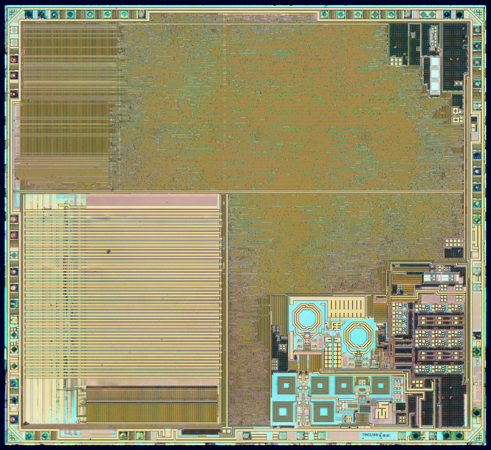

footer: Carsten Wulff 2021
slidenumbers:true
autoscale:true
theme: Plain Jane, 1
text:  Helvetica
header:  Helvetica
date: 2025-01-08

<!--pan_skip: -->

#[fit] Passives

---

<!--pan_title: Integrated Passives -->

<!--pan_doc:

**Keywords:** Resistors, Polysilicon, Diffusion, Capacitors, MOM, MOS Cap, Varactors, Inductors

-->


# Metal in ICs is not wire in schematic

<!--pan_doc: 


Metal wires in an integrated circuit comes in two types, copper and aluminium.

Most of the routing layers will be copper. To ensure that the copper ions don't diffuse into 
the silicon-oxide a barrier material surrounds all copper interconnect. 

Copper is too stiff to be wire-bonded. As such, the top layer metals would be aluminium.

Since the routing is so small, we have to care about the parasitic properties of the routing. Below is a table with some
common quantities for copper. For example, if we have 1000 $\mu$m metal wire with 1 $\mu$m width, then it would be approximately 
150 $\Omega$, 1 nH , 1 pF and tolerate a maximum of 1 mA DC current.

-->

| Parameter      | Typ. Value | Unit                       |
|:--------------:|:----------:|:--------------------------:|
| Resistance     | 150        | $$\text{m}\Omega/\square$$ |
| Capacitance    | 1          | $$\text{fF}/\mu\text{m}$$    |
| Inductance     | 1          | nH/mm                      |
| Max DC current | 1          | mA/$$\square$$             |


<!--pan_skip: -->

<!---->


---

<!--pan_doc:

The type of circuit we have determine what we must simulate. Everything needs to be simulated with parasitc capacitance and max current.
Only RF, however, usually needs to be simulated with resistance, capacitance, inductance and maximum current. 

-->

| Circuit type | Must simulate/know |
|:--: | :--: |
| All | C Imax |
| Analog, Power | R C Imax |
| Some RF, Some Power | R L C Imax |

---

<!--pan_doc:

To simulate the effects of parasitics, we need a description of the technology. A Process Design Kit (PDK). Most PDKs are closely
guarded secrets, as they describe many things about the way the foundry makes the integrated circuits. 

Some PDKs are open source, however, see [Skywater 130 nm](https://skywater-pdk.readthedocs.io) and [IHP-Open-PDK](https://github.com/IHP-GmbH/IHP-Open-PDK)

In addition to the PDK, we need tools that can calculate from the layout the parasitic elements. Some of the tools are 
-->

[.column]

Layout parasitic extraction tools
 
- [Calibre xRC](https://eda.sw.siemens.com/en-US/ic/calibre-design/circuit-verification/xrc/)
- [Synopsys StarRC](https://eda.sw.siemens.com/en-US/ic/calibre-design/circuit-verification/xrc/)
- [Cadence Quantus](https://eda.sw.siemens.com/en-US/ic/calibre-design/circuit-verification/xrc/)
- [Magic VLSI](http://opencircuitdesign.com/magic/)
 
[.column]

3D EM Simulators
 
 - [Keysight ADS](https://www.keysight.com/zz/en/products/software/pathwave-design-software/pathwave-advanced-design-system.html)
 - [HFSS](https://www.keysight.com/zz/en/products/software/pathwave-design-software/pathwave-advanced-design-system.html)

Transistor CAD (TCAD)
 
- [Synopsys TCAD](https://www.synopsys.com/silicon/tcad.html)

---

#[fit] Resistors

<!--pan_doc:

Sometimes we want a specific resistance. In general, any resistance on IC will vary in absolute value by maybe up to $\pm$ 20 %.
The relative size, however, can be controlled to within 0.1 %. 

In other words, you can't rely on a 1 kOhm resistor actually being 1 kOhm, it might be 0.8 kOhm. If you have two, however, you can 
trust that both of them will be 0.8 kOhm.

That's why almost all analog circuits rely on the relative sizes of passives, not the absolute value. If a circuit
does rely on absolute values, then it usually needs to be trimmed in production. 

-->

---

## Polysilicon

<!--pan_doc:

The workhorse resistor is the gate material itself: polysilicon. In
Figure 1 the resistor is a strip of poly with contacts at both ends,
sitting on field oxide so it is insulated from the substrate.

-->

Can be both N-doped, and P-doped

Often with two flavors, with, and without silicide 

Silicide reduces resistance of polysilicon


<!--pan_doc:
<sub>Figure 1: Polysilicon resistor</sub>

In a modern process the poly on top of transistors is silicided - a
metal alloy on the surface that reduces the sheet resistance to a few
ohms per square, great for gates, useless for resistors. The foundry
therefore offers a mask that blocks the silicide, and the unsilicided
flavor has a sheet resistance of hundreds of ohms per square with a
small temperature coefficient. When an analog schematic says
"resistor", it is nearly always unsilicided poly.

-->

---

## Diffusion

<!--pan_doc:

A doped region in the silicon also conducts, and Figure 2 shows it used
as a resistor.

-->

Use doped region as resistor

Usually without silicide

Non-linear capacitance

Tricky temperature dependence

<!--pan_doc:

The diffusion resistor comes with baggage. The resistor body forms a pn
junction to whatever surrounds it, so it carries a distributed, voltage
dependent junction capacitance, and the depletion region eats into the
conducting cross section, so the resistance itself moves with the
voltage. The substrate is p- in every modern process, so an n+ resistor
sits straight in it, but a p+ resistor needs an n-well around it - and
that well is a third terminal you must bias, with its own junction to
the substrate underneath. Add a temperature coefficient set by doping
and mobility pulling in opposite directions, and the diffusion resistor
is a device you use when the poly resistor is unavailable, not because
you want to.

-->


<!--pan_doc:
<sub>Figure 2: Diffusion resistors: n+ in the substrate, p+ in an n-well</sub>
-->

---

## Metal

<!--pan_doc:

Metal, Figure 3, is at the other end of the scale: at milliohms per
square you would need a kilometer of it for a useful resistance.

-->

Usually too low omhic to be a useful resistor

Useful for "separating nets" in schematic and layout

Must be considered for power supply and ground routing (high currents)

<!--pan_doc:

A zero ohm metal "resistor" still earns its place in the schematic: it
splits a net in two, which lets layout tools keep sense lines away from
current carrying lines, and lets the extraction report where the IR
drop goes. In power routing the metal resistance is not a device you
add but a parasitic you budget: milliohms times amperes is millivolts
of ground bounce.

-->


<!--pan_doc:
<sub>Figure 3: Metal resistor</sub>
-->

---

#[fit] Capacitors

---
## What is S, M, L, XL on a chip?

<!--pan_doc:

Capacitors are where the silicon area goes, so before the devices, a
sense of scale. The nRF52832 die is about 9.6 million square
micrometers, and on it, a component below five thousand square
micrometers is small, while anything above two hundred thousand - a
fiftieth of the die - is extra large and had better earn its keep.

-->

[nRF52832](https://www.nordicsemi.com/products/nrf52832) $$ 3200 \mu m \times 3000 \mu m = 9600 k \mu m^2$$ 

| Size | Area |
|:--:|:--:|
| S | below 5 k square um |
| M | below 50 k square um |
| L | below 200 k square um |
| XL | above 200 k square um |

---

## Metal-Oxide-Metal finger capacitors

<!--pan_doc:

The default capacitor in a modern process is drawn, not grown: thin
metal fingers side by side, alternating polarity, stacked over several
metal layers, as in Figure 4. The lateral spacing between fingers is
smaller than the vertical oxide between layers, so the sideways fringe
field does most of the work.

-->

Unit capacitance $$ \approx 1 fF/\mu m^2/layer $$

 $$ 10 pF = 100 \mu m \times 100 \mu m = 10 k \mu m^2$$


<!--pan_doc:
<sub>Figure 4: Metal-oxide-metal finger capacitor</sub>

The MOM capacitor is linear, matches to a tenth of a percent when drawn
as identical units, and costs nothing but metal. Its weakness is
density: at about a femtofarad per square micrometer per layer, ten
picofarads is a hundred micrometers on a side - a Medium on the scale
above, for one capacitor.

-->

---

## MOS capacitors

<!--pan_doc:

When density matters more than linearity, use the thinnest oxide on the
die: the gate oxide. A MOSFET with source, drain and bulk tied together
is a capacitor from the gate to the channel, Figure 5, and it is about
ten times denser than the MOM capacitor.

The price is that the capacitance depends on the bias. Below threshold
there is no channel and the gate sees the oxide in series with the
depletion region; above threshold the inversion layer forms and the
capacitance jumps to the full oxide value. A MOS capacitor is a fine
decoupling capacitor - the bias is fixed and nobody cares about
linearity - and a poor filter capacitor.

-->


<!--pan_doc:
<sub>Figure 5: A MOS capacitor is a MOSFET in strong inversion</sub>
-->

---

[.column]


```bash
dicex/sim/spice/NCHIO/vcap.cir
* gate cap

.include ../../../models/ptm_130.spi

vdrain D 0 dc 1
vgaini G 0 dc 0.5
vbulk B 0 dc 0
vcur S 0 dc 0

M1 D G S B nmos  w=1u  l=1u

.op
```

<!--pan_doc:

The operating point readout below, from the SPICE deck on the left,
shows where the number comes from: at this bias the gate-gate
capacitance $C_{gg}$ of the 1 um by 1 um device reads about 10 fF -
ten femtofarads per square micrometer, right at the estimate.

-->

Moscap is $$ \approx 10 fF / \mu m^2 $$

$$ 10 pF = 31 \mu m \times 31 \mu m \approx 1 k \mu m^2$$

[.column]


```bash
dicex/sim/spice/NCHIO/vcap.vlog
Device m1:
	Vgs     (gate-source voltage)        [V] : 0.5
	Vgd     (gate-drain voltage)         [V] : -0.5
	Vds     (drain-source voltage)       [V] : 1
	Vbs     (bulk-source voltage)        [V] : 1.90808e-12
	Vbd     (bulk-drain voltage)         [V] : -1
	Id      (drain current)              [A] : 7.32634e-06
	Is      (source current)             [A] : -7.32633e-06
	Ibd     (bulk-drain current)         [A] : -1.01e-12
	Ibs     (bulk-source current)        [A] : 9.581e-25
	Vt      (threshold voltage)          [V] : 0.378198
	Vgt     (gate overdrive voltage)     [V] : 0.121802
	Vgsteff (effective vgt)              [V] : 0.12515
	Gm      (transconductance)           [S] : 8.44164e-05
	Gmb     (bulk bias transconductance) [S] : 2.00071e-05
	Ueff    (mobility)             [cm^2/Vs] : 417.675
	Gds     (channel conductance)        [S] : 1.95043e-07
	Rds     (output resistance)        [Ohm] : 5.12708e+06
	Vdsat   (drain saturation voltage)   [V] : 0.14171
	IC      (inversion coefficient)       [] : 4.42478
	Cgs     (gate-source capacitance)    [F] : 9.98457e-15
	Csg     (source-gate capacitance)    [F] : 5.86932e-15
	Cgd     (gate-drain capacitance)     [F] : 3.98239e-16
	Cdg     (drain-gate capacitance)     [F] : 3.91086e-15
	Cds     (drain-source capacitance)   [F] : 4.30968e-15
	Cgg     (gate-gate capacitance)      [F] : 1.05198e-14
	Cdd     (drain-drain capacitance)    [F] : 1.05198e-14
	Css     (source-source capacitance)  [F] : 0
	Cgb     (gate-bulk capacitance)      [F] : 1.05198e-14
	Cbg     (bulk-gate capacitance)      [F] : 1.74123e-15
	Cbs     (bulk-source capacitance)    [F] : 8e-16
	Cbd     (bulk-drain capacitance)     [F] : 3.97768e-16
```


---

## Varactors

<!--pan_doc:

A varactor is a "variable capacitor", usually it's a device that varies the capacitance with the voltage across the device.

-->


<!--pan_doc:
<sub>Figure 6: A reverse biased pn junction as a varactor</sub>

The junction depletion capacitance falls as the reverse bias grows -
the same square root we met in the diode chapter - which makes a
reverse biased junction a voltage controlled capacitor. The other
common varactor is the MOS capacitor biased around its transition. The
customer for both is the oscillator chapter: a varactor in an LC tank
turns a fixed oscillator into a voltage controlled one.

-->

---

#[fit] Inductors

<!--pan_doc:

Inductors on chip are spirals in the top metals, like the ones visible
on the nRF51822 die photograph in Figure 7. The top layers are the
thick, low resistance ones, and resistance is the enemy: the quality
factor of an integrated inductor - some tens at gigahertz - is set by
the metal losses and by eddy currents in the substrate below.

-->

Usually two top metals, because they are thick (low ohmic)

Use foundry model

3D electro magnetic simulation often needed

<!--pan_doc:

An inductor is the least portable device on the die: its value and its
losses depend on everything nearby, so use the foundry's characterized
model, and if the layout deviates from it - or the frequency is high
enough that every via matters - budget for a 3D electromagnetic
simulation. Nanohenries cost hundreds of micrometers on a side, which
is why inductors only appear where nothing else will do: LC
oscillators, RF matching and power converters.

-->

<!-- -->

 

<!--pan_doc:
<sub>Figure 7: nRF51822 die - the spirals are inductors. Die photograph by [zeptobars.com](https://zeptobars.com/en/read/nRF51822-Bluetooth-LE-SoC-Cortex-M0), [CC BY 3.0](https://creativecommons.org/licenses/by/3.0/)</sub>
-->

---

# Variation in passives

<!--pan_doc:

The rule from the resistor introduction deserves numbers. Nothing on an
IC has a trustworthy absolute value: oxide thickness, implant dose and
line width all drift from lot to lot, and the passives drift with them.
What the process does guarantee is that two identical devices drawn
next to each other drift together.

-->

Absolute value for resistors and capacitors: 10 % to 20 %

Relative precision for closely spaced devices: 0.1 % to 1 %

Relative precision for devices far apart on the same die: worse than 2 %

---


# Relative precision 

<!--pan_doc:

Figure 8 shows the payoff in circuit form: a resistor divider whose
output is half the input to a tenth of a percent, and two capacitors
whose charge ratio holds equally well - even though every one of those
devices may be off by ten percent in absolute value. The precision is
earned in layout: identical unit devices, interdigitated or common
centroid so process gradients hit both halves equally, dummies at the
edges so every unit sees the same neighborhood.

This is the deal the whole chapter has been building to: design
circuits so that only ratios matter - two resistors setting a gain, a
capacitor array setting a DAC - and the process variation cancels out
of the equation.

-->

Resistors and Capacitors can be matched extremely well


<!--pan_doc:
<sub>Figure 8: Ratios of matched devices hold to a tenth of a percent</sub>
-->


---


## Summary

<!--pan_doc:

The one-page version of this chapter:

-->

- Metal is not a schematic wire: budget resistance, capacitance and current for every long route
- Resistors: unsilicided poly first; diffusion if you must; metal never
- Capacitors: MOM for linearity and matching, MOS cap for density at a fixed bias
- Varactors turn junctions or MOS caps into tunable capacitors for oscillators
- Inductors are area-hungry and non-portable: foundry model or EM simulation
- Absolute values drift by tens of percent; ratios of matched units hold a tenth of a percent - design with ratios


