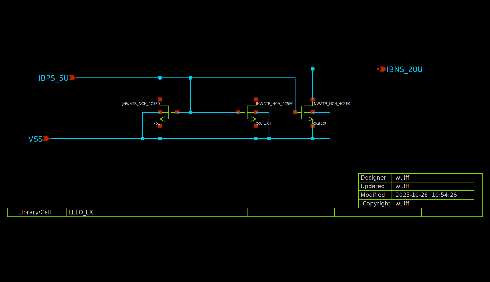
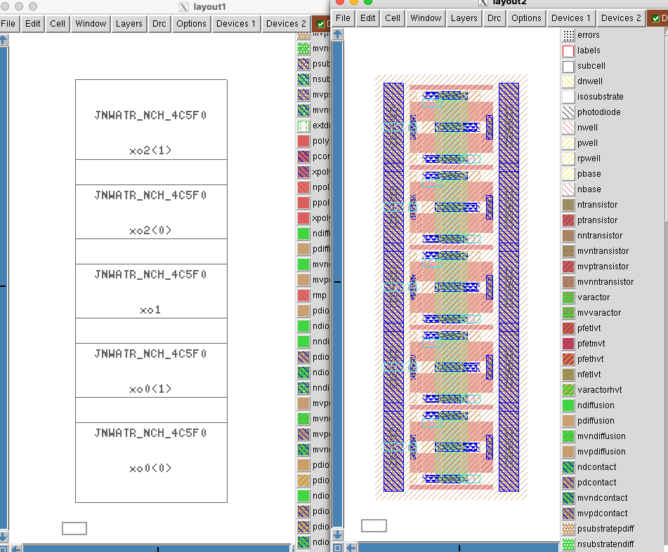
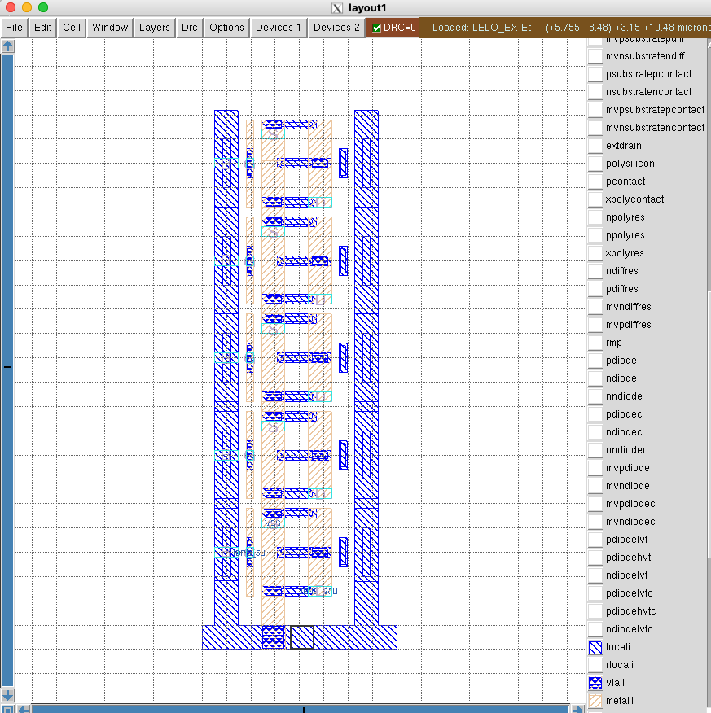
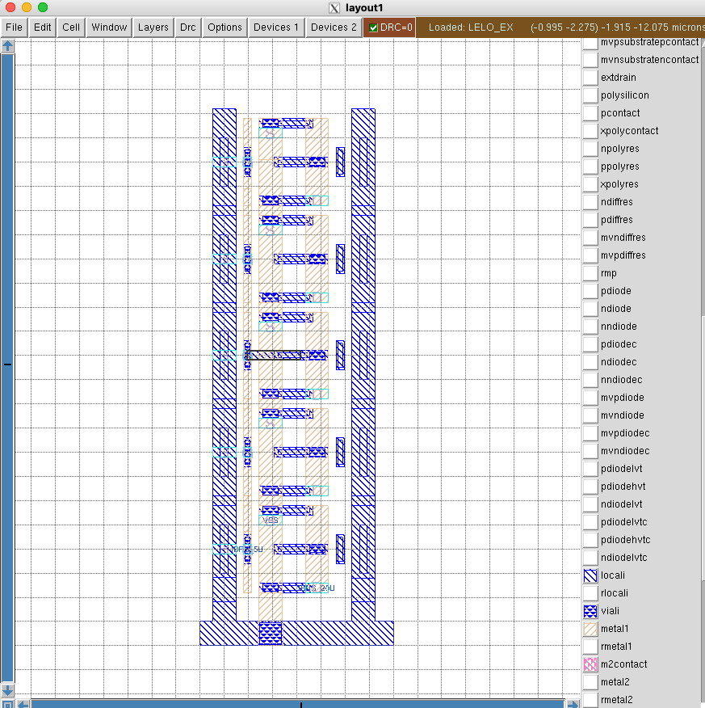
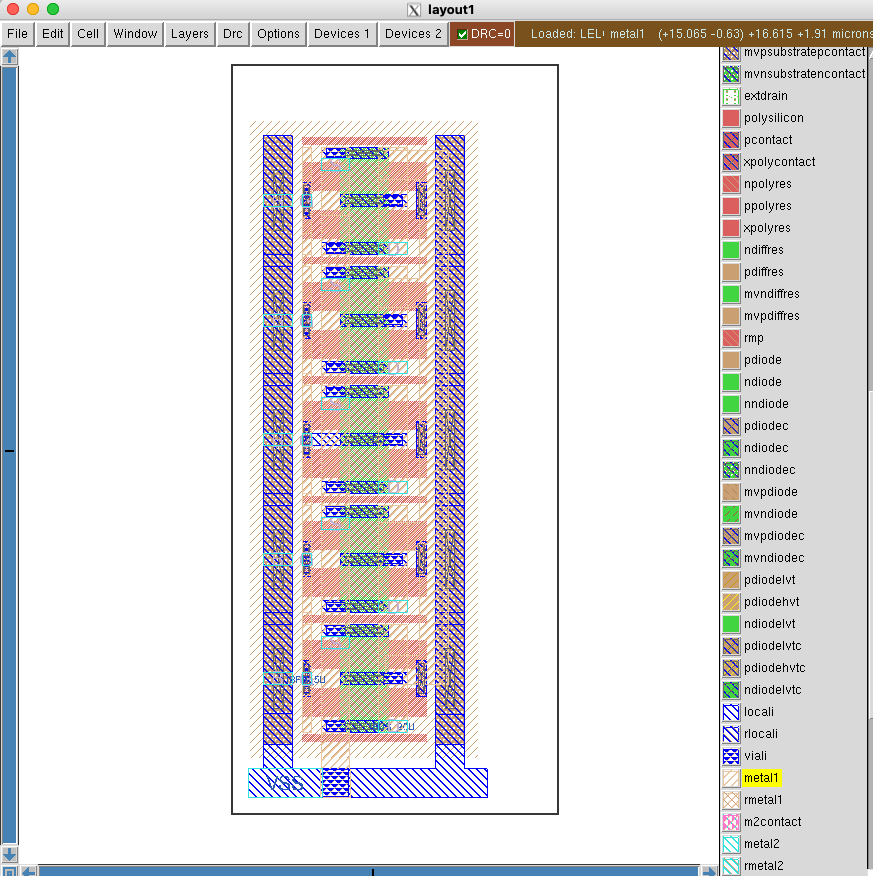

footer: Carsten Wulff 2025
slidenumbers:true
autoscale:true
theme: Plain Jane, 1
text:  Helvetica
header:  Helvetica
date: 2025-10-26

<!--pan_title: Sky130nm tutorial-->

**Status:** 0.5

If the commands don't work, then you have not installed the tools. Check [The Tools](https://analogicus.com/aic2026/2025/10/25/The-Tools.html) chapter first.

<iframe width="560" height="315" src="https://www.youtube.com/embed/YoJCkAmBo44?si=PA9Td0lBYERgkOrS" title="YouTube video player" frameborder="0" allow="accelerometer; autoplay; clipboard-write; encrypted-media; gyroscope; picture-in-picture; web-share" referrerpolicy="strict-origin-when-cross-origin" allowfullscreen></iframe>

## Create the IP 

I've made some scripts to automatically generate the IP. 

To see what files are generated, see `tech_sky130A/cicconf/lelo.yaml`

```bash
cd aicex/ip
cicconf newip ex --project lelo --technology sky130A --ip  tech_sky130A/cicconf/lelo.yaml
```

## The file structure 
    
It matters how you name files, and store files. I would be surprised if you 
had a good method already, as such, I won't allow you to make your own folder
structure and names for things. I also control the filenames and folder
structure because there are many scripts to make your life easier (yes, really)
that rely on an exact structure. Don't mess with it. 

### Github workflows

On github it's possible use something called workflows to run things every time
you push a new version. It's really nice, since it can then check that
your design is valid. 

The workflows are defined below. 

```bash
.github
   workflows  
   docs.yaml # Generate a github page 
   drc.yaml  # Run Design Rule Checks 
   gds.yaml  # Generate a GDS file from layout 
   lvs.yaml  # Run Layout Versus Schematic 
             # and Layout Parasitic Extraction
```

### Configuration files 

Each IP has a few files that define the setup, you'll need to modify at least
the `README.md` and the `info.yaml`.

```bash
 .gitignore  # files that are ignored by git
 README.md   # Frontpage documentation 
 config.yaml # What libraries are used. Used by  cicconf
 info.yaml   # Setup names, authors etc 
 media       # Where you should store images for documentation
 tech -> ../tech_sky130A  # The technology library
``` 

### Design files 

A "cell" in the open source EDA world should consists of the following files

- Schematic (.sch)
- Layout (.mag)
- Documenation (.md)

The files must have the same name, and must be stored in `design/<LIB>/` as
shown below. 

Note there are also two symbolic links to other libraries. These two libraries
contain standard cells and standard analog transistors (ATR) that you should be using.

```bash
design
  LELO_EX_SKY130A
  LELO_EX.sch
  JNW_ATR_SKY130A -> ../../jnw_atr_sky130a/design/JNW_ATR_SKY130A
  JWN_TR_SKY130A -> ../../jnw_tr_sky130a/design/JNW_TR_SKY130A
```

For example, if the cell name was `LELO_EX`, then you would have 

- `design/LELO_EX_SKY130A/LELO_EX.sch`: Schematic (xschem)
- `design/LELO_EX_SKY130A/LELO_EX.sym`: Symbol (xschem)
- `design/LELO_EX_SKY130A/LELO_EX.mag`: Layout (Magic)
- `design/LELO_EX_SKY130A/LELO_EX.md` : Markdown documentation (any text editor)

All these files are text files, so you can edit them in a text editor, but
mostly you shouldn't (except for the Markdown)

### Simulations 

All simulations shall be stored in `sim`. Once you have a Schematic ready for
simulation, then 

```bash 
cd sim 
make cell CELL=LELO_EX
```
This will make a simulation folder for you. Repeat for all your cells. 

```bash
sim
  Makefile
  cicsim.yaml -> ../tech/cicsim/cicsim.yaml
```


### The work 

All commands (except for simulation), shall be run in the `work` folder. 

In the `work/` folder there are startup files for Xschem (xschemrc) and Magic (.magicrc).
They tell the tools where to find the process design kit, symbols, etc. At some point you probably
need to learn those also, but I'd wait until you feel a bit more comfortable.


```bash 
work
 .magicrc
 Makefile
 mos.24bit.dstyle -> ../tech/magic/mos.24bit.dstyle
 mos.24bit.std.cmap -> ../tech/magic/mos.24bit.std.cmap
 xschemrc
```

## Github setup

Create a repository on [github](https://github.com).
The name of the repository that you make on GitHub has to be the same as what is written after ```<your username>``` in the last command below. In this example, that is ```lelo_ex_sky130a```.


``` bash
cd lelo_ex_sky130a
git remote add origin \
 git@github.com:<your username>/lelo_ex_sky130a.git
```

## Start working 

### Edit README.md

Open README.md in your favorite text editor and make necessary changes.

### Familiarize yourself with the Makefile and make

I write all commands I do into a Makefile. There is nothing special with a Makefile, it's just what I choose
to use 20 years ago. I'm not sure I'd choose something different now.

``` bash
cd work
make
```

Take a look inside the file called Makefile.

## Draw Schematic <a name="sch"></a>

The block we'll make is a current mirror with a 1 to 4 scaling. 

A schematic is how we describe the connectivity, and the types of devices in an
analog circuit. The open source schematic editor we will use is XSchem.

Open the schematic:

```bash
xschem -b ../design/LELO_EX_SKY130A/LELO_EX.sch &
```

### Add Ports

Add IBPS\_5U and IBNS\_20U ports, the P and N in the name signifies what
transistor the current comes from. So IBPS must go into a diode connected NMOS,
and N will be our output, and go into a diode connected PMOS somewhere else.

### Add transistors

Use 'I' or 'Shift+i' (note the letter case) to open the library manager. Click the `lelo_ex_sky130A/design`
path, then `JNW_ATR_SKY130A` and select `JNWATR_NCH_4C5F0.sym`

The naming convention for these transistors is `<number of contacts on
drain/source>C<times minimum gate length>F`, so the number before the C is the width,
and the number before/after the F is the length. The absolute size does not matter for now.
Just think "4C5F0 is a 4 contact wide long transistor", while a "4C1F2 is a 4
contact wide, short transistor".

Select the transistor and press 'c' to copy it, while dragging, press 'shift-f'
to flip the transistor so our current mirror looks nice. 'shift-r' rotates the
transistor, but we don't want that now.

Place two transistors for the output transistor, as shown in the figure below.

Press ESC to deselect everything

Select the input transistor, and change the name to 'xo1'

Select the first output transistor, and change the name to 'xo0[1:0]'. Using bus
notation on the name will create 2 transistors.

Select the second output transistor and give it the name 'xo1[1:0]'.

Select ports, and use 'm' to move the ports close to the transistors.

Press 'w' to route wires.

Use 'shift-z' and z, to zoom in and out

Use 'f' to zoom full screen

Remember to save the schematic



### Netlist schematic

Check that the netlist looks OK

In work/
``` bash
make xsch CELL=LELO_EX
cat xsch/LELO_EX.spice
```

---

## Typical corner SPICE simulation <a name="simschtyp"></a>

I've made [cicsim](https://github.com/wulffern/cicsim) that I use to run simulations (ngspice) and extract
results

### Setup simulation environment
Navigate to the `lelo_ex_sky130a/sim/` directory.

Make a new simulation folder

``` bash
cicsim simcell  LELO_EX_SKY130A LELO_EX \
    ../tech/cicsim/cell_spice/template.yaml
```

I would recommend you have a look at simcell_template.yaml file to understand what happens.

### Familiarize yourself with the simulation folder

I've added quite a few options to cicsim, and it might be confusing. For
reference, these are what the files are used for

| File         | Description                                       |
|--------------|---------------------------------------------------|
| Makefile     | Simulation commands                               |
| cicsim.yaml  | Setup for cicsim                                  |
| summary.yaml | Generate a README with simulation results         |
| tran.meas    | Measurement to be done after simulation           |
| tran.py      | Optional python script to run for each simulation |
| tran.spi     | Transient testbench                               |
| tran.yaml    | What measurements to summarize                                                   |


The default setup should run, so

``` bash
cd LELO_EX
make typical
```

### Modify default testbench (tran.spi)

Delete the VDD source

Add a current source of 5uA, and a voltage source of 1V to IBNS_20U

``` spice
IBP 0 IBPS_5U dc 5u
V0  IBNS_20U 0 dc 1
```

Save the current in V0 by adding i(V0) to the save statement in the testbench

Save the voltage by adding v(IBPS_5U) to the save statement

```spice 
.save i(V0) v(IBPS_5U)
```

### Modify measurements (tran.meas)

Add measurement of the current and VGS. It must be added between the
"MEAS_START" and "MEAS_END" lines.

``` spice
let ibn = -i(v0)
meas tran ibns_20u find ibn at=5n
meas tran vgs_m1 find v(ibps_5u) at=5n
```

Run simulation

``` bash
make typical
```
and check that the output looks okish. 

Try to run the simulation again 

``` bash
make typical
```

If everything works, then the simulation now should **not** be run. Every time
cicsim runs (provided the `sha: True` option is set in `cicsim.yaml`) cicsim will 
compute a SHA hash of all files (stored in output_tran/*.sha*) that is
referenced in the `tran.spi`. Next time cicsim is run, it checks the hash's and
does not re-run if there is no need (no files changed). 

Sometimes you want to force running, and you can do that by 

```bash 
make typical OPT="--no-sha"
```
 
Often, it's the measurement that I get wrong, so instead of rerunning simulation every time
I've added a "--no-run" option to cicsim. For example

``` bash
make typical OPT="--no-run"
```

will skip the
simulation, and rerun only the measurement. This is why you should split the testbench and the
measurement. Simulations can run for days, but measurement takes seconds.

### Modify result specification (tran.yaml)

Add the result specifications, for example

``` yaml
ibn:
  src:
    - ibns_20u
  name: Output current
  min: -5%
  typ: 20
  max: 5%
  scale: 1e6
  digits: 3
  unit: uA

vgs:
  src:
    - vgs_m1
  name: Gate-Source voltage
  typ: 0.6
  min: 0.3
  max: 0.8
  scale: 1
  digits: 3
  unit: V
```

Re-run the measurement and result generation

``` bash
make typical OPT="--no-run"
```

Open `results/tran_Sch_typical.html`


### Check waveforms

You can either use ngspice, or you can use cicsim, or you can use something I
don't know about 

Open the raw file with 

``` bash
cicsim wave output_tran/tran_SchGtKttTtVt.raw 
```

Load the results, and try to look at the plots. There might not be that much
interesting happening 

#### Searching waveforms

On the left side of the window you'll see a text box in the middle between the
filename, and the wave names. This is a regex search field, and you can easily
search for waveforms (like `i(v0)`) that you want to find. 

Note that the search field uses [regular expressions](https://en.wikipedia.org/wiki/Regular_expression). If you don't know regex,
then it's time to learn. I always use the perl regular expression variants.

For example, searching for "i(v0)" won't acctually show anything, because the
`()` are special characters. "i\(v0\)" will find it though.

I could search for both ibps and v0 at the same time with `ibps|i\(`, so it's
well worth learning. 

A great resource is [Mastering Regular Expressions](https://regex.info/book.html)

---

## All corners SPICE simulations <a name="simschcorner"></a>

Analog circuits must be simulated for all physical conditions, we call them corners.
We must check high and low temperature, high and low voltage, all process corners, and device-to-device mismatch.


### Remove Vh and Vl corners (Makefile)

For the current mirror we don't need to vary voltage, since we don't have a VDD.

Open Makefile in your favorite text editor.

Change all instances of "Vt,Vl,Vh" and "Vl,Vh" to Vt


### Run all corners
To simulate all corners do

``` bash
make typical etc mc
```

where etc is extreme test condition and mc is monte-carlo.

Wait for simulations to complete.


### Get creative with python

Open `tran.py` in your favorite editor, try to read and understand it.

The `name` parameter is the corner currently running, for example `tran_SchGtAmcttTtVt`.

The measured outputs from ngspice will be added to `tran_SchGtAmcttTtVt.yaml`

Delete the "return" line.

Add the following lines (they automatically plot the current and gate voltage)

```python
import cicsim as cs
fname = name +".png"
print(f"Saving {fname}")
cs.rawplot(name + ".raw","time","v(ibps_5u),i(v0)" \
  ,ptype="",fname=fname)
```

Re-run measurements to check the python code

```bash
make typical etc mc OPT="--no-run"
```

You'll see that cicsim writes all the png's. Check with `ls -l output_tran/*.png`.

You'll also notice it will slow down the simulation, so maybe remove the lines
from `tran.py` again ;-) 

### Generate simulation summary

Run

``` bash
make summary
```

Install [pandoc](https://pandoc.org) if you don't have it

Run

``` bash
pandoc -s   README.md -o README.html
```

to generate a HTML slideshow that you can open in browser. Open the HTML file.

### Viewing results without GUI browser 

If your on a system without a browser, or indeed a GUI, then it's possible to
view the results in the terminal.

Check if `lynx` is installed, if it's not installed, then 

On linux
```bash
sudo apt-get install lynx
```

On Mac
```bash
brew install lynx
```

Then 

```bash
lynx README.html
```

### Think about the results

From the corner and mismatch simulation, we can observe a few things.

- The typical value is not 20 uA. This is likely because we have a M2 VDS of 1 V, which is not the same
  as the VDS of M1. As such, the current will not be the same.
- The statistics from 30 corners show that when we add or subtract 3 standard deviation from the mean,
  the resulting current is outside our specification of +- 5 %. 

---

## Draw Layout <a name="layout"></a>


A foundry (the factory that makes integrated circuits) needs to know how we want
  them to create our circuit. So we need to provide them with a "layout", the
  recipe, or instruction, for how to make the circuit. Although the layout
  contains the same components as the schematic, the layout contains the
  physical locations, and how to actually instruct the foundry on how to make
  the transistors we want.

Open Magic VLSI

``` bash
cd work
magic ../design/LELO_EX_SKY130A/LELO_EX.mag
```

Now brace yourself, Magic VLSI was created in the 1980's. For it's time it was extremely modern,
however, today it seems dated. However, it is free, so we use it.

### Magic VLSI

Try google for most questions, and there are youtube videos that give an intro.

- [Magic Tutorial 1](https://www.youtube.com/watch?v=ORw5OaY33A4&t=9s)
- [Magic Tutorial 2](https://www.youtube.com/watch?v=NUahmUtY814)
- [Magic Tutorial 3](https://www.youtube.com/watch?v=OKWM1D0_fPI)
- [Magic command
  reference](http://opencircuitdesign.com/magic/commandref/commands.html)
- [Magic Documentation](https://analogicus.com/magic/)

Default magic start with the BOX tool. Mouse left-click to select bottom corner,
left-click to select top corner.

Press "space" to select another tool (WIRING, NETLIST, PICK).

Type "macro help" in the command window to see all shortcuts

| Hotkey      | Function                          |
|-------------|-----------------------------------|
| v           | View all                          |
| shift-z     | zoom out                          |
| z           | zoom in                           |
| x           | look inside box (expand)          |
| shift-x     | don't look inside box  (unexpand) |
| u           | undo                              |
| d           | delete                            |
| s           | select                            |
| Shift-Up    | Move cell up                      |
| Shift-Down  | Move cell down                    |
| Shift-Left  | Move cell left                    |
| Shift-Right | Move cell right                   |


### Add transistors

Open Cell -> Place Instance. Navigate to the right transistor.

Place it. Hover over the transistor and select it with 's'. Now comes a bit of
tedious thing. Select again, and copy. It's possible to align the transistors
on-top of eachother, but it's a bit finicky.

Place all transistors on top of each other as shown below in the picture. 



### Place devices

You will find that one of the more time consuming things with analog layout is to
place the devices, and to follow the design rules from foundry. I detest tedious
work. As such, I've tried for the past 25 years to simplify analog layout. I've
not finished yet, but maybe you'll find some of the scripts useful. 

Note that the command below will override all your hard work ;-) 


```
cd work
make xsch
cicpy sch2mag LELO_EX_SKY130A LELO_EX
```

### Add Ground

In the command window, type

```tcl
see no *
see viali
see locali
see m1
see via1
see m2
```

Make a box around the layout by left cliking bottom left, and right clicking top
right. Press 'x' to expand.


Change grid to 1 um. Set "Window->Snap to grid on"

Select a 1 um box below the transistors and paint the rectangle with locali (middle click on locali)

Change to the 'wire tool' with spacebar. Set "Window-> Snap to grid off"

Connect guard rings to ground. 

Press the top transistor 'S' and draw
all the way down to connect all of the transistors' source terminals. Use 'shift-right click' to
change layer down 



### Route Gates

Press "space" to enter wire mode. Left click on the top gate to start a wire, and right click to end the wire.

The drain of M1 transistor needs a connection from gate to drain. We do that
for the middle transistor. Change to the box tool (spacebar a few times). Create
a box that matches the locali. Connect the drain to the gate in locali.




### Drain of M2

Use the wire tool to draw connections for the drains.

To add vias you can do "shift-left click" to move up a metal, and "shift-right click" to go down.

It's a very good idea to have direction rules for metal layers. I would
recommend that you route metal1 vertical, metal2 horizontal, metal3 vertical
etc. For locali it's usually all over the place. 


### Add labels

All ports must be named (IBPS\_5U, IBNS\_20U, VSS). The cicpy script may add
ports, but not necessarily where you want them.

Select a box on a metal, and use "Edit->Text" to add labels for the ports.
Select the port button.

---

## Layout verification <a name="ver"></a>

The DRC can be seen directly in Magic VLSI as you draw.

To check layout versus schematic navigate to work/ and do

``` tcl
make cdl lvs
```

Remember to save the layout first.

If you've routed correctly, then the LVS should be correct. 




---

## Extract layout parasitics <a name="lpe"></a>

With the layout complete, we can extract parasitic capacitance.

``` bash
make lpe
```

Check the generated netlist

``` bash
cat lpe/LELO_EX_lpe.spi
```

---

## Simulate with layout parasitics <a name="simlpe"></a>

Navigate to sim/LELO_EX. We now want to simulate the layout.

The default `tran.spi` should already have support for that.

Open the Makefile, and change

```bash
VIEW=Sch
```

to

```bash
VIEW=Lay
```

### Typical simuation

Run

```bash
make typical
```

### Corners
Navigate to sim/LELO_EX. Run all corners again

``` bash
make all
```

### Simulation summary

Open `summary.yaml` and add the layout files.

``` yaml
      - name: Lay_typ
        src: results/tran_Lay_typical
        method: typical
      - name: Lay_etc
        src: results/tran_Lay_etc
        method: minmax
      - name: Lay_3std
        src: results/tran_Lay_mc
        method: 3std
```

Run summary again

```bash
make summary
pandoc -s  README.md -o README.html
```

Open the README.html and have a look a the results. The layout should be close
to the schematic simulation. 

## Make documentation 

Make a file (or it may exists) `design/LELO_EX_SKY130A/LELO_EX.md` and add some
documentation of what you've made. 

Add the simulation results to your git repository to keep track

```
git add sim/LELO_EX/results/*.html
git add sim/LELO_EX/README.md 
```

## Edit info.yaml 

Finally, let's setup the `info.yaml` so that all the github workflows run
correctly. 

Mine will look like this. 

You need to setup the url (probably something like `<your username>.github.io`)
to what is correct for you.

I've added the doc section such that the workflows will generate the docs. 

The sim is to run a typical simulation. 

```yaml
library: LELO_EX_SKY130A
cell: LELO_EX
author: Carsten Wulff
github: wulffern
tagline: The answer is 42
email: carsten@wulff.no
url: wulffern.github.io
doc:
  libraries:
    LELO_EX_SKY130A:
      - LELO_EX
```

## Setup github pages 

Go to your GitHub repository (repo). Press Settings. Press Pages. Choose source under Build and Deployment  ->
GitHub Actions

Wait for the workflows to build. And check your github pages. 
Mine is [https://wulffern.github.io/lelo_ex0_sky130a/](https://wulffern.github.io/lelo_ex0_sky130a/).

## Frequency asked questions

*Q:*  My GDS/LVS/DRC action fails, even though it works locally. 

Sometimes the reference to the transistors in the magic file might be wrong.
Open the .mag file in a text editor and check. The correct way is 

```sh
use JNWATR_NCH_4C5F0  JNWATR_NCH_4C5F0_0 ../LELO_ATR_SKY130A
```

It's the last `../JNW_ATR_SKY130A` that sometimes is missing.


